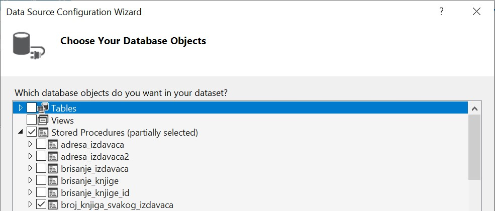
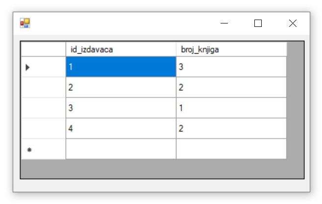

Писање програма у развојном окружењу Visual Studio - stored procedure
=====================================================================

.. suggestionnote::

    Видели смо како се у оквиру објекта *DataGridView* приказује садржај целе табеле. Могуће је приказати и резултат рада неке процедуре коју смо креирали и која је остала сачувана унутар базе података. Следи пример. 

Програми се пишу у развојном окружењу *Visual Studio Community* и помоћу програмког језика C#. Сви приказани примери су у вези са табелама које чине део базе података за библиотеку. 

Написаћемо програм у којем се за сваког издавача приказује број књига. Раније смо креирали процедуру *broj_knjiga_svakog_izdavaca* која је остала сачувана у бази података и коју можемо да искористимо у нашем програму. 

Сетимо се како је изгледала та процедура.

::

    CREATE PROCEDURE broj_knjiga_svakog_izdavaca
    AS
    SELECT id_izdavaca, COUNT(id_knjige) AS broj_knjiga
    FROM knjige
    GROUP BY id_izdavaca

Када се покрене развојно окружење *Visual Studio Community*, потребно је да се креира нови пројекат избором опције *Create a new project*. Изабрани језик треба да буде С#, а врста пројекта *Windows Forms App*, апликација са графичким корисничким интерфејсом. 

У следећем кораку је потребно да се пројекат именује и да се изабере локација на којој ће се пројекат чувати. Може да остане и предложена локација. Кликнути на дугме *Create* и прелазимо у простор за креирање апликације, тј. програма. 

Први корак је додавање раније креиране базе података новом пројекту. У прозору *Solution Explorer* је потребно да се кликне десни тастер миша над називом пројекта, а затим да се изабере *Add/Existing Item...* са менија који се појави. База података коју смо креирали се већ налази на рачунару и потребно је пронаћи и изабрати фајл *Biblioteka_knjige.mdf* у којем је сачувана. Тачна локација може да се провери у систему *SQL Server Management Studio* у којем смо креирали базу. 

За приказ резултата позива процедуре из релационе базе података ћемо користити контролу *DataGridView* коју можемо да превучемо из прозора *Toolbox*. 

За додати *DataGridView* неопходно је да изаберемо податке који ће бити приказани у оквиру њега, у овом случају да га повежемо са сачуваном процедуром. У горњем десном углу постоји мала стрелица која води до падајућег менија *Choose Data Source*. Са падајућег менија изабрати *Add Project Data Source...* У наредна два корака изабрати *Database* и *Dataset*. 

Следећи корак је веома значајан зато што се формира конекција са базом података. Уколико смо већ креирали апликацију која се повезује на ову базу података и означили смо да се сачува конекциони стринг, нећемо морати поново да га формирамо. 

Ако треба да се формира конекција, након што се кликне на дугме *New Connection...*, потребно је да се изабере опција *Microsoft SQL Server Database File*, а затим и да се на рачунару пронађе и дода фајл који садржи базу података. Када се изабере фајл, значајно је да се штиклира опција која приказује конекциони стринг (енг. *connection string*). Тај стринг треба негде запамтити ради употребе у примерима који следе. 

У последњем кораку је потребно изабрати жељену процедуру са списка свих објеката који се налазе у бази података на коју смо се повезали. 

Процедура коју смо изабрали је *broj_knjiga_svakog_izdavaca* и када се покрене програм кликом на дугме *Start*, биће приказан идентификациони број сваког издавача и поред њега број књига тог издавача које се налазе у библиотеци.

