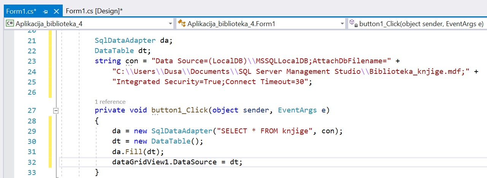

Угнежђени упит SELECT унутар програма
=====================================

.. suggestionnote::

    Унутар програмског кода писаног програмским језиком С# могу да се користе команде упитног језика SQL. 

    Креираћемо у окружењу *Visual Studio* рачунарски програм који издваја податке из једне табеле креиране базе података употребом угњежденог упита SELECT.

Програми се пишу у развојном окружењу *Visual Studio Community* и помоћу програмког језика C#. 

Креираћемо програм у којем можемо да претражујемо табелу са подацима о књигама. Програм ће имати опције да се прикаже цела табела, да се издвоје подаци о књизи чији идентификациони број унесемо, као и да се ради претрага списка књига по називу. 

Када се покрене развојно окружење *Visual Studio Community*, потребно је да се креира нови пројекат избором опције *Create a new project*. Изабрани језик треба да буде С#, а врста пројекта *Windows Forms App*, апликација са графичким коирсничким интерфејсом. 

У следећем кораку је потребно да се пројекат именује и да се изабере локација на којој ће се пројекат чувати. Може да остане и предложена локација. Кликнути на дугме Create и прелазимо у простор за креирање апликације, тј. програма. 

Први корак је додавање раније креиране базе података новом пројекту. У прозору *Solution Explorer* је потребно да се кликне десни тастер миша над називом пројекта, а затим да се изабере *Add/Existing Item...* са менија који се појави. База података коју смо креирали се већ налази на рачунару и потребно је пронаћи и изабрати фајл *Biblioteka_knjige.mdf* у којем је сачувана. Тачна локација може да се провери у систему *SQL Server Management Studio* у којем смо креирали базу. 

За приказ резултата угњежденог упита SELECT који узима податке из релационе базе података је најбоље да се користи контрола *DataGridView* који можемо да превучемо из прозора *Toolbox*.

Потребно је да додамо и једно дугме, контролну *Button*, за прву опцију коју ћемо имати у нашем програму, а то је приказ комплетног садржаја табеле *knjige*. У прозору *Properties* изменимо својство *Text* за дугме тако да на дугмету пише текст који одговара радњи која ће да се догоди када се на дугме кликне. 

Комплетан дизајн апликације може да се види на следећој слици. 

За разлику од претходних примера, садржај објекта *DataGridView* ћемо попунити наредбама програмског језика C#. 

Класе које су нам потребне за читање података из базе и њихов приказ у програму се налазе у именском простору *System.Data.SqlClient* који није аутоматски укључен у нови пројекат. Потребно је да додамо следећи ред на врх документа са програмским кодом. 

.. code-block:: Csharp

    using System.Data.SqlClient;

Овај ред може да се дода и на крај постојећег низа са наредбама *using*, а можемо и да га додамо и након додавања именског простора *System.Data* који је већ укључен у празан пројекат. 

Да би се програм повезао на базу, неопходан је конекциони стринг. За базу података коју користимо у овом примеру, у ранијим пројектима смо добили конекциони стринг који ћемо овде прекопирати и употребити.

.. infonote::
    
    **ВАЖНО:** Стринг који сте добили није идентичан овоме који је овде приказан. Значајно је да сте запамтили конекциони стринг који сте ви добили на вашем рачунару за вашу базу података. Тај стринг ће се користити и у свим наредним програмима које креирамо и који се повезују на ову базу података. У првом примеру програмског кода који следи ће бити приказан један конекциони стринг, а касније ће свуда писати само *KONEKCIONI_STRING* на местима где треба да убаците ваш конекциони стринг. 

За повезивање са базом података нам је потребан објекат класе *SqlDataAdapter*. Приликом креирања тог објекта наводимо упит SELECT, у овом случају упит који приказује комплетан садржај табеле *knjige*, и конекциони стринг. Креирани објекат ћемо употребити да попунимо објекат класе *DataTable* који директно можемо да упишемо у постављени *DataGridView*. Имамо могућност да на различите начине именујемо објекте које креирамо, а у свим примерима који следе ћемо се придржавати правила именовања да је назив објекта скраћеница назива класе на енглеском језику. 

Више о класама које користимо у програмима може да се нађе у званичној документацији на интернету. 
 
- https://learn.microsoft.com/en-us/dotnet/api/system.data.sqlclient.sqldataadapter?view=dotnet-plat-ext-7.0
- https://learn.microsoft.com/en-us/dotnet/api/system.data.datatable?view=net-7.0

Следи програмски код којим се остварује ваза са базом података, а резултат извршеног упита се приказује кориснику. 

.. code-block:: Csharp

    SqlDataAdapter da;
    DataTable dt;
    string conText = "Data Source=(LocalDB)\\MSSQLLocalDB;AttachDbFilename=" +
    "C:\\Users\\Dusa\\Documents\\SQL Server Management Studio\\Biblioteka_knjige.mdf;" +
    "Integrated Security=True;Connect Timeout=30";

        private void button1_Click(object sender, EventArgs e)
        {
            da = new SqlDataAdapter("SELECT * FROM knjige", conText);
            dt = new DataTable();
            da.Fill(dt);
            dataGridView1.DataSource = dt;
        }

На следећој слици можемо да видимо како овај програмски код изгледа у развојном окружењу.

Као и у другим ситуацијама у програмирању, има више начина да постигнемо исти резултата. Следи другачији програмски код где смо креирали објекат класе *SqlCommand*. Приликом креирања овог објекта непходан је текст упита, али и објекат *SqlConnection* који се креира на основу конекционог стринга. Помоћу својства *SelectCommand* креирани упит додељујемо објекту класе *SqlDataAdapter*, након чега следе кораци као и у претходној варијатни решења. 

.. code-block::

        private void button1_Click(object sender, EventArgs e)
            {
                da = new SqlDataAdapter();
    SqlCommand cmd = new SqlCommand("SELECT * FROM knjige", new SqlConnection(con));
                da.SelectCommand = cmd;
                dt = new DataTable();
                da.Fill(dt);
                dataGridView1.DataSource = dt;
            }

Више о класама *SqlConnection* и *SqlCommand* може да се нађе у званичној документацији на интернету. 

- https://learn.microsoft.com/en-us/dotnet/api/system.data.sqlclient.sqlconnection?view=dotnet-plat-ext-7.0
- https://learn.microsoft.com/en-us/dotnet/api/system.data.sqlclient.sqlcommand?view=dotnet-plat-ext-7.0

Све је спремно да се покрене апликација кликом на дугме *Start* и да се тестира прва опција коју смо испрограмирали. 

.. image:: ../../_images/slika_35f.jpg
    :width: 780
    :align: center

На следећој слици може да се види резултат рада програма када се кликне на дугме.

Програм можемо да зауставимо тако што затворимо прозор у којем је покренут и вратимо се у развојно окружење. 

База података за библиотеку коју користимо нема превелики број података. Најчешће у базама имамо табеле са јако великим бројем редова и није могуће да све податке из табеле повучемо у програм. Из тог разлога можемо да ограничимо број редова из којих узимамо податке користећи у упиту TOP уз навођење броја редова који нам је потребан. 

.. infonote::
    
    **ВАЖНО:** Како је пример базе података за библиотеку мали, ово нећемо употребљавати у програмима који следе, али би требало да увек имате у виду да се TOP, или нека друга опција за ограничањање броја редова који се узимају, обавезно користи у већим базама података. 

Следећи упит узима само податке о првих пет књига и могли смо да га употребимо уместо упита који враћа цео садржај табеле. 

::

    SELECT TOP 5 * FROM knjige

Наставићемо рад на нашем програму. Потребно је да се вратимо на картицу *Form1.cs [Design]* и да дорадимо дизајн за следећи део програма. Из помоћног прозора *Toolbox* превучемо један *GroupBox* и у њега ставимо један *TextBox* за унос идентификационог броја и дугме за приказ података о књизи са тим бројем. 

Следи програмски код којим издвајамо жељену књигу. Текст упита смо формирали тако што смо на део упита који је исти за сваку књигу налепили број који смо прочитали из поља за унос текста. 

.. code-block::

    private void button2_Click(object sender, EventArgs e)
        {
            int id_knjige = int.Parse(textBox1.Text);
            string cmd = "SELECT * FROM knjige WHERE id_knjige=" + id_knjige;
            da = new SqlDataAdapter(cmd, con);
            dt = new DataTable();
            da.Fill(dt);
            dataGridView1.DataSource = dt;
        }

Апликација може да се покрене кликом на дугме *Start* и да се тестира ова друга опција коју смо испрограмирали. На следећој слици може да се види резултат рада програма када се унесе идентификациони број књиге у поље за унос текста и кликне на друго дугме. 

Програм можемо да зауставимо тако што затворимо прозор у којем је покренут и вратимо се у развојно окружење. Потребно је да се вратимо на картицу *Form1.cs [Design]* и да дорадимо дизајн за следећи део програма. Из помоћног прозора *Toolbox* превучемо један *GroupBox* и у њега ставимо један *TextBox* за унос назива књига. Како корисник буде уносио текст у поље за унос текста, тако ће се филтирати списак књига и приказиваће се оне које имају унети текст као део назива. 

Потребно је да урадимо двоструки клик на поље за унос текста које смо управо додали и да унесемо програмски код. Текст упита смо формирали тако што смо у део упита који је исти за сваки унети текст додали текст који смо прочитали из поља за унос текста.

.. code-block::

    private void textBox2_TextChanged(object sender, EventArgs e)
        {
            if (textBox2.Text != string.Empty)
            {
                string naziv = textBox2.Text;
                string cmd = "SELECT * FROM knjige WHERE naziv LIKE '%" + naziv + "%'";
                da = new SqlDataAdapter(cmd, con);
                dt = new DataTable();
                da.Fill(dt);
                dataGridView1.DataSource = dt;
            }
        }

Апликација може да се покрене кликом на дугме *Start* и да се тестира ова трећа опција коју смо испрограмирали. На следеће две слике може да се види резултат рада програма када се уноси различит текст у друго поље за унос текста.

Уколико је упит дугачак, добро је да се преломи у неколико редова. Најбољи начин да се то уради је да се упит прво цео напише у једном реду са знацима навода на почетку и крају. Затим се позиционирати на место где желимо да поделимо упит на два реда, на пример непосредно испред речи FROM. Када се кликне на ентер, окружење ће само да правилно подели стринг на два. Исто може да се понови и испред речи WHERE. Важно је да се обрати пажња да у стрингу у којем се налази упит имамо све размаке који раздвајају кључне речи и називе колона и табела. 

Приликом рада програма, тј. апликације, може да дође до разних грешака и потенцијалног пуцања програма. Да би се то спречило, неопходно је да се користи *try-catch* блок. Сваки блок кода који смо писали треба да се убаци унутар *try* дела, а порука о грешци се исписује у *catch* блоку. Следи поправљен програмски код догађаја везаног за друго дугме.

.. code-block::

    private void button2_Click(object sender, EventArgs e)
        {
            try
            {
                int id_knjige = int.Parse(textBox1.Text);
                string upit = "SELECT * FROM knjige WHERE id_knjige=" + id_knjige;
                da = new SqlDataAdapter(upit, con);
                dt = new DataTable();
                da.Fill(dt);
                dataGridView1.DataSource = dt;
            }
            catch (Exception exception)
            {
                MessageBox.Show(exception.Message);
            }
        }

.. infonote::

   **ВАЖНО:**  Блок *try-catch* треба увек да се пише, а изостављен је у многим примерима који следе само због укупне дужине програмских кодова који су приказани. 

