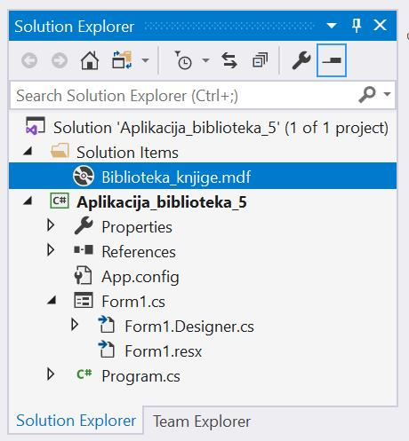
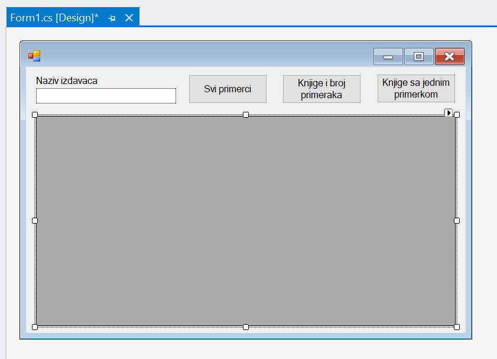
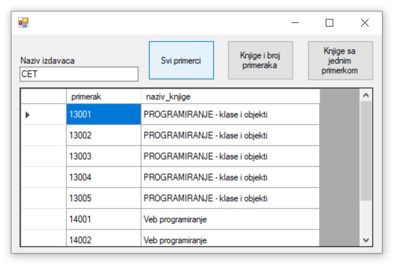
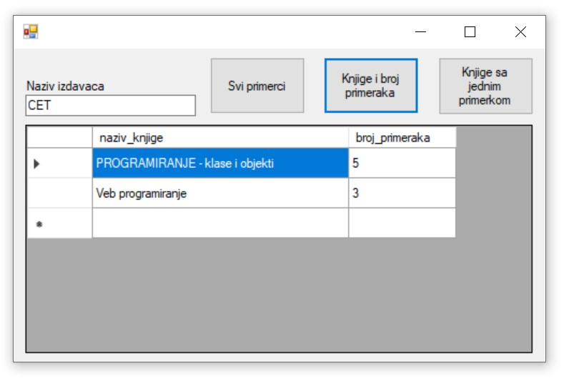
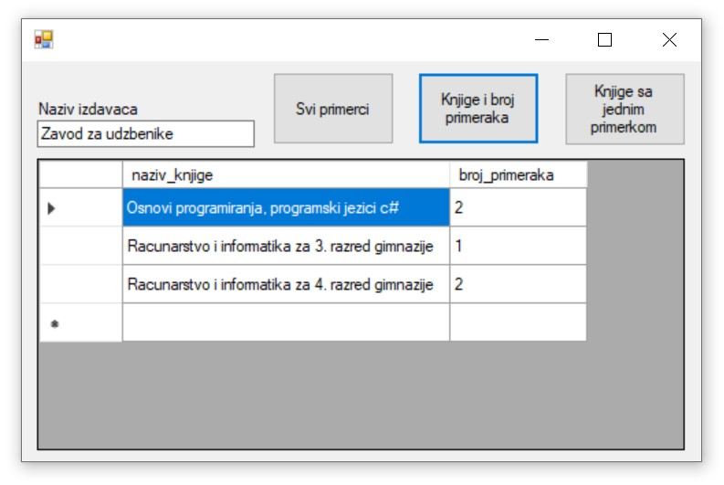
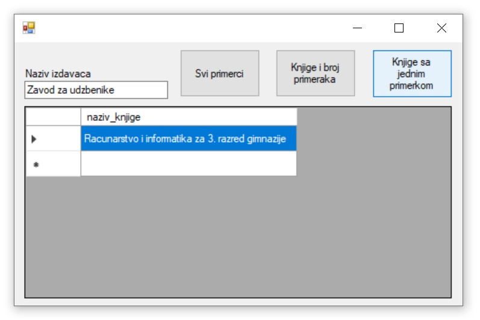

Угнежђени упит SELECT унутар програма - задаци
==============================================

.. suggestionnote::

    Вратимо се на пример да библиотека жели да провери колико има примeрака књига једног издавача да би размислили да ли да набављају још књига тог издавача. За сваки примерак је пожељно да се види и која је књига у питању да би се размотрило могуће додатно набављање и појединих наслова овог издавача који се већ налазе у библиотеци. Потребно је написати програм којим ћемо добити овај извештај. 

Програми се пишу у развојном окружењу *Visual Studio Community* и помоћу програмког језика C#.  

Када се покрене развојно окружење *Visual Studio Community*, потребно је да се креира нови пројекат избором опције *Create a new project*. Изабрани језик треба да буде С#, а врста пројекта *Windows Forms App*, апликација са графичким корисничким интерфејсом. 

У следећем кораку је потребно да се пројекат именује и да се изабере локација на којој ће се пројекат чувати. Може да остане и предложена локација. Кликнути на дугме *Create* и прелазимо у простор за креирање апликације, тј. програма. 

Први корак је додавање раније креиране базе података новом пројекту. У прозору *Solution Explorer* је потребно да се кликне десни тастер миша над називом пројекта, а затим да се изабере *Add/Existing Item...* са менија који се појави. База података коју смо креирали се већ налази на рачунару и потребно је пронаћи и изабрати фајл *Biblioteka_knjige.mdf* у којем је сачувана. Тачна локација може да се провери у систему *SQL Server Management Studio* у којем смо креирали базу. 

За приказ резултата угњежденог упита SELECT, који узима податке из релационе базе података, најбоље је да се користи контрола *DataGridView* коју можемо да превучемо из прозора *Toolbox*.

Потребно је да додамо и поље за унос назива издавача, тј. један *TextBox*, као и три дугмета за различите опције. У прозору *Properties* изменимо својство *Text* за свако дугме тако да на дугмету пише текст који одговара радњи која ће да се догоди када се на дугме кликне. Комплетан дизајн апликације се види на следећој слици. 

Централни део програма је упит којим се приказују инвентарски бројеви и назив књига издавача чији је назив дат. Списак је уређен по називу књиге, а ако имамо више примерака исте књиге, ти примерци ће бити уређени по инвентарском броју

::

    SELECT inventarski_broj primerak, knjige.naziv naziv_knjige
    FROM primerci JOIN knjige ON (primerci.id_knjige=knjige.id_knjige)
    JOIN izdavaci ON (knjige.id_izdavaca=izdavaci.id)
    WHERE izdavaci.naziv = 'CET'
    ORDER BY knjige.naziv, inventarski_broj

Овај упит ћемо да уградимо у програмски код, а на месту назива издавача ћемо налепити текст који се унесе у поље за унос текста. 

Класе које су нам потребне за читање података из базе и њихов приказ у програму се налазе у именском простору *System.Data.SqlClient* који није аутоматски укључен у нови пројекат. Потребно је да додамо следећи ред на врх документа са програмским кодом. 

.. code-block:: Csharp

    using System.Data.SqlClient;

Следи комплетан програмски код којим се приказује тражени списак свих примерака књига једног издавача. Уместо *KONEKCIONI_STRING* треба ставити конекциони стринг који је формиран у ранијим примерима, а односи се на повезивање програма на базу података *Biblioteka_knjige.mdf*. 

.. code-block:: Csharp

    SqlDataAdapter da;
        DataTable dt;
        string con = KONEKCIONI_STRING;

        private void button1_Click(object sender, EventArgs e)
        {
            string izdavac = textBox1.Text;
            string upit = "SELECT inventarski_broj primerak, " +
                "knjige.naziv naziv_knjige "+
                "FROM primerci JOIN knjige ON(primerci.id_knjige = knjige.id_knjige)" +
                "JOIN izdavaci ON(knjige.id_izdavaca = izdavaci.id)" +
                "WHERE izdavaci.naziv = '" + izdavac + "' "+
                "ORDER BY knjige.naziv, inventarski_broj";
            da = new SqlDataAdapter(upit, con);
            dt = new DataTable();
            da.Fill(dt);
            dataGridView1.DataSource = dt;
        }

Све је спремно да се покрене апликација кликом на дугме *Start* и да се тестира прва опција коју смо испрограмирали. На следећој слици може да се види резултат рада програма када се кликне на прво дугме. 

Има смисла да додамо и извештај који приказује за сваку књигу број примерака. Програм можемо да зауставимо тако што затворимо прозор у којем је покренут и вратимо се у развојно окружење.

.. code-block:: Csharp

            private void button2_Click(object sender, EventArgs e)
        {
            string izdavac = textBox1.Text;
            string upit = "SELECT knjige.naziv naziv_knjige, " +
                "COUNT(inventarski_broj) broj_primeraka " +
                "FROM primerci JOIN knjige ON(primerci.id_knjige = knjige.id_knjige)" +
                "JOIN izdavaci ON(knjige.id_izdavaca = izdavaci.id)" +
                "WHERE izdavaci.naziv = '" + izdavac + "' " +
                "GROUP BY knjige.naziv " +
                "ORDER BY knjige.naziv";
            da = new SqlDataAdapter(upit, con);
            dt = new DataTable();
            da.Fill(dt);
            dataGridView1.DataSource = dt;
        }

Апликација се покреће кликом на дугме *Start* и можемо да тестирамо овај извештај. На следеће две слике може да се види резултат рада програма када се кликне на друго дугме за различите издаваче. 

Програм можемо да зауставимо тако што затворимо прозор у којем је покренут и вратимо се у развојно окружење. Додаћемо и програмски код којим се издвајају оне књиге од којих имамо само један примерак у библиотеци. 

.. code-block:: Csharp

    private void button3_Click(object sender, EventArgs e)
        {
            string izdavac = textBox1.Text;
            string upit = "SELECT knjige.naziv naziv_knjige " +
                "FROM primerci JOIN knjige ON(primerci.id_knjige = knjige.id_knjige)" +
                "JOIN izdavaci ON(knjige.id_izdavaca = izdavaci.id)" +
                "WHERE izdavaci.naziv = '" + izdavac + "' " +
                "GROUP BY knjige.naziv " +
                "HAVING COUNT(inventarski_broj) = 1 " +
                "ORDER BY knjige.naziv";
            da = new SqlDataAdapter(upit, con);
            dt = new DataTable();
            da.Fill(dt);
            dataGridView1.DataSource = dt;
        }

Апликација се покреће кликом на дугме *Start* и можемо да тестирамо и овај извештај. На следећој слици може да се види резултат рада програма када се кликне на треће дугме.

