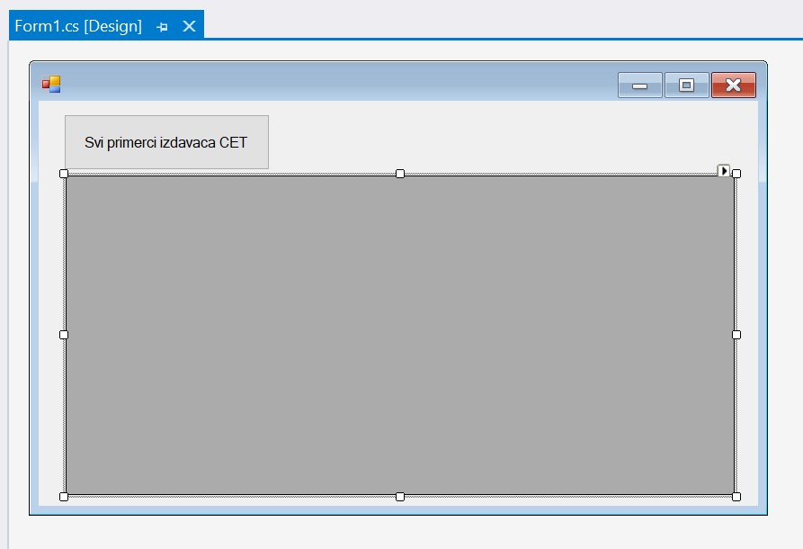
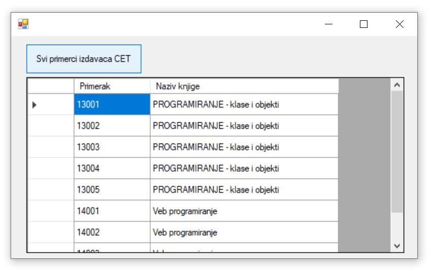
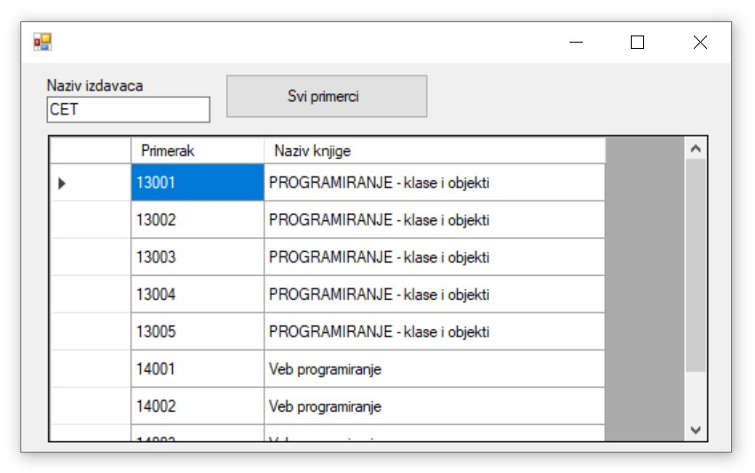
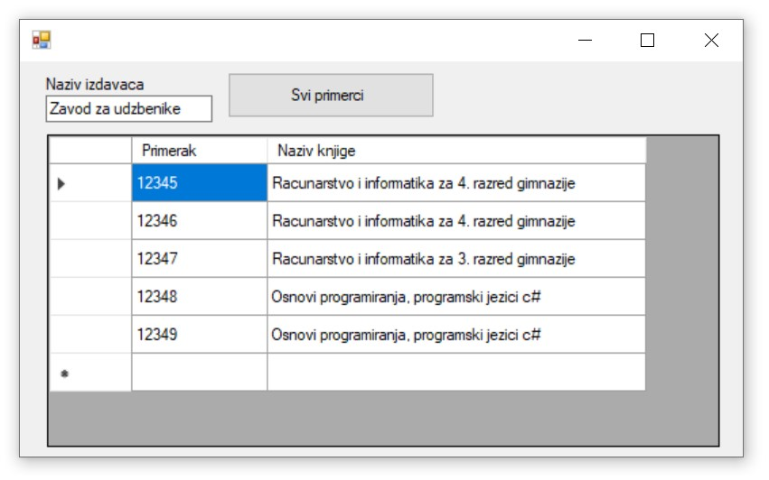

Позив процедуре унутар програма
===============================

.. suggestionnote::

    Видели смо да је могуће приказати у програму и резултат рада неке процедуре коју смо креирали и која је остала сачувана унутар базе података. За разлику од претходног примера, садржај објекта *DataGridView* ћемо попунити наредбама програмског језика C#. 

    Употребом угњежденог упита смо креирали програм којим добијамо извештај који садржи списак свих примерака књига једног издавача и који је библиотеци потребан да би размотрили да ли да набављају још књига тог издавача. Како у бази података имамо креирану и сачувану процедуру која припрема овај исти извештај, приказаћемо решење, тј. програм у којем уместо угњежденог упита, позивамо ову процедуру. 

Програми се пишу у развојном окружењу *Visual Studio Community* и помоћу програмског језика C#.  

Када се покрене развојно окружење *Visual Studio Community*, потребно је да се креира нови пројекат избором опције *Create a new project*. Изабрани језик треба да буде С#, а врста пројекта *Windows Forms App*, апликација са графичким корисничким интерфејсом. 

У следећем кораку је потребно да се пројекат именује и да се изабере локација на којој ће се пројекат чувати. Може да остане и предложена локација. Кликнути на дугме *Create* и прелазимо у простор за креирање апликације, тј. програма. 

Први корак је додавање раније креиране базе података новом пројекту. У прозору *Solution Explorer* је потребно да се кликне десни тастер миша над називом пројекта, а затим да се изабере *Add/Existing Item...* са менија који се појави. База података коју смо креирали се већ налази на рачунару и потребно је пронаћи и изабрати фајл *Biblioteka_knjige.mdf*, у којем је сачувана. Тачна локација може да се провери у систему *SQL Server Management Studio*, у којем смо креирали базу. 

.. image:: ../../_images/slika_37a.jpg
    :width: 540
    :align: center

Прво ћемо позвати процедуру која нема параметре и која приказује списак примерака књига издавача CET. Да се подсетимо како је изгледала та процедура коју смо креирали. 

::

    CREATE PROCEDURE svi_primerci_CET
    AS
        SELECT inventarski_broj "Primerak", knjige.naziv "Naziv knjige"
        FROM primerci JOIN knjige ON (primerci.id_knjige=knjige.id_knjige)
        JOIN izdavaci ON (knjige.id_izdavaca=izdavaci.id)
        WHERE izdavaci.naziv = 'CET';

За приказ резултата рада процедуре који узима податке из релационе базе података је најбоље да се користи контрола *DataGridView*, коју можемо да превучемо из прозора *Toolbox*. Потребно је да додамо и дугме. У прозору *Properties* изменимо својство *Text* за дугме тако да на дугмету пише текст који одговара радњи која ће се догодити када се на дугме кликне. Комплетан дизајн апликације се види на следећој слици. 

Класе које су нам потребне за читање података из базе и њихов приказ у програму се налазе у именском простору *System.Data.SqlClient* који није аутоматски укључен у нови пројекат. Потребно је да додамо следећи ред на врх документа са програмским кодом. 

.. code-block:: Csharp

    using System.Data.SqlClient;

Када позивамо процедуру, као и када имамо угњеждени упит, можемо да направимо објекат *SqlCommand*. Разлика је у томе што сада треба да нагласимо да је ова команда заправо позив процедуре. То постижемо следећом наредбом. 

.. code-block:: Csharp

    cmd.CommandType = CommandType.StoredProcedure;

Следи комплетан програмски код којим се приказује тражени списак свих примерака књига једног издавача. Уместо *KONEKCIONI_STRING* треба ставити конекциони стринг који је формиран у ранијим примерима, а односи се на повезивање програма на базу података *Biblioteka_knjige.mdf*. 

.. code-block:: Csharp

            private void button1_Click(object sender, EventArgs e)
        {
            SqlConnection con = new SqlConnection(KONEKCIONI_STRING);
            SqlDataAdapter da = new SqlDataAdapter();
            SqlCommand cmd = new SqlCommand("dbo.svi_primerci_CET", con);
            cmd.CommandType = CommandType.StoredProcedure;
            da.SelectCommand = cmd;
            DataTable dt = new DataTable();
            da.Fill(dt);
            dataGridView1.DataSource = dt;
        }

Апликација се покреће кликом на дугме *Start* и можемо да тестирамо како ради.

Програм можемо да зауставимо тако што затворимо прозор у којем је покренут и вратимо се у развојно окружење. Потребно је да додамо поље за унос назива издавача и да позовемо процедуру која има параметар тако да програм ради за било ког издавача. 

Да се подсетимо како је изгледала та процедура коју смо креирали и која има један параметар. 

::

    CREATE PROCEDURE svi_primerci_izdavaca @izdavac VARCHAR(40)
    AS
        SELECT inventarski_broj "Primerak", knjige.naziv "Naziv knjige"
        FROM primerci JOIN knjige ON (primerci.id_knjige=knjige.id_knjige)
        JOIN izdavaci ON (knjige.id_izdavaca=izdavaci.id)
        WHERE izdavaci.naziv = @izdavac;

Вредност параметра читамо из поља за унос текста. Потребан нам је један објекат класе *SqlParameter*. Приликом креирања овог објекта, потребно је да наведемо назив параметра из процедуре и чиме га попуњавамо, у овом случају попуњавамо га садржајем поља за унос текста. За параметар је још важно да нагласимо да је улазни, и да је типа *string*. Оригинални параметар је типа VARCHAR, али тај тип не постоји у програмском језику C#.

.. code-block:: Csharp

    SqlParameter param = new SqlParameter("@izdavac", textBox1.Text);
    param.Direction = ParameterDirection.Input;
    param.DbType = DbType.String;
    cmd.Parameters.Add(param);

Следи комплетан програмски код којим се приказује тражени списак свих примерака књига издавача чији је назив унет.

.. code-block:: Csharp

    private void button1_Click(object sender, EventArgs e)
        {
            SqlConnection con = new SqlConnection(KONEKCIONI_STRING);
            SqlDataAdapter da = new SqlDataAdapter();
            SqlCommand cmd = new SqlCommand("dbo.svi_primerci_izdavaca", con);
            cmd.CommandType = CommandType.StoredProcedure;
            SqlParameter param = new SqlParameter("@izdavac", textBox1.Text);
            param.Direction = ParameterDirection.Input;
            param.DbType = DbType.String;
            cmd.Parameters.Add(param);
            da.SelectCommand = cmd;
            DataTable dt = new DataTable();
            da.Fill(dt);
            dataGridView1.DataSource = dt;
        }

Апликација се покреће кликом на дугме *Start* и можемо да тестирамо како ради за различите издаваче.

