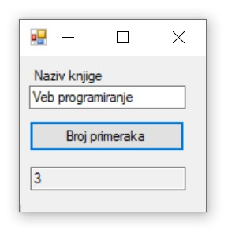
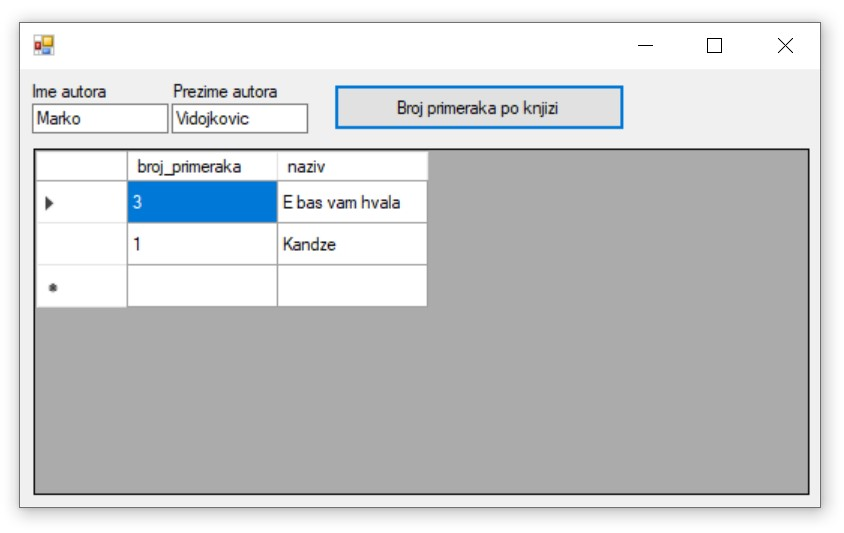
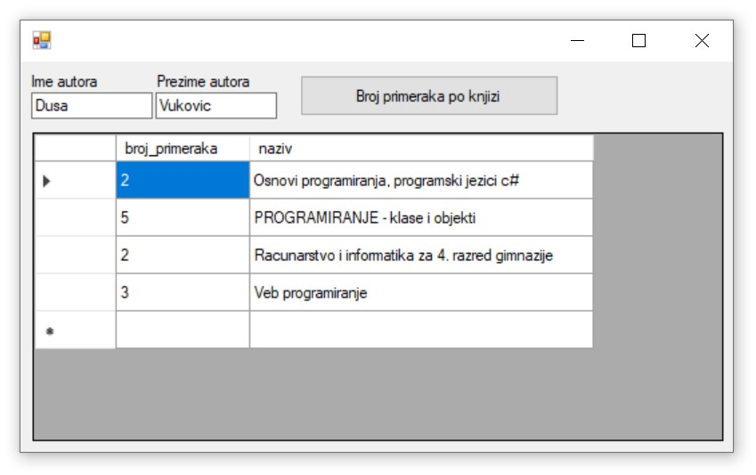

Позив креиране функције унутар програма
========================================

.. suggestionnote::

    Поред процедура, у систему за управљање базама података смо могли да креирамо и функције. Функције остају запамћене у бази података и по потреби могу да се позивају. Имамо две врсте функција: скаларне функције и функције које враћају табелу. Кроз два примера ћемо приказати како се различите врсте функција позивају унутар програма. 

Програми се пишу у развојном окружењу *Visual Studio Community* и помоћу програмског језика C#.  

Када се покрене развојно окружење *Visual Studio Community*, потребно је да се креира нови пројекат избором опције *Create a new project*. Изабрани језик треба да буде С#, а врста пројекта *Windows Forms App*, апликација са графичким корисничким интерфејсом. 

У следећем кораку је потребно да се пројекат именује и да се изабере локација на којој ће се пројекат чувати. Може да остане и предложена локација. Кликнути на дугме *Create* и прелазимо у простор за креирање апликације, тј. програма. 

Први корак је додавање раније креиране базе података новом пројекту. У прозору *Solution Explorer* је потребно да се кликне десни тастер миша над називом пројекта, а затим да се изабере *Add/Existing Item...* са менија који се појави. База података коју смо креирали се већ налази на рачунару и потребно је пронаћи и изабрати фајл *Biblioteka_knjige.mdf*, у којем је сачувана. Тачна локација може да се провери у систему *SQL Server Management Studio*, у којем смо креирали базу. 

Класе које су нам потребне за читање података из базе и њихов приказ у програму се налазе у именском простору *System.Data.SqlClient*, који није аутоматски укључен у нови пројекат. Потребно је да додамо следећи ред на врх документа са програмским кодом. 

.. code-block:: Csharp

    using System.Data.SqlClient;

Узмимо функцију која за дати назив књиге враћа број примерака. Унутар система *SQL Sever Management Studio* можемо да погледамо програмски код те функције. 

::

    CREATE FUNCTION broj_primeraka_knjige (@naziv_knjige VARCHAR(50))
    RETURNS INT
    AS 
    BEGIN
        DECLARE @broj INT;
        SELECT @broj = COUNT(inventarski_broj)
        FROM primerci JOIN knjige ON (primerci.id_knjige=knjige.id_knjige)
        WHERE naziv = @naziv_knjige;
        RETURN @broj;
    END

Можемо да формирамо упит који позива ову функцију, а на месту параметра стављамо садржај поља за унос текста. 

.. code-block:: Csharp

    string cmdText = "SELECT dbo.broj_primeraka_knjige('" + textBox1.Text + "')";

Како је ова функција скаларна и враћа један број, потребна нам је целобројна променљива и да нагласимо да се ради о позиву скаларне функције *ExecuteScalar*. 

.. code-block:: Csharp

    int broj = Convert.ToInt32(cmd.ExecuteScalar());

Што се дизајна апликације тиче, потребно нам је поље за унос назива књиге, дугме и једно поље за приказ броја књига. Следи комплетан програмски код. Уместо *KONEKCIONI_STRING* треба ставити конекциони стринг који је формиран у ранијим примерима, а односи се на повезивање програма на базу података *Biblioteka_knjige.mdf*. 

.. code-block:: Csharp

    private void button1_Click(object sender, EventArgs e)
        {
            SqlConnection con = new SqlConnection(KONEKCIONI_STRING);
            string cmdText;
            cmdText = "SELECT dbo.broj_primeraka_knjige('" + textBox1.Text + "')";
            SqlCommand cmd = new SqlCommand(cmdText, con);
            con.Open();
            int broj = Convert.ToInt32(cmd.ExecuteScalar());
            textBox2.Text = broj.ToString();
        }

Апликација се покреће кликом на дугме *Start* и можемо да тестирамо како ради.

У другом програму ћемо приказати како се позива функција која враћа табелу. Узмимо функцију која за дато име и презиме аутора враћа списак његових књига и за сваку књигу број примерака. Унутар система *SQL Sever Management Studio* можемо да погледамо програмски код те функције. 

::

    CREATE FUNCTION broj_primeraka_po_knjizi_autora (@ime VARCHAR(15), @prezime VARCHAR(15))
    RETURNS TABLE
    AS
    RETURN SELECT COUNT(inventarski_broj) AS broj_primeraka, naziv
    FROM primerci JOIN knjige ON (primerci.id_knjige=knjige.id_knjige)
    JOIN autori_knjige ON (autori_knjige.id_knjige=knjige.id_knjige)
    JOIN autori ON (autori_knjige.id_autora=autori.id_autora)
    WHERE ime = @ime AND prezime = @prezime
    GROUP BY naziv

За позив функције која враћа табелу нам треба угњеждени упит у којем, уместо да податке читамо из неке табеле, читамо их из позива ове функције. 

.. code-block:: Csharp

    private void button1_Click(object sender, EventArgs e)
        {
            string ime = textBox1.Text;
            string prezime = textBox2.Text;

            string cmd = "SELECT * FROM broj_primeraka_po_knjizi_autora(";
            cmd += "'" + ime + "', ";
            cmd += "'" + prezime + "')";

            string conText = KONEKCIONI_STRING;
            SqlDataAdapter da = new SqlDataAdapter(cmd, conText);
            DataTable dt = new DataTable();
            da.Fill(dt);
            dataGridView1.DataSource = dt;
        }

Апликација се покреће кликом на дугме *Start* и можемо да тестирамо како ради за различите ауторе.

