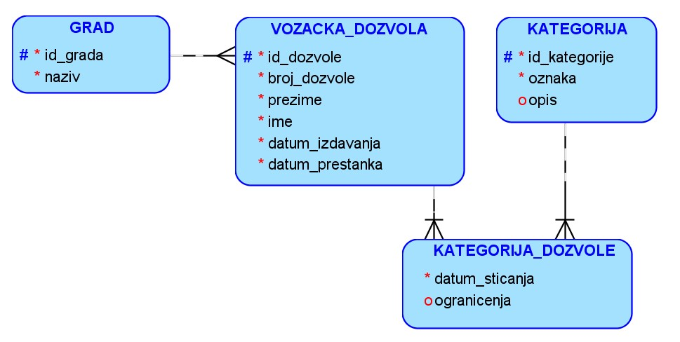
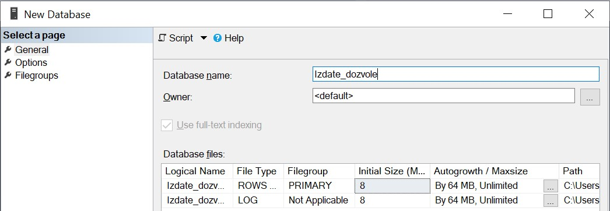
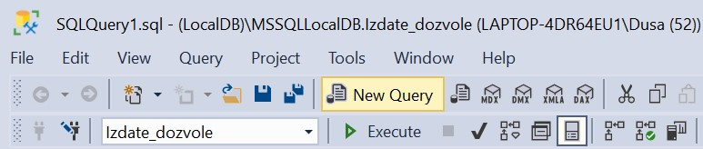
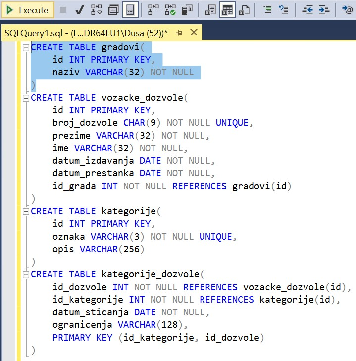
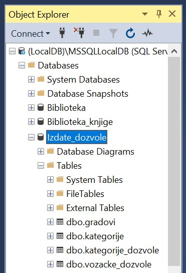

База података за возачке дозволе - креирање базе
================================================

.. suggestionnote::

    Следи један практичан задатак инспирисан стварним примером из живота у којем се ради са великим количинама података. Креираћемо базу података за евиденцију издатих возачких дозвола. 

    Приказани пример базе података ћемо касније употребити тако што ћемо креирати програме у којима ћемо јој приступати. 

Возачке дозволе су издате у различитим градовима. За град чувамо назив, али је у плану проширење базе и чуваћемо више различитих података као што је, на пример, број становника, број регистрованих возила и слично. Свака дозвола има број дозволе, име и презиме особе, датум издавања и датум до када важи. На дозволи могу да се нађу различите категорије и за сваку је познат датум стицања. Категорије су: AM, A1, A2, A, B1, B, BE, C1, C1E, C, CE, D1, D1E, D, DE, F и M. Свака категорија има неки опис. Најчешћа категорија је категорија В и за њу би опис могао да буде: „Za upravljanje motornim vozilom, čija masa ne prelazi 3500 kg i koja nemaju više od 9 mesta za sedenje“.

Унети у базу податке о свим категоријама и о четири возачке дозволе издате у Београду. Јанко Мировић и Филип Цагић имају само категорију В. Јанкова дозвола има број 001579640, важи од 28. априла 2022. године до 15. марта 2026. године, а категорију је стекао 21. априла 2022. године. Филипова дозвола има број 001579375, важи од 23. септембра 2022. године, када је и стекао В категорију, до 5. марта 2026. године. Душа Вуковић је 3. октобра 1995. године стекла категорије: AM, B1, B, BE, F и M, а има дозволу са бројем 001560375, која важи десет година од датума издавања 8. маја 2014. године. Возачка дозвола са бројем 000123175 припада Браниславу Зорановићу. Дозвола важи десет година, од 17. маја 2020. године када је стекао категорију А2. Осим те категорије, дозвола има и категорију В, која је стечена 15. септембра 2016. године.

На следећој слици је приказан модел базе након чега следе и нека објашњења како се до овог модела дошло. 

Број возачке дозволе је јединствен, али није најбољи избор за примарни кључ, па ће се увести нови идетификациони број. Због водећих нула, број возачке дозволе је добро да буде текстуални податак фиксиране дужине.

Свака возачка дозвола је издата тачно у једом граду, а у истом граду је издато више возачких дозвола, па је веза између ентитета GRAD и VOZACKA_DOZVOLA један-према-више. 

Уз податке о возачкој дозволи се чува и идентификациони број града у којем је издата. Тако ће, уз све податке који описују возачку дозволу коју је добио Бранислав Зорановић, на крају да стоји и број 1, који представља идентификациони број града Београда. 

::

    INSERT INTO vozacke_dozvole
    (id, broj_dozvole, prezimе, ime, datum_izdavanja, datum_prestanka, id_grada)
    VALUES (4, '000123175', 'Zoranovic', 'Branislav', '2020-05-17', '2030-05-17', 1)

Возачка дозвола Јанка Мировића је такође издата у Београду, па је и код њега унет идентификациони број 1 као вредност страног кључа који се односи на место издавања дозволе. Случајност је да је идентификациони број Јанкове возачке дозволе такође 1, али та вредност нема везе са идентификацијом града. Различите табеле за идентификационе бројеве често користе редом вредности 1, 2, 3, 4, и тако даље. 

::

    INSERT INTO vozacke_dozvole
    (id, broj_dozvole, prezimе, ime, datum_izdavanja, datum_prestanka, id_grada)
    VALUES (1, '001579640', 'Mirovic', 'Janko', '2022-04-28', '2026-03-15', 1)

Као што можемо да видимо из датих података, на четири различите возачке дозволе се налази категорија В, а две дозволе имају више од једне категорије. Веза између ентитета VOZACKA_DOZVOLA и KATEGORIJA је више-према-више. То значи да имамо посебан ентитет, односно имаћемо посебну табелу, која ће представљати ову везу. Табела у бази података ће имати комбинацију кључева којом се јасно представља на којој дозволи се налази која категорија. 

Уколико Бранислав Зорановић има дозволу на којој има две категорије, у табели *kategorije_dozvole* ће бити два реда која се односе на ову дозволу. У тим редовима ће бити записане две различите комбинације идентификационог броја возачке дозволе и идентификационих бројева категорија. Уколико је идентификациони број дозволе 4, а идентификациони бројеви категорија В и А2 су редом 6 и 3, а датуми стицања тих категорија су редом 15. септембар 2016. године и 17. мај 2020. године, следе два реда која се уносе у табелу *kategorije_dozvole*, а односе се на ову једну дозволу и две категорије на њој. 

::

    INSERT INTO kategorije_dozvole
    (id_dozvole, id_kategorije, datum_sticanja, ogranicenja)
    VALUES (4, 6, '2016-09-15', NULL)

    INSERT INTO kategorije_dozvole
    (id_dozvole, id_kategorije, datum_sticanja, ogranicenja)
    VALUES (4, 3, '2020-05-17', NULL)

Креирати базу података за библиотеку употребом алата **SQL Server Management Studio**. 

Кликнути десни тастер миша над **Databases** у прозору *Object Explorer** и изабрати *New Database...*

.. image:: ../../_images/slika_131b.jpg
    :width: 780
    :align: center

Унети назив нове базе података и кликнути дугме OK. 

Новокреирана база података се појавила на списку у прозору *Object Explorer*. Кликнути дугме *New Query* испод главног падајућег менија. 

Прво извршити све **CREATE TABLE** команде, једну по једну.

.. infonote::

    **ВАЖНО: Редослед је битан!** Пре креирања табеле која има страни кључ неопходно је креирати табелу на коју она показује. 

Све команде могу да се истовремено прекопирају, али се свака појединачно прво означи мишем и за сваку означену команду се кликне *Execute*, као што је приказано на следећој слици. 

Након сваке успешно извршене команде појави се одговарајућа порука.

Након што се свака команда изврши, све табеле ће остати сачуване у бази података за даљу употребу. Фајл *SQLQuery1.sql* може, а и не мора да се сачува.

Следе све CREATE TABLE команде за табеле базе података за библиотеку. 

::

    CREATE TABLE gradovi(
    id INT PRIMARY KEY,
    naziv VARCHAR(32) NOT NULL
    )

    CREATE TABLE vozacke_dozvole(
    id INT PRIMARY KEY,
    broj_dozvole CHAR(9) NOT NULL UNIQUE,
    prezime VARCHAR(32) NOT NULL,
    ime VARCHAR(32) NOT NULL,
    datum_izdavanja DATE NOT NULL,
    datum_prestanka DATE NOT NULL,
    id_grada INT NOT NULL REFERENCES gradovi(id)
        )

    CREATE TABLE kategorije(
    id INT PRIMARY KEY,
    oznaka VARCHAR(3) NOT NULL UNIQUE,
    opis VARCHAR(256)
    )

    CREATE TABLE kategorije_dozvole(
    id_dozvole INT NOT NULL REFERENCES vozacke_dozvole(id),
    id_kategorije INT NOT NULL REFERENCES kategorije(id),
    datum_sticanja DATE NOT NULL,
    ogranicenja VARCHAR(128),
    PRIMARY KEY (id_kategorije, id_dozvole)
    ) 

Након што су све табеле креиране, појављују се на списку у прозору *Object Explorer*. Ако се не виде, потребно је кликнути *Refresh*. 

Уколико је прозор за писање команди угашен, кликнути поново дугме *New Query* испод главног падајућег менија. Све команде могу да се истовремено прекопирају, али се свака појединачно прво означи мишем и за сваку означену команду се кликне *Execute*. 

Након што се свака команда изврши, сви подаци ће остати сачувани у бази података за даљу употребу. Фајл *SQLQuery1.sql* може, а и не мора да се сачува.

Извршити све **INSERT INTO** команде, једну по једну. Када редом уносимо податке у све колоне, можемо да изоставимо списак назива колона.

.. infonote::

    **ВАЖНО: Редослед је битан!**

::

    INSERT INTO gradovi
    VALUES (1, 'BEOGRAD')

    INSERT INTO vozacke_dozvole
    VALUES (1, '001579640', 'Mirovic', 'Janko', '2022-04-28', '2026-03-15', 1)

    INSERT INTO vozacke_dozvole
    VALUES (2, '001579375', 'Cagic', 'Filip', '2022-09-23', '2026-03-05', 1)

    INSERT INTO vozacke_dozvole
    VALUES (3, '001560375', 'Vukovic', 'Dusa', '2014-05-08', '2024-05-08', 1)

    INSERT INTO vozacke_dozvole
    VALUES (4, '000123175', 'Zoranovic', 'Branislav', '2020-05-17', '2030-05-17', 1)

    INSERT INTO kategorije
    VALUES (1, 'AM', NULL)

    INSERT INTO kategorije
    VALUES (2, 'A1', NULL)

    INSERT INTO kategorije
    VALUES (3, 'A2', NULL)

    INSERT INTO kategorije
    VALUES (4, 'A', NULL)

    INSERT INTO kategorije
    VALUES (5, 'B1', NULL)

    INSERT INTO kategorije
    VALUES (6, 'B', 
    'Za upravljanje motornim vozilom, čija masa ne prelazi 3500 kg i koja nemaju više od 9 mesta za sedenje')

    INSERT INTO kategorije
    VALUES (7, 'BE', NULL)

    INSERT INTO kategorije
    VALUES (8, 'C1', NULL)

    INSERT INTO kategorije
    VALUES (9, 'C1E', NULL)

    INSERT INTO kategorije
    VALUES (10, 'C', NULL)

    INSERT INTO kategorije
    VALUES (11, 'CE', NULL)

    INSERT INTO kategorije
    VALUES (12, 'D1', NULL)

    INSERT INTO kategorije
    VALUES (13, 'D1E', NULL)

    INSERT INTO kategorije
    VALUES (14, 'D', NULL)

    INSERT INTO kategorije
    VALUES (15, 'DE', NULL)

    INSERT INTO kategorije
    VALUES (16, 'F', NULL)

    INSERT INTO kategorije
    VALUES (17, 'M', NULL)

    INSERT INTO kategorije_dozvole
    VALUES (1, 6, '2022-04-21', NULL)

    INSERT INTO kategorije_dozvole
    VALUES (2, 6, '2022-09-23', NULL)

    INSERT INTO kategorije_dozvole
    VALUES (3, 1, '1995-10-03', NULL)

    INSERT INTO kategorije_dozvole
    VALUES (3, 6, '1995-10-03', NULL)

    INSERT INTO kategorije_dozvole
    VALUES (3, 5, '1995-10-03', NULL)

    INSERT INTO kategorije_dozvole
    VALUES (3, 7, '1995-10-03', NULL)

    INSERT INTO kategorije_dozvole
    VALUES (3, 17, '1995-10-03', NULL)

    INSERT INTO kategorije_dozvole
    VALUES (3, 16, '1995-10-03', NULL)

    INSERT INTO kategorije_dozvole
    VALUES (4, 6, '2016-09-15', NULL)

    INSERT INTO kategorije_dozvole
    VALUES (4, 3, '2020-05-17', NULL)
