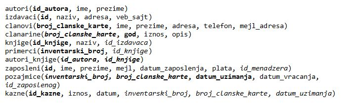

Језик PL/SQL и наредба SELECT INTO – задаци
============================================

.. suggestionnote::

    Следе примери једноставних програма написаних у језику PL/SQL који узимају и обрађују податке из базе података за библиотеку. Сваки пример има угњеждену наредбу SELECT INTO, којом се узима један ред из базе. 

Програми се пишу у едитору у оквиру онлајн окружења *Oracle APEX*, а покрећу се кликом на дугме **Run**:

- https://apex.oracle.com/en/ (обавезно логовање на креирани налог)
- SQL Workshop
- SQL Commands

Креирати PL/SQL програме који узимају податке из базе података библиотеке. Следи списак свих табела са колонама. Примарни кључеви су истакнути болд, а страни италик. 

.. questionnote::

    1. Приказати име, презиме и телефон члана библиотеке са бројем чланске карте 22. Име и презиме приказати спојено. 

Погледајмо прво једноставан упит којим ове податке узимамо из базе података. 

::

    SELECT ime||' '||prezime, telefon
    FROM clanovi WHERE broj_clanske_karte=22;

Када покренемо овај упит добијамо табеларни приказ. 

Овакав приказ може да буде непрегледан за неке сложеније задатке, па је једна од првих предности писања PL/SQL програма управо могућност форматирања приказа података из базе података у облику који је прегледнији и читљивији.  

Потребно је да за сваки податак декларишемо променљиву и да упит, приликом угњеждавања у програмски код, проширимо са INTO делом да би податке из табеле учитали у променљиве. 
::

    DECLARE
        v_clan VARCHAR2(150);
        v_telefon clanovi.telefon%TYPE;
    BEGIN
        SELECT ime||' '||prezime, telefon INTO v_clan, v_telefon
        FROM clanovi WHERE broj_clanske_karte=22;
        DBMS_OUTPUT.PUT_LINE('Ime i prezime clana: '||v_clan);
        DBMS_OUTPUT.PUT_LINE('Telefon: '|| v_telefon);
    EXCEPTION
        WHEN NO_DATA_FOUND THEN
            DBMS_OUTPUT.PUT_LINE('Nepostojeci broj clanske karte');
        WHEN TOO_MANY_ROWS THEN
            DBMS_OUTPUT.PUT_LINE('Vise redova odgovara zahtevu');
        WHEN OTHERS THEN
            DBMS_OUTPUT.PUT_LINE('Greska');
    END

Погледајмо шта се дешава када се исти програм покрене за број чланске карте 11111. 

Уколико обришемо WHERE део упита и покренемо програм, добићемо поруку о грешци зато што наредба SELECT INTO узима податке из само једног реда, па када упит враћа више редова, аутоматски се испаљује изузетак.

Следи решење са једном сложеном променљивом.  

::

    DECLARE
        v_clan clanovi%ROWTYPE;
    BEGIN
        SELECT * INTO v_clan
        FROM clanovi WHERE broj_clanske_karte=22;
        DBMS_OUTPUT.PUT_LINE('Ime i prezime clana: '||v_clan.ime||' '||v_clan.prezime);
        DBMS_OUTPUT.PUT_LINE('Telefon: '|| v_clan.telefon);
    EXCEPTION
        WHEN OTHERS THEN
            DBMS_OUTPUT.PUT_LINE('Greska');
    END

.. questionnote::

    2. Приказати име, презиме и телефон члана библиотеке са датим бројем чланске карте. Име и презиме приказати спојено. Број чланске карте се уноси са тастатуре. 

Решење које следи је само надоградња претходног програма. Да би програм који смо малопре написали био шире применљив, има смисла да за било ког члана на основу броја чланске карте добијемо потребне податке о њему. Додајемо једну променљиву *v_broj* у коју ћемо са тастатуре унети број чланске карте а вредност ове променљиве ћемо да употребимо у упиту да издвојимо баш податке који нам требају. 

::

    DECLARE
        v_broj clanovi.broj_clanske_karte%TYPE;
        v_clan VARCHAR2(150);
        v_telefon clanovi.telefon%TYPE;
    BEGIN
        v_broj := :broj_cl_karte;
        SELECT ime||' '||prezime, telefon INTO v_clan, v_telefon
        FROM clanovi WHERE broj_clanske_karte=v_broj;
        DBMS_OUTPUT.PUT_LINE('Ime i prezime clana: '||v_clan);
        DBMS_OUTPUT.PUT_LINE('Telefon: '||v_telefon);
    EXCEPTION
        WHEN NO_DATA_FOUND THEN
            DBMS_OUTPUT.PUT_LINE('Nepostojeci broj clanske karte');
        WHEN OTHERS THEN
            DBMS_OUTPUT.PUT_LINE('Greska');
    END

.. questionnote::

    3. Приказати број примерака у библиотеци издавача чији је назив CET.

Упити које пишемо унутар PL/SQL програма могу да буду сложени, да имају и пројекцију, и селекцију, и спајање табела, као и употребу функција, укључујући и групне функције. Као што смо већ видели, када добијемо задатак да напишемо програм, потребно је прво размислити о самом упиту којим се узимају подаци из базе, а када се тај део добро разради и реши, додајемо и програм у којем се упит користи.  

У овом задатку је потребно повезати три табеле. Када се примарни и страни кључ зову исто, могуће је употребити спајање са USING, где се у загради само наводи тај исти назив по којем се ради спајање.

Потребно је применити и групну функцију која ће пребројати примерке.

::

    SELECT COUNT(inventarski_broj)
    FROM izdavaci JOIN knjige ON(knjige.id_izdavaca=izdavaci.id)
    JOIN primerci USING (id_knjige)
    WHERE izdavaci.naziv = 'CET';

Следи комплетно решење у виду PL/SQL програма. 

::

    DECLARE
        broj NUMBER(5);
    BEGIN
        SELECT COUNT(inventarski_broj) INTO broj 
        FROM izdavaci JOIN knjige ON(knjige.id_izdavaca=izdavaci.id)
        JOIN primerci USING (id_knjige)
        WHERE izdavaci.naziv = 'CET';
        DBMS_OUTPUT.PUT_LINE('Broj primeraka: '||broj);
    END

.. questionnote::

    4. Приказати податке о менаџеру запосленог са унетим идентификационим бројем. Идентификациони број се уноси са тастатуре. 

У решењу које следи је употребљен подупит који налази идентификациони број менаџера запосленог чији је идентификациони број унет са тастатуре. Спољни упит налази презиме менаџера. 

::

    DECLARE
        v_broj zaposleni.id%TYPE;
        v_prezime zaposleni.prezime%TYPE;
    BEGIN
        v_broj := :id_zaposlenog;
        SELECT prezime INTO v_prezime
        FROM zaposleni WHERE id=(SELECT id_menadzera FROM zaposleni
                                            WHERE id=v_broj);
        DBMS_OUTPUT.PUT_LINE('Prezime menadzera: '||v_prezime);       
    EXCEPTION
        WHEN NO_DATA_FOUND THEN
            DBMS_OUTPUT.PUT_LINE('Nepostojeci broj clanske karte');
        WHEN OTHERS THEN
            DBMS_OUTPUT.PUT_LINE('Greska');
    END

.. questionnote::

    5. Приказати презиме запосленог и презиме његовог менаџера за запосленог са идентификационим бројем 3.

Један начин да се задатак реши је употребом упита у којем један примерак табеле *zaposleni*, који смо кратко назвали *z*, и из којег узимамо податке о запосленом, спајамо са другим примерком табеле *zaposleni* који смо кратко назвали *m*, и из које узимамо податке о менаџеру. 

::

    DECLARE
        v_zaposleni zaposleni.prezime%TYPE;
        v_menadzer zaposleni.prezime%TYPE;
    BEGIN
        SELECT z.prezime, m.prezime INTO v_zaposleni, v_menadzer
        FROM zaposleni z JOIN zaposleni m
        ON (z.id_menadzera=m.id) WHERE z.id=3;
        DBMS_OUTPUT.PUT_LINE('Prezime zapolsenog: '||v_zaposleni); 
        DBMS_OUTPUT.PUT_LINE('Prezime menadzera: '||v_menadzer);       
    EXCEPTION
        WHEN NO_DATA_FOUND THEN
            DBMS_OUTPUT.PUT_LINE('Nema zaposlenog sa id=3');
        WHEN OTHERS THEN
            DBMS_OUTPUT.PUT_LINE('Greska');
    END

Тражене податке могли смо да добијемо писањем једног упита у језику SQL. 

::

    SELECT z.prezime, m.prezime 
    FROM zaposleni z JOIN zaposleni m
    ON (z.id_menadzera=m.id) WHERE z.id=3;

Задатак може да се реши и једноставније, без писања овог сложеног спајања које је најјкомпликованије које сте видели у свим примерима, спајање два примерка исте табеле *zaposleni*, која има страни кључ који показује на њен примарни кључ. 

Решење које следи никако није могло да се добије чистом употребом упитног језика SQL и ово је још један пример где нам програмирање помаже да решавамо проблеме једноставније него да користимо само језик SQL. Једним упитом добијамо презиме запосленог и идентификациони број његовог менаџера, а следећим упитом на основу тог идентификационог броја добијамо презиме менаџера. 

::

    DECLARE
        v_zaposleni zaposleni.prezime%TYPE;
        v_id_menadzera zaposleni.id%TYPE;
        v_menadzer zaposleni.prezime%TYPE;
    BEGIN
        --prezime zaposlenog i identifikacioni broj njegovog menadzera
        SELECT prezime, id_menadzera INTO v_zaposleni, v_id_menadzera
        FROM zaposleni WHERE id=3;
        --prezime menadzera
        SELECT prezime INTO v_menadzer
        FROM zaposleni WHERE id=v_id_menadzera;
        DBMS_OUTPUT.PUT_LINE('Prezime zapolsenog: '||v_zaposleni); 
        DBMS_OUTPUT.PUT_LINE('Prezime menadzera: '||v_menadzer);       
    EXCEPTION
        WHEN NO_DATA_FOUND THEN
            DBMS_OUTPUT.PUT_LINE('Nema zaposlenog sa id=3');
        WHEN OTHERS THEN
            DBMS_OUTPUT.PUT_LINE('Greska');
    END

.. questionnote::

    6. Приказати да ли менаџер са идентификационим бројем 2 има тим који се састоји од више од 2 радника или не. 

У PL/SQL програмима које пишемо можемо да користимо и наредбе као што су наредбе гранања и циклуса, које нам омогућавају да решимо већи скуп задатака у односу на оно што можемо да решимо уколико само користимо језик SQL. 

::

    DECLARE
        br NUMBER(2);
    BEGIN
        SELECT COUNT(*) INTO br
        FROM zaposleni 
        WHERE id_menadzera=2;
        IF br > 2 THEN
            DBMS_OUTPUT.PUT_LINE('Tim ima vise od 2 zaposlena');
        ELSE 
            DBMS_OUTPUT.PUT_LINE('Tim nema vise od 2 zaposlena');
        END IF;
    END

.. questionnote::

    7. Проверити да ли је Пупавац Војин менаџер радника Јовић Александра.

::

    DECLARE
        v_ime zaposleni.ime%TYPE;
        v_prezime zaposleni.prezime%TYPE;
        v_id_menadzera zaposleni.id_menadzera%TYPE;
        v_ime_menadzera zaposleni.ime%TYPE;
        v_prezime_menadzera zaposleni.prezime%TYPE;
    BEGIN
        SELECT id_menadzera INTO v_id_menadzera
        FROM zaposleni 
        WHERE UPPER(ime) = 'ALEKSANDAR' AND UPPER(prezime)='JOVIC';

        SELECT ime, prezime INTO v_ime_menadzera, v_prezime_menadzera
        FROM zaposleni 
        WHERE id = v_id_menadzera;

        IF UPPER(v_ime_menadzera) = 'VOJIN' AND UPPER(v_prezime_menadzera) = 'PUPAVAC' THEN
            DBMS_OUTPUT.PUT_LINE('Vojin je menadzer Aleksandru');
        ELSE 
            DBMS_OUTPUT.PUT_LINE('Vojin nije menadzer Aleksandru');
        END IF;
    END

.. questionnote::

    8. Приказати податке о запосленом који ради најдуже. Предвидети обраду изузетка уколико постоји више од једног запосленог који испуњавају овај услов. 

Следи прво решење у којем користимо упит са подупитом. 

::

    DECLARE
        v_zaposleni zaposleni%ROWTYPE;
    BEGIN
        SELECT * INTO v_zaposleni FROM zaposleni
        WHERE datum_zaposlenja = (SELECT MIN(datum_zaposlenja) FROM zaposleni);
        DBMS_OUTPUT.PUT_LINE(v_zaposleni.ime||' '||v_zaposleni.prezime);
        DBMS_OUTPUT.PUT_LINE('Mejl: '||v_zaposleni.mejl);
    EXCEPTION
        WHEN TOO_MANY_ROWS THEN
            DBMS_OUTPUT.PUT_LINE('Postoji vise zaposlenih koji su poceli da rade istog dana');
        WHEN NO_DATA_FOUND THEN
            DBMS_OUTPUT.PUT_LINE('Ne postoje zaposleni');  
        WHEN OTHERS THEN
            DBMS_OUTPUT.PUT_LINE('Greska');
    END

Други начин је да употребимо две наредбе SELECT INTO. 

::
    
    DECLARE
        v_zaposleni zaposleni%ROWTYPE;
        najstariji_datum zaposleni.datum_zaposlenja%TYPE;
    BEGIN
        SELECT MIN(datum_zaposlenja) INTO najstariji_datum
        FROM zaposleni;
        SELECT * INTO v_zaposleni 
        FROM zaposleni
        WHERE datum_zaposlenja = najstariji_datum;
        DBMS_OUTPUT.PUT_LINE(v_zaposleni.ime||' '||v_zaposleni.prezime);
        DBMS_OUTPUT.PUT_LINE('Mejl: '||v_zaposleni.mejl);
    EXCEPTION
        WHEN TOO_MANY_ROWS THEN
            DBMS_OUTPUT.PUT_LINE('Postoji vise zaposlenih koji su poceli da rade istog dana');
    WHEN NO_DATA_FOUND THEN
        DBMS_OUTPUT.PUT_LINE('Ne postoje zaposleni');  
    WHEN OTHERS THEN
        DBMS_OUTPUT.PUT_LINE('Greska');
    END

.. questionnote::

    9. Приказати податке о запосленима којима је менаџер са идентификационим бројем 3.

Овај задатак не треба да се решава помоћу SELECT INTO зато што упит враћа више редова. 

Можемо да напишемо програмски код и предвидимо изузетак TOO_MANY_ROWS. 

::

    DECLARE
        v_broj zaposleni.id%TYPE;
        v_prezime zaposleni.prezime%TYPE;
    BEGIN
        SELECT prezime INTO v_prezime
        FROM zaposleni WHERE id_menadzera=3;
        DBMS_OUTPUT.PUT_LINE('Prezime menadzera: '||v_prezime);       
    EXCEPTION
        WHEN TOO_MANY_ROWS THEN
            DBMS_OUTPUT.PUT_LINE('Postoji vise od jednog zaposlenog');
        WHEN OTHERS THEN
            DBMS_OUTPUT.PUT_LINE('Greska');
    END

Након покретања програма, приказаће се порука. 

За неки други тим у библиотеци би овај програм можда и прорадио, уколико бисмо имали ситуацију да код неког менаџера имамо само једног запосленог. У примеру података у нашој бази немамо такав случај. 