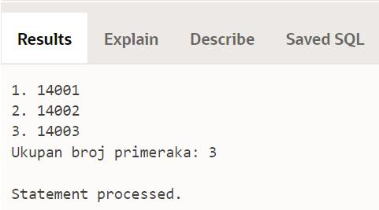
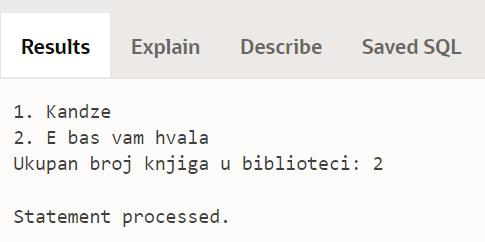

Курсори - задаци
================

.. suggestionnote::

    Следе примери програма написаних у језику PL/SQL који користе курсоре. У решењима ће бити илустрован и експлицитан и имплицитан начин рада са курсором. 

Програми се пишу у едитору у оквиру онлајн окружења *Oracle APEX*, а покрећу се кликом на дугме **Run**:

- https://apex.oracle.com/en/ (обавезно логовање на креирани налог)
- SQL Workshop
- SQL Commands

Креирати PL/SQL програме који узимају податке из базе података библиотеке. Следи списак свих табела са колонама. Примарни кључеви су истакнути болд, а страни италик. 

.. image:: ../../_images/slika_73a.jpg
   :width: 600
   :align: center

.. questionnote::

    1. Приказати инвентарске бројеве свих примерака књиге „Veb-programiranje“ која може да се користи за истоимени предмет у четвртом разреду. 

Погледајмо прво упит којим ове податке узимамо из базе података. 

::

    SELECT inventarski_broj
    FROM primerci JOIN knjige ON (primerci.id_knjige=knjige.id_knjige)
    WHERE naziv='Veb programiranje'

У програму ћемо креирати курсор који је везан за овај упит. Прво ћемо радити експлицитно са курсором. 

::

    DECLARE
        CURSOR kursor_primerci IS SELECT inventarski_broj
            FROM primerci JOIN knjige ON (primerci.id_knjige=knjige.id_knjige)
            WHERE naziv='Veb programiranje';
        v_red kursor_primerci%ROWTYPE;
    BEGIN
        OPEN kursor_primerci;
        LOOP
            FETCH kursor_primerci INTO v_red;
            EXIT WHEN kursor_primerci%NOTFOUND;
            DBMS_OUTPUT.PUT_LINE(v_red.inventarski_broj);
        END LOOP;
        CLOSE kursor_primerci;
    END

Можемо програм да проширимо тако што ћемо увести и редне бројеве за примерке. 

::

    DECLARE
        CURSOR kursor_primerci IS SELECT inventarski_broj
            FROM primerci JOIN knjige ON (primerci.id_knjige=knjige.id_knjige)
            WHERE naziv='Veb programiranje';
        v_red kursor_primerci%ROWTYPE;
        v_broj INT;
    BEGIN
        v_broj := 0;
        OPEN kursor_primerci;
        LOOP
            FETCH kursor_primerci INTO v_red;
            EXIT WHEN kursor_primerci%NOTFOUND;
            v_broj := v_broj+1;
            DBMS_OUTPUT.PUT_LINE(v_broj||'. '||v_red.inventarski_broj);
        END LOOP;
        CLOSE kursor_primerci;
        DBMS_OUTPUT.PUT_LINE('Ukupan broj primeraka: '||v_broj);
    END

Други приступ раду са курсором подразумева имплицитни облик рада и употребу циклуса FOR. И када радимо на овај начин, иако их ми не набрајамо експлицитно, сви кораци са курсором се такође изврше (декларација променљиве у коју се чита један ред на који показује курсор, отварање курсора, читање ред по ред, провера да ли се стигло до краја и затварање курсора на крају). 

::

    DECLARE
        CURSOR kursor_primerci IS SELECT inventarski_broj
            FROM primerci JOIN knjige ON (primerci.id_knjige=knjige.id_knjige)
            WHERE naziv='Veb programiranje';
        v_broj INT;
    BEGIN
        v_broj := 0;
        FOR v_red IN kursor_primerci LOOP
            v_broj := v_broj+1;
            DBMS_OUTPUT.PUT_LINE(v_broj||'. '||v_red.inventarski_broj);
        END LOOP;
        DBMS_OUTPUT.PUT_LINE('Ukupan broj primeraka: '||v_broj);
    END

     

Погледајмо прво упит којим ове податке узимамо из базе података. 

::

    SELECT god 
    FROM clanarine JOIN clanovi USING (broj_clanske_karte)
    WHERE ime='Milica' AND prezime='Zoranovic'

У програму ћемо креирати курсор који је везан за овај упит. Прво ћемо радити експлицитно са курсором. 

::

    DECLARE
        CURSOR kursor_godine IS SELECT god 
            FROM clanarine JOIN clanovi USING (broj_clanske_karte)
            WHERE ime='Milica' AND prezime='Zoranovic';
        v_red kursor_godine%ROWTYPE;
    BEGIN
        OPEN kursor_godine;
        LOOP
            FETCH kursor_godine INTO v_red;
            EXIT WHEN kursor_godine%NOTFOUND;
            DBMS_OUTPUT.PUT_LINE(v_red.god);
        END LOOP;
        CLOSE kursor_godine;
    END

Други приступ раду са курсором подразумева имплицитни облик рада и употребу циклуса FOR.

::

    DECLARE
        CURSOR kursor_godine IS SELECT god 
            FROM clanarine JOIN clanovi USING (broj_clanske_karte)
            WHERE ime='Milica' AND prezime='Zoranovic';
    BEGIN
        FOR v_red IN kursor_godine LOOP
            DBMS_OUTPUT.PUT_LINE(v_red.god);
        END LOOP;
    END

.. questionnote::

    3. Приказати све књиге аутора Марка Видојковића. 

::

    SELECT naziv 
    FROM knjige JOIN autori_knjige USING (id_knjige)
    JOIN autori USING (id_autora)
    WHERE ime='Marko' AND prezime='Vidojkovic'

У програму ћемо креирати курсор који је везан за овај упит. Прво ћемо радити експлицитно са курсором. 

::

    DECLARE 
        CURSOR spisak_knjiga IS SELECT naziv 
            FROM knjige JOIN autori_knjige USING (id_knjige)
            JOIN autori USING (id_autora)
            WHERE ime='Marko' AND prezime='Vidojkovic';
        v_knjiga spisak_knjiga%ROWTYPE;
    BEGIN
        OPEN spisak_knjiga;
        LOOP
            FETCH spisak_knjiga INTO v_knjiga;
            EXIT WHEN spisak_knjiga%NOTFOUND;
            DBMS_OUTPUT.PUT_LINE(v_knjiga.naziv);
        END LOOP;
        CLOSE spisak_knjiga;
    END

Други приступ раду са курсором подразумева имплицитни облик рада и употребу циклуса FOR.

::

    DECLARE 
        CURSOR spisak_knjiga IS SELECT naziv 
            FROM knjige JOIN autori_knjige USING (id_knjige)
            JOIN autori USING (id_autora)
            WHERE ime='Marko' AND prezime='Vidojkovic';
    BEGIN
        FOR v_knjiga IN spisak_knjiga LOOP
            DBMS_OUTPUT.PUT_LINE(v_knjiga.naziv);
        END LOOP;
    END

Можемо програм да проширимо тако што ћемо да уведемо и редне бројеве.

::

    DECLARE 
        CURSOR spisak_knjiga IS SELECT naziv 
            FROM knjige JOIN autori_knjige USING (id_knjige)
            JOIN autori USING (id_autora)
            WHERE ime='Marko' AND prezime='Vidojkovic';
        v_broj INT;
    BEGIN
        v_broj := 0;
        FOR v_knjiga IN spisak_knjiga LOOP
            v_broj := v_broj+1;
            DBMS_OUTPUT.PUT_LINE(v_broj||'. '||v_knjiga.naziv);
        END LOOP;
        DBMS_OUTPUT.PUT_LINE('Ukupan broj knjiga u biblioteci: '||v_broj);
    END

