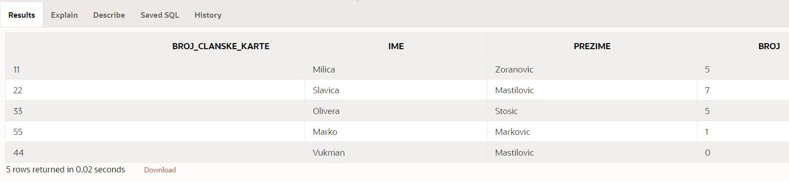
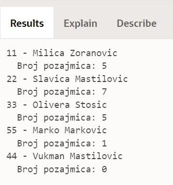

Различити начини да се реши проблем
===================================

.. suggestionnote::

    Писање PL/SQL програма нам даје многобројне могућности које немамо на располагању када користимо чист упитни језик SQL. Кроз пример који следи ћемо видети како на различите начине можемо да решимо исти проблем и како нам језик PL/SQL помаже да имамо различите опције. 

Програми се пишу у едитору у оквиру онлајн окружења *Oracle APEX*, а покрећу се кликом на дугме **Run**:

- https://apex.oracle.com/en/ (обавезно логовање на креирани налог)
- SQL Workshop
- SQL Commands

Сви примери PL/SQL програма узимају податке из базе података библиотеке. Следи списак свих табела са колонама. Примарни кључеви су истакнути болд, а страни италик. 

.. image:: ../../_images/slika_73a.jpg
   :width: 780
   :align: center

Анализираћемо следећи проблем. Приказати укупан број позајмица за сваког члана библиотеке. Приказати и чланове који нису имали позајмице.

Погледајмо прво упит којим ове податке узимамо из базе података. 

::

    --SELECT upit koji vraca ukupan broj pozajmica za svakog clana biblioteke
    SELECT broj_clanske_karte, ime, prezime, COUNT(datum_uzimanja) AS broj
    FROM clanovi LEFT OUTER JOIN pozajmice USING (broj_clanske_karte)
    GROUP BY broj_clanske_karte, ime, prezime

Да би био приказан и члан који није имамо позајмице и чији се број чланске карте не појављује у табели *pozajmice*, неопходно је да користимо спољно спајање LEFT OUTER. Ово спајање је лево спољно спајање зато што је лево од речи JOIN наведен назив табеле у којој имамо неупарене податке, у овом случају податке о члану без позајмица. 

Како треба да се пребројавање обави за сваког члана, поред позива групне функције COUNT, мора да се уради и груписање помоћу GROUP BY. 

Прво могуће решење нашег задатка подразумева да у програму креирамо курсор који је везан баш за овај упит. Прво ћемо радити експлицитно са курсором. 

::

    DECLARE
        CURSOR kursor_clanovi IS 
            SELECT broj_clanske_karte, ime, prezime, COUNT(datum_uzimanja) AS broj
            FROM clanovi LEFT OUTER JOIN pozajmice USING (broj_clanske_karte)
            GROUP BY broj_clanske_karte, ime, prezime; 
        v_clan kursor_clanovi%ROWTYPE;
    BEGIN
        OPEN kursor_clanovi;
        LOOP
            FETCH kursor_clanovi INTO v_clan;
            EXIT WHEN kursor_clanovi%NOTFOUND;
        DBMS_OUTPUT.PUT_LINE(v_clan.broj_clanske_karte||' - '||v_clan.ime||' '||v_clan.prezime);
            DBMS_OUTPUT.PUT_LINE('  Broj pozajmica: '||v_clan.broj);
        END LOOP;
        CLOSE kursor_clanovi;
    END

Други приступ раду са курсором подразумева имплицитни облик рада и употребу циклуса FOR.

::

    DECLARE
        CURSOR kursor_clanovi IS 
            SELECT broj_clanske_karte, ime, prezime, COUNT(datum_uzimanja) AS broj
            FROM clanovi LEFT OUTER JOIN pozajmice USING (broj_clanske_karte)
            GROUP BY broj_clanske_karte, ime, prezime; 
            v_clan kursor_clanovi%ROWTYPE;
    BEGIN
        FOR v_clan IN kursor_clanovi LOOP
        DBMS_OUTPUT.PUT_LINE(v_clan.broj_clanske_karte||' '||v_clan.ime||' '||v_clan.prezime);
            DBMS_OUTPUT.PUT_LINE('  Broj pozajmica: '||v_clan.broj);
        END LOOP;
    END

Погледајмо сада други начин да се приступи решавању истог проблема, а без спајања табела, без потребе да водимо рачуна о спољном спајању, и без употребе GROUP BY.

У овом решењу задатка имамо другачији приступ. Курсором идемо кроз списак свих чланова, а за сваког члана наредбом SELECT INTO узмемо број његових позајмица.

::

    DECLARE
        CURSOR kursor_clanovi IS
            SELECT * FROM clanovi;
        broj NUMBER(3);
    BEGIN
        FOR v_clan IN kursor_clanovi LOOP
        DBMS_OUTPUT.PUT_LINE(v_clan.broj_clanske_karte||' - '||v_clan.ime||' '||v_clan.prezime);
            SELECT COUNT(*) INTO broj
            FROM pozajmice WHERE broj_clanske_karte=v_clan.broj_clanske_karte;
            DBMS_OUTPUT.PUT_LINE('  Broj pozajmica: '||broj);
        END LOOP;
    END
