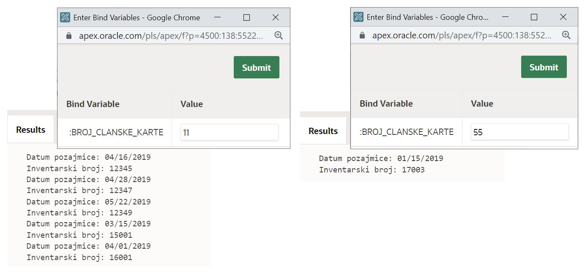
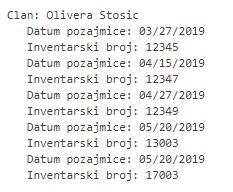
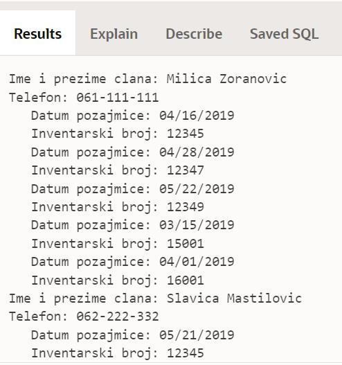

Курсори са параметром
======================

.. suggestionnote::

    Уколико желимо да прикажемо све позајмице члана са бројем чланске карте 33, можемо да употребимо курсор као у примерима које смо претходно видели. Уколико, међутим, желимо да напишемо флексибилан програмски код који ће радити за било који унети број чланске карте, онда је потребно да користимо курсор са параметром. Вредност параметра се најчешће користи у услову селекције упита за који смо везали курсор. 

Следе примери програма написаних у језику PL/SQL који користе курсоре са параметрима. 

Програми се пишу у едитору у оквиру онлајн окружења *Oracle APEX*, а покрећу се кликом на дугме **Run**:

- https://apex.oracle.com/en/ (обавезно логовање на креирани налог)
- SQL Workshop
- SQL Commands

Сви примери PL/SQL програма узимају податке из базе података библиотеке. Следи списак свих табела са колонама. Примарни кључеви су истакнути болд, а страни италик. 

.. image:: ../../_images/slika_73a.jpg
   :width: 780
   :align: center

Илустроваћемо рад са курсором са параметром тако што ћемо приказати све позајмице члана чији се број чланске карте унесе са тастатуре. 

Потребно је креирати курсор са параметром, назовимо га *p_broj_clanske_karte*, који је истог типа као колона *clanovi.broj_clanske_karte* и чија ће се вредност употребити у SELECT упиту да би се издвојиле само позајмице оног члана који има тај број чланске карте. 

Приликом отварања курсора, потребно је проследити конкретну вредност, у овом случају вредност коју смо прочитали са тастатуре и која се налази у променљивој *v_broj_clanske_karte*.

::

    DECLARE
        v_broj_clanske_karte clanovi.broj_clanske_karte%TYPE;
        CURSOR kursor_pozajmica (p_broj_clanske_karte clanovi.broj_clanske_karte%TYPE) 
            IS SELECT datum_uzimanja, inventarski_broj FROM pozajmice 
            WHERE broj_clanske_karte=p_broj_clanske_karte;
        v_red_pozajmica kursor_pozajmica%ROWTYPE;
    BEGIN
        v_broj_clanske_karte := :broj_clanske_karte;
        OPEN kursor_pozajmica(v_broj_clanske_karte);
        LOOP
            FETCH kursor_pozajmica INTO v_red_pozajmica;
            EXIT WHEN kursor_pozajmica%NOTFOUND;
            DBMS_OUTPUT.PUT_LINE('   Datum pozajmice: '||v_red_pozajmica.datum_uzimanja);
            DBMS_OUTPUT.PUT_LINE('   Inventarski broj: '||v_red_pozajmica.inventarski_broj);
        END LOOP;
        CLOSE kursor_pozajmica;
    END

На следећој слици се види како се разликује резултат рада програма за различите унете бројеве чланских карата. 

Следи програм у којем се користи имплицитни облик рада са курсором са параметром. 

::

    DECLARE
        v_broj_clanske_karte clanovi.broj_clanske_karte%TYPE;
        CURSOR kursor_pozajmica (p_broj_clanske_karte clanovi.broj_clanske_karte%TYPE) 
            IS SELECT datum_uzimanja, inventarski_broj FROM pozajmice 
            WHERE broj_clanske_karte=p_broj_clanske_karte;
    BEGIN
        v_broj_clanske_karte := :broj_clanske_karte;
        FOR v_red_pozajmica IN kursor_pozajmica(v_broj_clanske_karte) LOOP
            DBMS_OUTPUT.PUT_LINE('   Datum pozajmice: '||v_red_pozajmica.datum_uzimanja);
            DBMS_OUTPUT.PUT_LINE('   Inventarski broj: '||v_red_pozajmica.inventarski_broj);
        END LOOP;
    END

Можемо да прикажемо податке о члану пре него што излистамо све позајмице. 

::

    DECLARE
        v_broj_clanske_karte clanovi.broj_clanske_karte%TYPE;
        v_ime clanovi.ime%TYPE;
        v_prezime clanovi.prezime%TYPE;
        CURSOR kursor_pozajmica (p_broj_clanske_karte clanovi.broj_clanske_karte%TYPE) 
            IS SELECT datum_uzimanja, inventarski_broj FROM pozajmice 
            WHERE broj_clanske_karte=p_broj_clanske_karte;
    BEGIN
        v_broj_clanske_karte := :broj_clanske_karte;
        SELECT ime, prezime INTO v_ime, v_prezime FROM clanovi 
        WHERE broj_clanske_karte=v_broj_clanske_karte; 
        DBMS_OUTPUT.PUT_LINE('Clan: '||v_ime||' '||v_prezime);
        FOR v_red_pozajmica IN kursor_pozajmica(v_broj_clanske_karte) LOOP
            DBMS_OUTPUT.PUT_LINE('   Datum pozajmice: '||v_red_pozajmica.datum_uzimanja);
            DBMS_OUTPUT.PUT_LINE('   Inventarski broj: '||v_red_pozajmica.inventarski_broj);
        END LOOP;
    END

На слици може да се види резултат за број чланске карте 33. 

Курсор са параметром можемо да употребимо и у сложенијим задацима као што је пример који следи. 

Приказати све позајмице за сваког члана. Довољно је приказати датум и инвентарски број позајмљеног примерка. 

У решењу ћемо употребити један обичан курсор да прођемо кроз списак свих чланова. Курсор са параметром ћемо отворити за сваког члана посебно да бисмо приказали његове позајмице. 

::

    DECLARE
        CURSOR kursor_clan 
            IS SELECT broj_clanske_karte, ime||' '||prezime clan, telefon FROM clanovi;
        CURSOR kursor_pozajmica (p_broj_clanske_karte clanovi.broj_clanske_karte%TYPE) 
            IS SELECT datum_uzimanja, inventarski_broj FROM pozajmice 
            WHERE broj_clanske_karte=p_broj_clanske_karte;
    BEGIN
        FOR v_red_clan IN kursor_clan LOOP
            DBMS_OUTPUT.PUT_LINE('Ime i prezime clana: '||v_red_clan.clan);
            DBMS_OUTPUT.PUT_LINE('Telefon: '|| v_red_clan.telefon);
            FOR v_red_pozajmica IN kursor_pozajmica(v_red_clan.broj_clanske_karte) LOOP
            DBMS_OUTPUT.PUT_LINE('   Datum pozajmice: '||v_red_pozajmica.datum_uzimanja);
            DBMS_OUTPUT.PUT_LINE('   Inventarski broj: '||v_red_pozajmica.inventarski_broj);
            END LOOP;
        END LOOP;
    END

Део резултата рада овог програма може да се види на следећој слици. 

Програм можемо да проширимо тако да се прикажу датум и назив позајмљене књиге за сваку позајмицу. 

::

    DECLARE
        CURSOR kursor_clan 
            IS SELECT broj_clanske_karte, ime||' '||prezime clan, telefon FROM clanovi;
        CURSOR kursor_pozajmica (p_broj_clanske_karte clanovi.broj_clanske_karte%TYPE) 
            IS SELECT datum_uzimanja, naziv FROM pozajmice JOIN primerci USING (inventarski_broj)
            JOIN knjige USING (id_knjige) WHERE broj_clanske_karte=p_broj_clanske_karte;
    BEGIN
        FOR v_red_clan IN kursor_clan LOOP
            DBMS_OUTPUT.PUT_LINE('Ime i prezime clana: '||v_red_clan.clan);
            DBMS_OUTPUT.PUT_LINE('Telefon: '|| v_red_clan.telefon);
            FOR v_red_pozajmica IN kursor_pozajmica(v_red_clan.broj_clanske_karte) LOOP
            DBMS_OUTPUT.PUT_LINE('   Datum pozajmice: '||v_red_pozajmica.datum_uzimanja);
            DBMS_OUTPUT.PUT_LINE('   Naziv knjige: '||v_red_pozajmica.naziv);
            END LOOP;
        END LOOP;
    END

Следи решење где се експлицитно ради са курсорима. 

::

    DECLARE
        CURSOR kursor_clan 
            IS SELECT broj_clanske_karte, ime||' '||prezime clan, telefon FROM clanovi;
        v_red_clan kursor_clan%ROWTYPE;
        CURSOR kursor_pozajmica (p_broj_clanske_karte clanovi.broj_clanske_karte%TYPE) 
            IS SELECT datum_uzimanja, naziv FROM pozajmice JOIN primerci USING (inventarski_broj)
            JOIN knjige USING (id_knjige) WHERE broj_clanske_karte=p_broj_clanske_karte;
        v_red_pozajmica kursor_pozajmica%ROWTYPE;
    BEGIN
        OPEN kursor_clan;
        LOOP
            FETCH kursor_clan INTO v_red_clan;
            EXIT WHEN kursor_clan%NOTFOUND;
            DBMS_OUTPUT.PUT_LINE('Ime i prezime clana: '||v_red_clan.clan);
            DBMS_OUTPUT.PUT_LINE('Telefon: '|| v_red_clan.telefon);
            OPEN kursor_pozajmica(v_red_clan.broj_clanske_karte);
            LOOP
            FETCH kursor_pozajmica INTO v_red_pozajmica;
            EXIT WHEN kursor_pozajmica%NOTFOUND;
            DBMS_OUTPUT.PUT_LINE('   Datum pozajmice: '||v_red_pozajmica.datum_uzimanja);
            DBMS_OUTPUT.PUT_LINE('   Naziv knjige: '||v_red_pozajmica.naziv);
            END LOOP;
            CLOSE kursor_pozajmica;
        END LOOP;
        CLOSE kursor_clan;
    END
