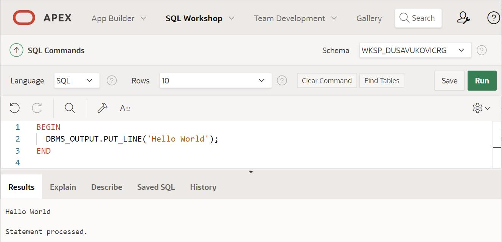

Oracle Apex и језик PL/SQL
==========================

.. suggestionnote::

    Многи велики информациони системи у свету користе систем за управљање базама података компаније Oracle. Један од начина да се упознамо са овом технологијом је у **онлајн окружењу Oracle APEX.** 

    За потребе учења, а након прихватања услова употребе, може бесплатно да се креира онлајн налог на следећој адреси:

    https://apex.oracle.com/en/

    Унутар овог СУБП-a можемо да пишемо програме користећи **програмски језик PL/SQL.** Упознаћемо се прво са основама овог програмског језика да бисмо касније могли да пишемо програме који се повезују на базе података. 

Предност онлајн *Oracle APEX* налога је у томе што не захтева локалну инсталацију и креираном налогу са базама података може да се приступи на исти начин са било ког уређаја који има приступ интернету. 

На наведеној адреси је потребно кликнути *Start for Free Today*, а затим изабрати опцију *Free APEX Workspace* и испратити све кораке.

.. infonote::

   Изглед сајта, поједини кораци и називи, као и код других ИКТ алата, могу да се временом промене, али су углавном најважније опције увек присутне и доступне.   

Унутар СУБП компаније *Oracle* може да се програмира у језику PL/SQL. **Програмски језик PL/SQL** је процедурални језик који је направљен као проширење упитног језика SQL. Иако се користи за писање програма који се повезују на базе података, прво ћемо да се упознамо са неким његовим основим могућностима кроз писање једноставних програма. 

Програми се пишу у едитору:  

- SQL Workshop
- SQL Commands

.. image:: ../../_images/slika_61a.jpg
   :width: 600
   :align: center

Након што се унесе програмски код, кликне се на дугме **Run**. 

Једноставан програм се састоји од одељка за декларацију променљивих и тела програма који је ограничен речима BEGIN на почетку и END на крају.

Одељак за декларацију почиње са речју DECLARE након чега следе декларације променљивих које ће се користити у програму. Свака променљива се појединачно декларише и декларација подразумева навођење назива променљиве и типа податка. Декларација може да садржи још неке делове, на пример, подразумевану вредност за ту променљиву. 

У примеру који следи је употребљен тип података NUMBER. Свуда где се користи овај тип, могао је да се употреби и целобројни тип INT. У одељку за декларацију су наведене три променљиве, од чега имамо два улазна податка и једну променљиву за резултат.

Када се променљива декларише, али јој се не додели нека конкретна вредност, она је *null*. Било који израз у којем је бар једна променљива *null* има коначну вредност *null*. 

Наредба доделе у овом програмском језику се означава са двотачка-једнако (:=).

Вредности можемо да унесемо са тастатуре користећи рад са пољем за унос тако што након знака двотачка додамо назив лабеле, тј. текста који ће бити приказан уз поље за унос. У називу лабеле не можемо да користимо размаке, па уколико нам треба неколико речи, савет је да се користи доња црта (_). 

Језик PL/SQL није осетљив на велика и мала слова, али нешто пишемо велико, а нешто мало, да би цео програмски код био лакши за читање и прегледнији. Обично резервисане речи пишемо великим словима, а називе променљивих малим. 

Програми који се пишу у програмском језику PL/SQL су углавном процедуре и функције које су организоване по пакетима. Да би се порука приказала на екрану, потребно је да позовемо процедуру PUT_LINE из пакета DBMS_OUTPUT. Касније у материјалима ћемо видети и како се пишу процедуре и функције. 

Када се програм покрене, у посебном прозору се појаве поља за унос. Да би се овај прозор појавио, важно је да се дозволи опција *pop-up* у изабраном прегледачу. Резултат се, након што се вредности унесу и кликне на дугме *Submit*, појављује испод едитора у картици *Results*. 

Одељак за декларацију није обавезан. Следи пример једноставног програма који само приказује поруку на екрану, такозвани *Hello World* програм, чувени први пример приликом упознавања са новим програмским језиком. 

Као и у другим програмским језицима, постоји могућност да ставимо коментаре. Коментар почиње са две цртице и завршава се на крају реда. Коментар не утиче на извршавање програма. 

