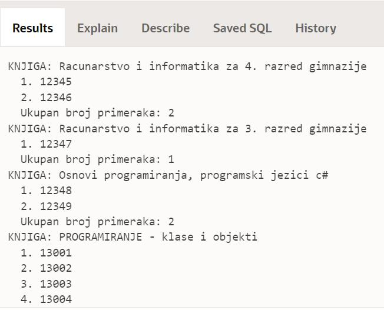

Курсори са параметром - задаци
==============================

.. suggestionnote::

    Следе примери програма написаних у језику PL/SQL који користе курсоре са параметрима. У решењима ће понегде бити употребљен експлицитан, а понегде имплицитан начин рада са курсором. 

Програми се пишу у едитору у оквиру онлајн окружења *Oracle APEX*, а покрећу се кликом на дугме **Run**:

- https://apex.oracle.com/en/ (обавезно логовање на креирани налог)
- SQL Workshop
- SQL Commands

Креирати PL/SQL програме који узимају податке из базе података библиотеке. Следи списак свих табела са колонама. Примарни кључеви су истакнути болд, а страни италик. 

.. image:: ../../_images/slika_73a.jpg
   :width: 780
   :align: center

.. questionnote::

    1. Приказати инвентарске бројеве свих примерака књиге чији се назив уноси са тастатуре. 

::

    DECLARE
        CURSOR kursor_primerci(p_naziv knjige.naziv%TYPE) 
        IS SELECT inventarski_broj
            FROM primerci JOIN knjige ON (primerci.id_knjige=knjige.id_knjige)
            WHERE naziv=p_naziv;
        v_red kursor_primerci%ROWTYPE;
        v_naziv knjige.naziv%TYPE;
        v_broj INT;
    BEGIN
        v_naziv := :naziv_knjige;
        v_broj := 0;
        OPEN kursor_primerci(v_naziv);
        LOOP
            FETCH kursor_primerci INTO v_red;
            EXIT WHEN kursor_primerci%NOTFOUND;
            v_broj := v_broj+1;
            DBMS_OUTPUT.PUT_LINE(v_broj||'. '||v_red.inventarski_broj);
        END LOOP;
        CLOSE kursor_primerci;
        DBMS_OUTPUT.PUT_LINE('Ukupan broj primeraka: '||v_broj);
    END

.. questionnote::

    2. Приказати за сваку књигу инвентарске бројеве свих примерака те књиге. 

Решење које следи је проширење претходног задатка. Са малим модификацијама је програмски код којим се излиставају примерци једне књиге угњежден у спољашњи циклус који приказује једну по једну књигу. 

::

    DECLARE
        CURSOR kursor_knjige IS SELECT naziv FROM knjige;
        CURSOR kursor_primerci(p_naziv knjige.naziv%TYPE) 
        IS SELECT inventarski_broj
            FROM primerci JOIN knjige ON (primerci.id_knjige=knjige.id_knjige)
            WHERE naziv=p_naziv;
        v_red_knjiga kursor_knjige%ROWTYPE;
        v_red kursor_primerci%ROWTYPE;
        v_broj INT;
    BEGIN
        OPEN kursor_knjige;
        LOOP
            FETCH kursor_knjige INTO v_red_knjiga;
            EXIT WHEN kursor_knjige%NOTFOUND;
            DBMS_OUTPUT.PUT_LINE('KNJIGA: '||v_red_knjiga.naziv);
            v_broj := 0;
            OPEN kursor_primerci(v_red_knjiga.naziv);
            LOOP
                FETCH kursor_primerci INTO v_red;
                EXIT WHEN kursor_primerci%NOTFOUND;
                v_broj := v_broj+1;
                DBMS_OUTPUT.PUT_LINE('  '||v_broj||'. '||v_red.inventarski_broj);
            END LOOP;
            CLOSE kursor_primerci;
            DBMS_OUTPUT.PUT_LINE('  Ukupan broj primeraka: '||v_broj);
        END LOOP;
        CLOSE kursor_knjige;
    END

Део резултата рада програма може да се види на следећој слици.

.. questionnote::

    3. Приказати све године када је члан чије се име и презиме уноси са тастатуре платио чланарину и био активни члан библиотеке. 

Курсор који се користи у овом решењу има два параметра, име и презиме члана. 

::

    DECLARE
        CURSOR kursor_godine(p_ime clanovi.ime%TYPE, p_prezime clanovi.prezime%TYPE) 
            IS SELECT god 
            FROM clanarine JOIN clanovi USING (broj_clanske_karte)
            WHERE UPPER(ime)=UPPER(p_ime) AND UPPER(prezime)=UPPER(p_prezime);
        v_ime clanovi.ime%TYPE;
        v_prezime clanovi.prezime%TYPE;
    BEGIN
        v_ime := :ime_clana;
        v_prezime := :prezime_clana;
        FOR v_red IN kursor_godine(v_ime, v_prezime) LOOP
            DBMS_OUTPUT.PUT_LINE(v_red.god);
        END LOOP;
    END

.. questionnote::

    4. За сваког аутора приказати све књиге које имамо у библиотеци. 

Један курсор ћемо употребити да прођемо кроз списак свих аутора, а други курсор ће имати параметар, идентификациони број аутора, и служиће да излистамо књиге тог аутора. Иако не пише у задатку, има смисла да списак аутора уредимо абецедно. 

::

    DECLARE 
        CURSOR spisak_autora IS SELECT id_autora, ime, prezime
            FROM autori ORDER BY prezime, ime;
        CURSOR spisak_knjiga(p_id_autora autori.id_autora%TYPE) 
            IS SELECT naziv 
            FROM knjige JOIN autori_knjige USING (id_knjige)
            WHERE id_autora=p_id_autora;
        v_broj INT;
    BEGIN
        FOR v_autor IN spisak_autora LOOP
            DBMS_OUTPUT.PUT_LINE('AUTOR: '||v_autor.ime||' '||v_autor.prezime);
            v_broj := 0;
            FOR v_knjiga IN spisak_knjiga(v_autor.id_autora) LOOP
                v_broj := v_broj+1;
                DBMS_OUTPUT.PUT_LINE('  '||v_broj||'. '||v_knjiga.naziv);
            END LOOP;
            DBMS_OUTPUT.PUT_LINE('  Ukupan broj knjiga u biblioteci: '||v_broj);
        END LOOP;
    END

