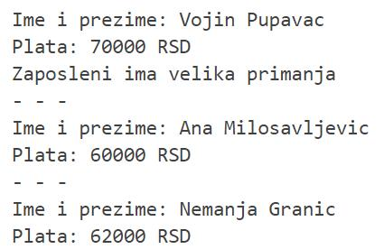

Курсори и гранање - задаци
===========================

.. questionnote::

    Често постоји потреба да извршимо одређену процену и обраду података које узимамо из базе, тако да се у програмима често користи наредба гранања уз употребу курсора. 

Програми се пишу у едитору у оквиру онлајн окружења *Oracle APEX*, а покрећу се кликом на дугме **Run**:

- https://apex.oracle.com/en/ (обавезно логовање на креирани налог)
- SQL Workshop
- SQL Commands

Креирати PL/SQL програме који узимају податке из базе података библиотеке. Следи списак свих табела са колонама. Примарни кључеви су истакнути болд, а страни италик. 

.. image:: ../../_images/slika_73a.jpg
   :width: 600
   :align: center

.. questionnote::

    1. Приказати имена, презимена и плате свих запослених у библиотеци. Приказати и поруке у случају да запослени има мала примања (испод 50.000 динара), или велика примања (70.000 динара и више).

::

    DECLARE
        v_zaposleni VARCHAR2(150);
        v_plata zaposleni.plata%TYPE;
        CURSOR kursor_zaposleni IS SELECT ime||' '||prezime, plata FROM zaposleni;
    BEGIN
        OPEN kursor_zaposleni;
        LOOP
            FETCH kursor_zaposleni INTO v_zaposleni, v_plata;
            EXIT WHEN kursor_zaposleni%NOTFOUND;
            DBMS_OUTPUT.PUT_LINE('Ime i prezime: '||v_zaposleni);
            DBMS_OUTPUT.PUT_LINE('Plata: '|| v_plata ||' RSD');
            IF v_plata < 50000 THEN
            DBMS_OUTPUT.PUT_LINE('Zaposleni ima mala primanja');
            ELSIF v_plata >= 70000 THEN
            DBMS_OUTPUT.PUT_LINE('Zaposleni ima velika primanja');
            END IF;
            DBMS_OUTPUT.PUT_LINE('- - -');
        END LOOP;
        CLOSE kursor_zaposleni;
    END

Следи решење задатка помоћу циклуса FOR. У решењу се користи сложена променљива v_red која садржи три поља: име, презиме и плату запосленог. Ова променљива не мора да се декларише. 

::

    
    DECLARE
        CURSOR kursor_zaposleni IS SELECT ime, prezime, plata FROM zaposleni;
    BEGIN
        FOR v_red IN kursor_zaposleni LOOP
            DBMS_OUTPUT.PUT_LINE('Ime i prezime: '||v_red.ime || ' ' ||v_red.prezime);
            DBMS_OUTPUT.PUT_LINE('Plata: '|| v_red.plata ||' RSD');
            IF v_red.plata < 50000 THEN
            DBMS_OUTPUT.PUT_LINE('Zaposleni ima mala primanja');
            ELSIF v_red.plata >= 70000 THEN
            DBMS_OUTPUT.PUT_LINE('Zaposleni ima velika primanja');
            END IF;
            DBMS_OUTPUT.PUT_LINE('- - -');
        END LOOP;
    END

.. questionnote::

    2. Приказати имена, презимена и плате свих запослених у библиотеци. Приказати и поруку за сваког запосленог да ли зарађује више или мање од унетог износа. Износ се уноси са тастатуре. 

::

    DECLARE
        CURSOR kursor_zaposleni IS SELECT ime, prezime, plata FROM zaposleni;
        v_iznos NUMBER;
    BEGIN
        v_iznos := :IZNOS;
        FOR v_red IN kursor_zaposleni LOOP
            DBMS_OUTPUT.PUT_LINE('Ime i prezime: '||v_red.ime || ' ' ||v_red.prezime);
            DBMS_OUTPUT.PUT_LINE('Plata: '|| v_red.plata ||' RSD');
            IF v_red.plata < v_iznos THEN
            DBMS_OUTPUT.PUT_LINE('Zaradjuje manje');
            ELSE 
            DBMS_OUTPUT.PUT_LINE('Zaradjuje vise');
            END IF;
            DBMS_OUTPUT.PUT_LINE('- - -');
        END LOOP;
    END

.. questionnote::

    3. Приказати имена, презимена и плате свих запослених у библиотеци. Приказати и поруку за сваког запосленог, да ли зарађује више или мање од просечне плате свих запослених. 

::

    DECLARE
        CURSOR kursor_zaposleni IS SELECT ime, prezime, plata FROM zaposleni;
        v_prosek zaposleni.plata%TYPE;
    BEGIN
        SELECT AVG(plata) INTO v_prosek FROM zaposleni;
        FOR v_red IN kursor_zaposleni LOOP
            DBMS_OUTPUT.PUT_LINE('Ime i prezime: '||v_red.ime || ' ' ||v_red.prezime);
            DBMS_OUTPUT.PUT_LINE('Plata: '|| v_red.plata ||' RSD');
            IF v_red.plata < v_prosek THEN
            DBMS_OUTPUT.PUT_LINE('Zaradjuje manje od proseka');
            ELSE 
            DBMS_OUTPUT.PUT_LINE('Zaradjuje vise od proseka');
            END IF;
            DBMS_OUTPUT.PUT_LINE('- - -');
        END LOOP;
    END

.. questionnote::

   4. Приказати за сваку позајмицу име и презиме члана, назив књиге и број дана од узимања до враћања књиге у библиотеку. Приказати одговарајућу поруку за текуће позајмице

::

    DECLARE
        CURSOR kursor_pozajmica  
            IS SELECT ime, prezime, naziv, datum_uzimanja, datum_vracanja FROM pozajmice 
            JOIN primerci USING (inventarski_broj) JOIN knjige USING (id_knjige)
            JOIN clanovi USING (broj_clanske_karte);
    BEGIN
        FOR v_red_pozajmica IN kursor_pozajmica LOOP
            DBMS_OUTPUT.PUT_LINE('Clan: '||v_red_pozajmica.ime || ' ' ||v_red_pozajmica.prezime);
            DBMS_OUTPUT.PUT_LINE('Knjiga: '||v_red_pozajmica.naziv);
            IF v_red_pozajmica.datum_vracanja IS NULL THEN
            DBMS_OUTPUT.PUT_LINE('Pozajmica u toku - knjiga se nalazi kod clana.');
            ELSE 
            DBMS_OUTPUT.PUT_LINE('Broj dana: ' || 
            ROUND(v_red_pozajmica.datum_vracanja - v_red_pozajmica.datum_uzimanja));
            END IF;
            DBMS_OUTPUT.PUT_LINE(' ');
        END LOOP;
    END

.. questionnote::

    5. Приказати све позајмице за сваког члана. Приказати назив књиге и број дана од узимања до враћања књиге у библиотеку. Приказати одговарајућу поруку за текуће позајмице, као и поруку у случају да је књига задржана дуже од 10 дана. 

::

    DECLARE
        CURSOR kursor_clan 
            IS SELECT broj_clanske_karte, ime||' '||prezime clan FROM clanovi;
        CURSOR kursor_pozajmica (p_broj_clanske_karte clanovi.broj_clanske_karte%TYPE) 
            IS SELECT datum_uzimanja, datum_vracanja, naziv FROM pozajmice JOIN primerci USING (inventarski_broj)
            JOIN knjige USING (id_knjige) WHERE broj_clanske_karte=p_broj_clanske_karte;
    BEGIN
        FOR v_red_clan IN kursor_clan LOOP
            DBMS_OUTPUT.PUT_LINE('Ime i prezime clana: '||v_red_clan.clan);
            FOR v_red IN kursor_pozajmica(v_red_clan.broj_clanske_karte) LOOP
            DBMS_OUTPUT.PUT_LINE('   Naziv knjige: '||v_red.naziv);
            IF v_red.datum_vracanja IS NULL THEN
                DBMS_OUTPUT.PUT_LINE('   Pozajmica u toku - knjiga se nalazi kod clana.');
            ELSIF ROUND(v_red.datum_vracanja - v_red.datum_uzimanja) > 10 THEN 
                DBMS_OUTPUT.PUT_LINE('   Knjiga je zadrzana duze od nedelju dana');
            ELSE 
                DBMS_OUTPUT.PUT_LINE('   Broj dana: ' || 
                ROUND(v_red.datum_vracanja - v_red.datum_uzimanja));
            END IF;
            END LOOP;
            DBMS_OUTPUT.PUT_LINE(' ');
        END LOOP;
    END
