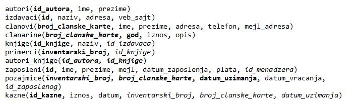

Тренутне позајмице члана - пример
=================================

.. suggestionnote::

    На неколико начина ћемо приступити сценарију који је описан у материјалима за предмет „Базе података“ у трећем разреду гимназије за ученике са посебним способностима за рачунарство и информатику. 

    https://petlja.org/kurs/7963/11/6720

    1. Члан библиотеке са својом чланском картом број 33 дошао је да позајми неколико књига. Пре него што му библиотека изда нове, потребно је да се провери да ли члан тренутно држи неке књиге код себе.

    **Задатак:** Написати упит којим се приказују датуми узимања и инвентарски бројеви књига које се тренутно налазе код члана са бројем чланске карте 33.

Програми се пишу у едитору у оквиру онлајн окружења *Oracle APEX*, а покрећу се кликом на дугме **Run**:

- https://apex.oracle.com/en/ (обавезно логовање на креирани налог)
- SQL Workshop
- SQL Commands

Сви примери PL/SQL програма узимају податке из базе података библиотеке. Следи списак свих табела са колонама. Примарни кључеви су истакнути болд, а страни италик. 

Погледајмо прво упит који нам приказује тражени скуп података. 

::

    SELECT datum_uzimanja, inventarski_broj
    FROM pozajmice
    WHERE broj_clanske_karte=33 AND datum_vracanja IS NULL

У програму ћемо креирати курсор који је везан за овај упит. Прво ћемо радити експлицитно са курсором. 

::

    DECLARE
        CURSOR trenutne_pozajmice IS 
                SELECT datum_uzimanja, inventarski_broj
                FROM pozajmice
                WHERE broj_clanske_karte=33 AND datum_vracanja IS NULL;
        pozajmica trenutne_pozajmice%ROWTYPE;
    BEGIN
        OPEN trenutne_pozajmice;
        LOOP
            FETCH trenutne_pozajmice INTO pozajmica;
            EXIT WHEN trenutne_pozajmice%NOTFOUND;
            DBMS_OUTPUT.PUT_LINE('Datum: '||pozajmica.datum_uzimanja);
            DBMS_OUTPUT.PUT_LINE('Inventarski broj: '||pozajmica.inventarski_broj);
        END LOOP;
        CLOSE trenutne_pozajmice;
    END

Други приступ раду са курсором подразумева имплицитни облик рада и употребу циклуса FOR.

::

    DECLARE
        CURSOR trenutne_pozajmice IS 
                SELECT datum_uzimanja, inventarski_broj
                FROM pozajmice
                WHERE broj_clanske_karte=33 AND datum_vracanja IS NULL;
    BEGIN
        FOR pozajmica IN trenutne_pozajmice LOOP
            DBMS_OUTPUT.PUT_LINE('Datum: '||pozajmica.datum_uzimanja);
            DBMS_OUTPUT.PUT_LINE('Inventarski broj: '||pozajmica.inventarski_broj);
        END LOOP;
    END

Можемо да проширимо програм тако што ћемо да прикажемо и име и презиме члана, као и називе књига. Наредбом SELECT INTO ћемо у две променљиве да учитамо име и презиме члана. Упит за који смо везали курсор ћемо проширити спајањем табела тако да можемо да добијемо и назив позајмљене књиге за сваку тренутну позајмицу.  

::

        
    DECLARE
        CURSOR trenutne_pozajmice IS 
            SELECT datum_uzimanja, inventarski_broj, naziv 
            FROM pozajmice JOIN primerci USING (inventarski_broj)
            JOIN knjige USING (id_knjige) WHERE broj_clanske_karte=33 
            AND datum_vracanja IS NULL;
        pozajmica trenutne_pozajmice%ROWTYPE;
        v_ime clanovi.ime%TYPE;
        v_prezime clanovi.prezime%TYPE;
    BEGIN
        SELECT ime, prezime INTO v_ime, v_prezime
        FROM clanovi WHERE broj_clanske_karte=33;
        DBMS_OUTPUT.PUT_LINE('CLAN: '||v_ime||' '||v_prezime);
        OPEN trenutne_pozajmice;
        LOOP
            FETCH trenutne_pozajmice INTO pozajmica;
            EXIT WHEN trenutne_pozajmice%NOTFOUND;
            DBMS_OUTPUT.PUT_LINE(' Datum: '||pozajmica.datum_uzimanja);
            DBMS_OUTPUT.PUT_LINE(' Inventarski broj: '||pozajmica.inventarski_broj);
            DBMS_OUTPUT.PUT_LINE(' Naziv knjige: '||pozajmica.naziv);
        END LOOP;
        CLOSE trenutne_pozajmice;
    END

Програмски код који смо написали би се највероватније користио у библиотеци свакодневно за сваког члана који дође да позајми неке књиге. Да би могао да се користи на такав начин, програм не треба да буде везан за број чланске карте 33, већ треба да врати списак текућих позајмица за унети број чланске карте. У решењу које следи је креиран курсор са параметром *p_broj_clanske_karte*. Вредност параметра се користи у упиту да би се издвојили редови који се односе на позајмице члана чији је то број чланске карте. 

::

    DECLARE
        CURSOR trenutne_pozajmice(p_broj_clanske_karte clanovi.broj_clanske_karte%TYPE) IS 
            SELECT datum_uzimanja, inventarski_broj, naziv 
            FROM pozajmice JOIN primerci USING (inventarski_broj)
            JOIN knjige USING (id_knjige) 
            WHERE broj_clanske_karte=p_broj_clanske_karte AND datum_vracanja IS NULL;
        pozajmica trenutne_pozajmice%ROWTYPE;
        v_broj_clanske_karte clanovi.broj_clanske_karte%TYPE;
        v_ime clanovi.ime%TYPE;
        v_prezime clanovi.prezime%TYPE;
    BEGIN
        v_broj_clanske_karte := :broj_cl_karte;
        SELECT ime, prezime INTO v_ime, v_prezime
        FROM clanovi WHERE broj_clanske_karte=v_broj_clanske_karte;
        DBMS_OUTPUT.PUT_LINE('CLAN: '||v_ime||' '||v_prezime);
        OPEN trenutne_pozajmice(v_broj_clanske_karte);
        LOOP
            FETCH trenutne_pozajmice INTO pozajmica;
            EXIT WHEN trenutne_pozajmice%NOTFOUND;
            DBMS_OUTPUT.PUT_LINE(' Datum: '||pozajmica.datum_uzimanja);
            DBMS_OUTPUT.PUT_LINE(' Inventarski broj: '||pozajmica.inventarski_broj);
            DBMS_OUTPUT.PUT_LINE(' Naziv knjige: '||pozajmica.naziv);
        END LOOP;
        CLOSE trenutne_pozajmice;
    END

Уколико је библиотеци потребан комплетан извештај свих тренутних позајмица свих чланова, могу да се употребе два курсора. Један курсор пролази кроз списак чланова, а други курсор који има параметар се отвара за сваког члана и приказује његове/њене тренутне позајмице. Решење смо проширили и провером да ли члан уопште има неке књиге тренутно код себе. Уколико нема тренутно задужење, приказује се одговарајућа порука и нема потребе да уопште отварамо курсор са параметром.

::

    DECLARE
        CURSOR spisak_clanova IS SELECT * FROM clanovi;
        CURSOR trenutne_pozajmice(p_broj_clanske_karte clanovi.broj_clanske_karte%TYPE) IS 
            SELECT datum_uzimanja, inventarski_broj, naziv 
            FROM pozajmice JOIN primerci USING (inventarski_broj)
            JOIN knjige USING (id_knjige) 
            WHERE broj_clanske_karte=p_broj_clanske_karte AND datum_vracanja IS NULL;
        v_broj_tren_pozajmica NUMBER;
    BEGIN
        FOR clan IN spisak_clanova LOOP
            DBMS_OUTPUT.PUT_LINE('CLAN: '||clan.ime||' '||clan.prezime);
            SELECT COUNT(*) INTO v_broj_tren_pozajmica
            FROM pozajmice WHERE broj_clanske_karte=clan.broj_clanske_karte AND datum_vracanja IS NULL;
            IF v_broj_tren_pozajmica=0 THEN
            DBMS_OUTPUT.PUT_LINE(' Clan nema trenutne pozajmice');
            ELSE
            FOR pozajmica IN trenutne_pozajmice(clan.broj_clanske_karte) LOOP
                DBMS_OUTPUT.PUT_LINE(' Datum: '||pozajmica.datum_uzimanja);
                DBMS_OUTPUT.PUT_LINE(' Inventarski broj: '||pozajmica.inventarski_broj);
                DBMS_OUTPUT.PUT_LINE(' Naziv knjige: '||pozajmica.naziv);
            END LOOP;
            END IF;
        END LOOP;
    END;
