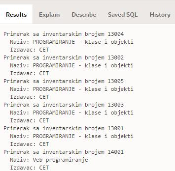
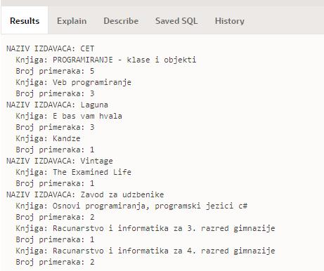
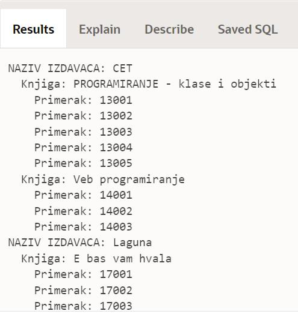

Спискови књига - пример
=======================

.. suggestionnote::

    На неколико начина ћемо приступити сценарију који је описан у материјалима за предмет „Базе података“ у трећем разреду гимназије за ученике са посебним способностима за рачунарство и информатику. 

    https://petlja.org/kurs/7963/12/6725

    **Задатак**: Написати упит којим се, уз инвентарски број, приказује и назив књиге тог примерка и назив издавача. Уредити резултат по називу издавача, а у случају да књиге имају истог издавача, по називу књиге.

Програми се пишу у едитору у оквиру онлајн окружења *Oracle APEX*, а покрећу се кликом на дугме **Run**:

- https://apex.oracle.com/en/ (обавезно логовање на креирани налог)
- SQL Workshop
- SQL Commands

Сви примери PL/SQL програма узимају податке из базе података библиотеке. Следи списак свих табела са колонама. Примарни кључеви су истакнути болд, а страни италик. 

.. image:: ../../_images/slika_73a.jpg
   :width: 600
   :align: center

Погледајмо прво упит који нам приказује тражени скуп података. 

::

    SELECT inventarski_broj, knjige.naziv, izdavaci.naziv
    FROM primerci JOIN knjige ON (primerci.id_knjige=knjige.id_knjige)
    JOIN izdavaci ON (knjige.id_izdavaca=izdavaci.id)
    ORDER BY izdavaci.naziv, knjige.naziv

У програму ћемо креирати курсор који је везан за овај упит. Прво ћемо радити експлицитно са курсором. 

::

    DECLARE
        CURSOR primerci_knjiga IS SELECT inventarski_broj, knjige.naziv AS naziv_knjige, 
            izdavaci.naziv AS naziv_izdavaca FROM primerci JOIN knjige 
            ON (primerci.id_knjige=knjige.id_knjige)
            JOIN izdavaci ON (knjige.id_izdavaca=izdavaci.id)
            ORDER BY naziv_izdavaca, naziv_knjige;
        v_primerak_knjige primerci_knjiga%ROWTYPE;
    BEGIN
        OPEN primerci_knjiga;
        LOOP
            FETCH primerci_knjiga INTO v_primerak_knjige;
            EXIT WHEN primerci_knjiga%NOTFOUND;
            DBMS_OUTPUT.PUT_LINE('Primerak sa inventarskim brojem '
                ||v_primerak_knjige.inventarski_broj);
            DBMS_OUTPUT.PUT_LINE('  Naziv: '||v_primerak_knjige.naziv_knjige);
            DBMS_OUTPUT.PUT_LINE('  Izdavac: '||v_primerak_knjige.naziv_izdavaca);
        END LOOP;
        CLOSE primerci_knjiga;
    END

Део резултата рада програма може да се види на следећој слици. 

Други приступ раду са курсором подразумева имплицитни облик рада и употребу циклуса FOR.

::

    DECLARE
        CURSOR primerci_knjiga IS SELECT inventarski_broj, knjige.naziv AS naziv_knjige, 
            izdavaci.naziv AS naziv_izdavaca FROM primerci JOIN knjige 
            ON (primerci.id_knjige=knjige.id_knjige)
            JOIN izdavaci ON (knjige.id_izdavaca=izdavaci.id)
            ORDER BY naziv_izdavaca, naziv_knjige;
    BEGIN
        FOR v_primerak_knjige IN primerci_knjiga LOOP
            DBMS_OUTPUT.PUT_LINE('Primerak sa inventarskim brojem'
                ||v_primerak_knjige.inventarski_broj);
            DBMS_OUTPUT.PUT_LINE('  Naziv: '||v_primerak_knjige.naziv_knjige);
            DBMS_OUTPUT.PUT_LINE('  Izdavac: '||v_primerak_knjige.naziv_izdavaca);
        END LOOP;
    END

Када пишемо PL/SQL програме, имамо различите могућности, па тражени списак примерака књига можемо и другачије да организујемо. На пример, можемо да за сваког издавача прикажемо све књиге и колико примерака сваке има у библиотеци. 

::

    DECLARE
        CURSOR spisak_izdavaca IS SELECT * FROM izdavaci ORDER BY naziv;
        CURSOR spisak_knjiga(p_id_izdavaca izdavaci.id%TYPE) IS
            SELECT knjige.naziv, COUNT(inventarski_broj) AS broj_primeraka
            FROM izdavaci JOIN knjige ON (knjige.id_izdavaca=izdavaci.id)
            JOIN primerci ON (primerci.id_knjige=knjige.id_knjige)
            WHERE izdavaci.id=p_id_izdavaca
            GROUP BY knjige.naziv ORDER BY knjige.naziv;
    BEGIN
        FOR izdavac IN spisak_izdavaca LOOP
            DBMS_OUTPUT.PUT_LINE('NAZIV IZDAVACA: '||izdavac.naziv);
            FOR knjiga IN spisak_knjiga(izdavac.id) LOOP
            DBMS_OUTPUT.PUT_LINE('  Knjiga: '||knjiga.naziv);
            DBMS_OUTPUT.PUT_LINE('  Broj primeraka: '||knjiga.broj_primeraka);
            END LOOP;
        END LOOP;
    END

Део резултата рада програма може да се види на следећој слици. 

Следећи програм приказује за сваког издавача све књиге, а за сваку књигу све примерке. 

::

    DECLARE
        CURSOR spisak_izdavaca IS SELECT * FROM izdavaci ORDER BY naziv;
        CURSOR spisak_knjiga(p_id_izdavaca izdavaci.id%TYPE) IS
            SELECT knjige.id_knjige, knjige.naziv
            FROM izdavaci JOIN knjige ON (knjige.id_izdavaca=izdavaci.id)
            WHERE izdavaci.id=p_id_izdavaca
            ORDER BY knjige.naziv;
        CURSOR spisak_primeraka(p_id_knjige knjige.id_knjige%TYPE) IS
            SELECT inventarski_broj FROM primerci 
            WHERE id_knjige=p_id_knjige; 
    BEGIN
        FOR izdavac IN spisak_izdavaca LOOP
            DBMS_OUTPUT.PUT_LINE('NAZIV IZDAVACA: '||izdavac.naziv);
            FOR knjiga IN spisak_knjiga(izdavac.id) LOOP
            DBMS_OUTPUT.PUT_LINE('  Knjiga: '||knjiga.naziv);
            FOR primerak IN spisak_primeraka(knjiga.id_knjige) LOOP
                DBMS_OUTPUT.PUT_LINE('    Primerak: '||primerak.inventarski_broj);
            END LOOP;
            END LOOP;
        END LOOP;
    END

Део резултата рада програма може да се види на следећој слици.

