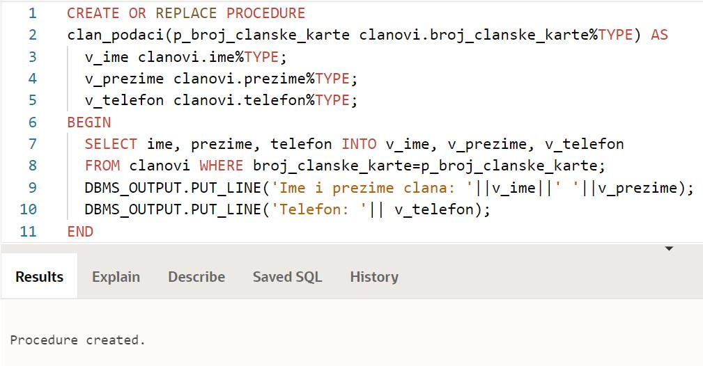
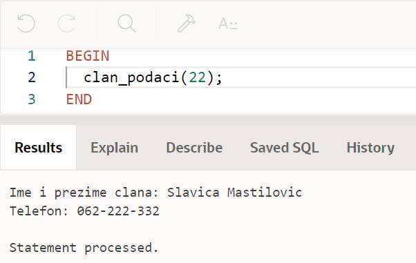
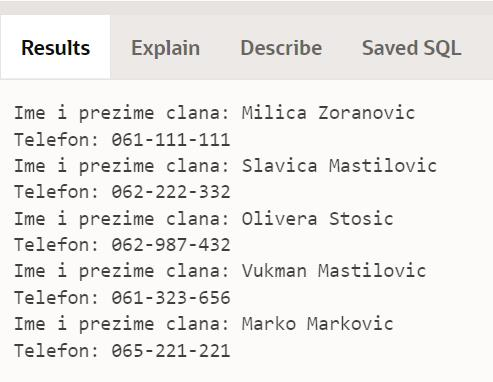
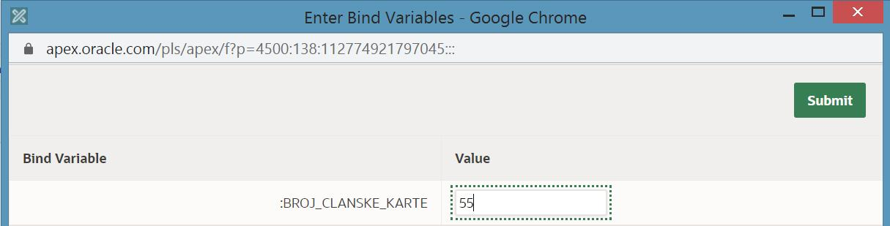
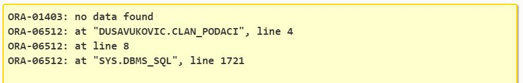
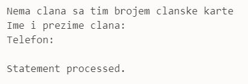

Процедуре и функције
=====================

.. suggestionnote::

    Често је потребно да један програм више пута користимо, и то са различитим параметрима. На пример, видели смо примере програма у којима приказујемо тренутне позајмице за члана чији број чланске карте уносимо са тастатуре. Да не бисмо стално писали и покретали исти програмски код, постоји могућност да се он организује у именовану целину која ће остати запамћена у СУБП-у, и по потреби ће се само позивати. У језику PL/SQL постоје две врсте именованих подпрограма, а то су процедуре и функције.

    Следе примери и објашњења како се пишу и позивају процедуре и функције, подпрограми написани у језику PL/SQL. 

Програми се пишу у едитору у оквиру онлајн окружења *Oracle APEX*, а покрећу се кликом на дугме **Run**:

- https://apex.oracle.com/en/ (обавезно логовање на креирани налог)
- SQL Workshop
- SQL Commands

Сви примери PL/SQL програма који следе узимају податке из базе података библиотеке, и то из једне табеле. 

clanovi(**broj_clanske_karte**, ime, prezime, adresa, telefon, mejl_adresa)

Погледајмо поново проблем који смо раније већ решавали. Приказати име, презиме и телефон члана библиотеке са бројем чланске карте 22.

Можемо да напишемо једноставан PL/SQL програм. 

::

    DECLARE
        v_clan VARCHAR2(150);
        v_telefon clanovi.telefon%TYPE;
    BEGIN
        SELECT ime||' '||prezime, telefon INTO v_clan, v_telefon
        FROM clanovi WHERE broj_clanske_karte=22;
        DBMS_OUTPUT.PUT_LINE('Ime i prezime clana: '||v_clan);
        DBMS_OUTPUT.PUT_LINE('Telefon: '|| v_telefon);
    END

Мана овог решења је што није флексибилно. Сам програмски код би морао да се мења и поново покреће да би се добили исти подаци за неког другог члана. Као што већ знамо из програмирања, када имамо потребу да неки програмски код често користимо и за различите улазне вредности, има смисла да креирамо именовани подпрограм. Једна врста подпрограма коју можемо да напишемо је процедура. **Процедура** је именовани подпрограм који изврши неки низ наредби. 

Погледаћемо две могуће организације процедуре. Прва процедура ће узети као улазни параметар број чланске карте, а приказаће име, презиме и телефон на екрану. 

::

    CREATE OR REPLACE PROCEDURE 
        clan_podaci(p_broj_clanske_karte clanovi.broj_clanske_karte%TYPE) AS
        v_ime clanovi.ime%TYPE;
        v_prezime clanovi.prezime%TYPE;
        v_telefon clanovi.telefon%TYPE;
    BEGIN
        SELECT ime, prezime, telefon INTO v_ime, v_prezime, v_telefon
        FROM clanovi WHERE broj_clanske_karte=p_broj_clanske_karte;
        DBMS_OUTPUT.PUT_LINE('Ime i prezime clana: '||v_ime||' '||v_prezime);
        DBMS_OUTPUT.PUT_LINE('Telefon: '|| v_telefon);
    END

Када се кликне на дугме *Run*, добијамо поруку да је процедура креирана, на енглеском *Procedure created.* Могуће је да, након тестирања, треба да изменимо програмски код сачуване процедуре. Из тог разлога је згодно увек писати CREATE OR REPLACE приликом креирања процедуре, па уколико већ постоји, она ће бити обрисана и уместо ње ће се креирати нова, измењена. У том случају, не морамо ми да ручно бришемо процедуру пре него што креирамо нову верзију. 

Процедура је запамћена у систему и можемо да је позовемо у једном или више различитих PL/SQL програма. Можемо да обришемо њен програмски код из едитора, и да напишемо следећи програм који ће процедуру да позове за број чланске карте 22. 

::

    BEGIN
        clan_podaci(22);
    END

Резултат рада програма може да се види на следећој слици. 

Исту процедуру можемо да употребимо и у неком другом програму. На пример, можемо да обришемо програм који смо написали у едитору и напишемо следећи програм у којем ћемо за сваког члана да прикажемо ове податке. 

::

    DECLARE
        CURSOR kursor_clanovi IS SELECT * FROM clanovi;
    BEGIN
        FOR v_clan IN kursor_clanovi LOOP
            clan_podaci(v_clan.broj_clanske_karte);
        END LOOP;
    END

Процедура не мора да исписује податке на екран. Тражени подаци могу да се врате програму из којег ће се процедура позвати кроз листу излазних параметара. За излазне параметре је неопходно написати реч OUT.  

::

    CREATE OR REPLACE PROCEDURE 
        clan_podaci2(p_broj_clanske_karte clanovi.broj_clanske_karte%TYPE, 
        p_ime OUT clanovi.ime%TYPE, p_prezime OUT clanovi.prezime%TYPE, 
        p_telefon OUT clanovi.telefon%TYPE) AS
    BEGIN
        SELECT ime, prezime, telefon INTO p_ime, p_prezime, p_telefon
        FROM clanovi WHERE broj_clanske_karte=p_broj_clanske_karte;
    END

Када се процедура креира, могуће је написати програм у којем се позива. У овом програму је потребно декларисати променљиве које ће процедура попунити вредностима, то су променљиве за име, презиме и телефон. Након позива процедуре, тражене вредности исписујемо на екран у програму. 

::

    DECLARE
        v_ime clanovi.ime%TYPE;
        v_prezime clanovi.prezime%TYPE;
        v_telefon clanovi.telefon%TYPE;
    BEGIN
        clan_podaci2(22, v_ime, v_prezime, v_telefon);
        DBMS_OUTPUT.PUT_LINE('Ime i prezime clana: '||v_ime||' '||v_prezime);
        DBMS_OUTPUT.PUT_LINE('Telefon: '|| v_telefon);
    END

И ову процедуру можемо да употребимо и у неком другом програму. Можемо да обришемо програм који смо написали у едитору и напишемо следећи програм у којем ћемо за сваког члана да прикажемо ове податке. Наравно, морамо да водимо рачуна о томе како је процедура организована и према томе да предвидимо променљиве и начин позива. 

::

    DECLARE
        CURSOR kursor_clanovi IS SELECT * FROM clanovi;
        v_ime clanovi.ime%TYPE;
        v_prezime clanovi.prezime%TYPE;
        v_telefon clanovi.telefon%TYPE;
    BEGIN
        FOR v_clan IN kursor_clanovi LOOP
            clan_podaci2(v_clan.broj_clanske_karte, v_ime, v_prezime, v_telefon);
            DBMS_OUTPUT.PUT_LINE('Ime i prezime clana: '||v_ime||' '||v_prezime);
            DBMS_OUTPUT.PUT_LINE('Telefon: '|| v_telefon);
        END LOOP;
    END

Следи нови програм у којем позивамо ову процедуру. У овом случају се број чланске карте уноси са тастатуре. 

::

    DECLARE
        v_ime clanovi.ime%TYPE;
        v_prezime clanovi.prezime%TYPE;
        v_telefon clanovi.telefon%TYPE;
        v_broj_clanske_karte clanovi.broj_clanske_karte%TYPE;
    BEGIN
        v_broj_clanske_karte := :BROJ_CLANSKE_KARTE;
        clan_podaci(v_broj_clanske_karte, v_ime, v_prezime, v_telefon);
        DBMS_OUTPUT.PUT_LINE('Ime i prezime clana: '||v_ime||' '||v_prezime);
        DBMS_OUTPUT.PUT_LINE('Telefon: '|| v_telefon);
    END

Уколико се унесе неисправан број чланске карте, долази до пуцања програма. 

Често грешке у писању подпрограма видимо тек када га позовемо у доста различитих ситуација. Јасно је да је потребно да додамо EXCEPTION блок. 

::

    CREATE OR REPLACE PROCEDURE 
        clan_podaci2(p_broj_clanske_karte clanovi.broj_clanske_karte%TYPE, 
        p_ime OUT clanovi.ime%TYPE, p_prezime OUT clanovi.prezime%TYPE, 
        p_telefon OUT clanovi.telefon%TYPE) AS
    BEGIN
        SELECT ime, prezime, telefon INTO p_ime, p_prezime, p_telefon
        FROM clanovi WHERE broj_clanske_karte=p_broj_clanske_karte;
    EXCEPTION
        WHEN NO_DATA_FOUND THEN 
        DBMS_OUTPUT.PUT_LINE('Nema clana sa tim brojem clanske karte');
    END

Када се покрене, нова процедура ће у систему заменити стару процедуру. 

Када се покрене програм и унесе неисправан број чланске карте, приказаће се одговарајућа порука

Можемо уместо процедуре да напишемо функцију. **Функција** је подпрограм који изврши неки низ наредби и обавезно помоћу RETURN врати једну вредност. Та вредност може да буде проста, један текстуални податак или један број, а може да буде и сложена. У овом случају нам треба сложена вредност која има и име, и презиме, и телефон члана. Пре одељка за декларацију и тела функције је потребно написати RETURN и тип променљиве коју функција враћа. 

::

        CREATE OR REPLACE FUNCTION clanovi_fja(p_br clanovi.broj_clanske_karte%TYPE) 
        RETURN clanovi%ROWTYPE AS
        podaci clanovi%ROWTYPE;
    BEGIN
        SELECT * INTO podaci FROM clanovi
        WHERE broj_clanske_karte=p_br;
        RETURN podaci;
    END

Када се кликне на дугме *Run*, добијамо поруку да је процедура креирана, на енглеском *Function created*. Функција је запамћена у систему и можемо да је позовемо у једном или више различитих PL/SQL програма. Можемо да обришемо њен програмски код из едитора, и да напишемо следећи програм који ће функцију да позове за број чланске карте 22. Када позивамо функцију, морамо да предвидимо променљиву којој ћемо да доделимо резултат рада функције, тако да се позив функције често налази као део у наредби доделе.

::

    DECLARE 
        v_clanovi clanovi%ROWTYPE;
    BEGIN
        v_clanovi := clanovi_fja(22);
        DBMS_OUTPUT.PUT_LINE(v_clanovi.prezime);
    END
