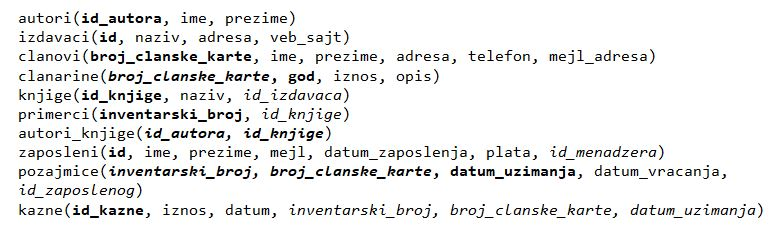
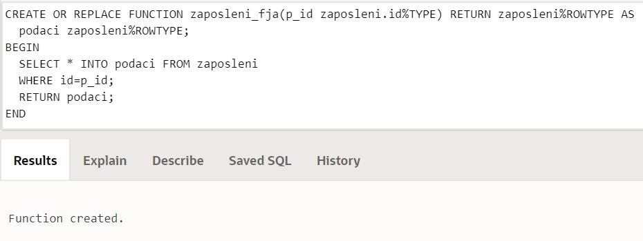
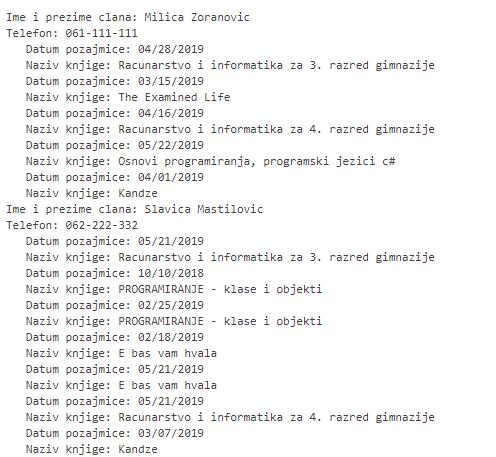
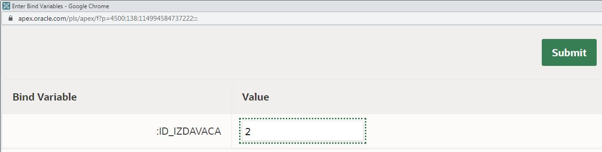
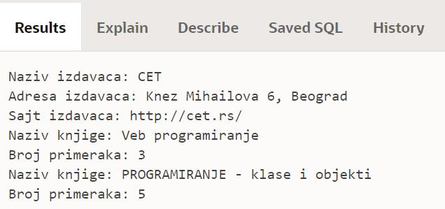

Процедуре и функције - задаци
=============================

.. suggestionnote::

    У свим задацима који следе, основни захтев ће бити да се креира подпрограм у језику PL/SQL, процедура или функција. Подпрограм остаје сачуван у СУБП-у и може да се користи у различитим програмима, па ће бити приказано и позивање креираних подпрограма. 

Програми се пишу у едитору у оквиру онлајн окружења *Oracle APEX*, а покрећу се кликом на дугме **Run:**

- https://apex.oracle.com/en/ (обавезно логовање на креирани налог)
- SQL Workshop
- SQL Commands

Креирати PL/SQL програме који узимају податке из базе података библиотеке. Следи списак свих табела са колонама. Примарни кључеви су истакнути болд, а страни италик.

.. questionnote::

    1. Написати функцију која враћа све податке о запосленом на основу идентификационог броја. 

::

    CREATE OR REPLACE FUNCTION zaposleni_fja(p_id zaposleni.id%TYPE) 
    RETURN zaposleni%ROWTYPE AS
        podaci zaposleni%ROWTYPE;
    BEGIN
        SELECT * INTO podaci FROM zaposleni
        WHERE id=p_id;
        RETURN podaci;
    END

Након што је креирана и сачувана, функцију можемо да позовемо у програму. У програму који следи, функцију позивамо за запосленог са идентификационим бројем 2. 

::

    DECLARE 
        v_zaposleni zaposleni%ROWTYPE;
    BEGIN
        v_zaposleni := zaposleni_fja(2);
        DBMS_OUTPUT.PUT_LINE('Zaposleni: '||v_zaposleni.prezime||' '||v_zaposleni.ime);
        DBMS_OUTPUT.PUT_LINE('Mejl: '||v_zaposleni.mejl);
        DBMS_OUTPUT.PUT_LINE('Plata: '||v_zaposleni.plata||' RSD'); 
    END

Функцију можемо да позовемо и тако да се приказују подаци за све запослене. 

::

    DECLARE 
        CURSOR spisak_zaposlenih IS SELECT id FROM zaposleni;
        v_zaposleni zaposleni%ROWTYPE;
    BEGIN
        FOR v_red IN spisak_zaposlenih LOOP
            v_zaposleni := zaposleni_fja(v_red.id);
            DBMS_OUTPUT.PUT_LINE('Zaposleni: '||v_zaposleni.prezime||' '||v_zaposleni.ime);
            DBMS_OUTPUT.PUT_LINE('Mejl: '||v_zaposleni.mejl);
            DBMS_OUTPUT.PUT_LINE('Plata: '||v_zaposleni.plata||' RSD'); 
        END LOOP;
    END

.. questionnote::

    2. Написати процедуру која приказује име, презиме и телефон за сваког члана библиотеке

Ова процедура нема параметре.  

::

    CREATE OR REPLACE PROCEDURE telefoni_clanova AS
        CURSOR kursor_clan IS SELECT ime, prezime, telefon FROM clanovi;
    BEGIN
        FOR clan IN kursor_clan LOOP
            DBMS_OUTPUT.PUT_LINE('Ime i prezime clana: '||clan.ime||' '||clan.prezime);
            DBMS_OUTPUT.PUT_LINE('Telefon: '|| clan.telefon);
        END LOOP;
    END

Након што је креирана и сачувана, процедуру можемо да позовемо у програму. 

::

    BEGIN
        telefoni_clanova;
    END

База података за библиотеку коју користимо нема превелики број података. Најчешће у базама имамо табеле са веома великим бројем редова и није могуће да све податке из табеле повучемо у програм. Из тог разлога можемо да ограничимо број редова из којих узимамо податке користећи у упиту FETCH FIRST ROWS ONLY уз навођење броја редова који нам је потребан. 

Следи измењена процедура која узима број чланова чије ћемо податке приказати. 

.. infonote::

    **ВАЖНО:** Како је пример базе података за библиотеку мали, ово нећемо употребљавати у програмима који следе, али би требало да увек имате у виду да се FETCH FIRST ROWS ONLY, или нека друга опција за ограничавање броја редова који се узимају, обавезно користи у већим базама података. 

::

    CREATE OR REPLACE PROCEDURE telefoni_clanova(broj INT) AS
        CURSOR kursor_clan IS SELECT ime, prezime, telefon FROM clanovi
        FETCH FIRST broj ROWS ONLY;
    BEGIN
        FOR clan IN kursor_clan LOOP
            DBMS_OUTPUT.PUT_LINE('Ime i prezime clana: '||clan.ime||' '||clan.prezime);
            DBMS_OUTPUT.PUT_LINE('Telefon: '|| clan.telefon);
        END LOOP;
    END

Следећи позив процедуре приказује телефоне само три члана. 

::

    BEGIN
        telefoni_clanova(3);
    END

.. questionnote::

    3. Написати функцију која рачуна просечну плату свих запослених у библиотеци.

Ова функција нема параметре.  

::

    CREATE OR REPLACE FUNCTION prosecna_plata RETURN NUMBER AS
        v_iznos NUMBER;
    BEGIN
        SELECT ROUND(AVG(plata),2) INTO v_iznos FROM zaposleni;
        RETURN v_iznos;
    END

Након што је креирана и сачувана, функцију можемо да позовемо у програму. У овом примеру, вредност коју је функција израчунала приказујемо на екрану директно у позиву процедуре PUT_LINE. 

::

    BEGIN
        DBMS_OUTPUT.PUT_LINE(prosecna_plata);
    END

У програму у којем позивамо функцију смо могли и да декларишемо и употребимо променљиву. 

::

    DECLARE
        v_prosek NUMBER;
    BEGIN
        v_prosek := prosecna_plata;
        DBMS_OUTPUT.PUT_LINE(v_prosek);
    END

.. questionnote::

    4. Написати функцију која рачуна просечну плату свих запослених у библиотеци чији менаџер има дати идентификациони број.

::

    CREATE OR REPLACE FUNCTION 
        prosecna_plata_po_menadzeru(p_id zaposleni.id_menadzera%TYPE) RETURN NUMBER AS
        v_iznos NUMBER;
    BEGIN
        SELECT ROUND(AVG(plata),2) INTO v_iznos FROM zaposleni
        WHERE id_menadzera = p_id;
        RETURN v_iznos;
    END

Након што је креирана и сачувана, функцију можемо да позовемо у програму. У програму који следи, функцију позивамо за менаџера са идентификационим бројем 1. 

::

    BEGIN
        DBMS_OUTPUT.PUT_LINE(prosecna_plata_po_menadzeru(1));
    END

Функцију можемо да позовемо и у програму тако да се за сваког менаџера прикажу просечне плате запослених који раде код њега у тиму. Нису сви запослени менаџери. Да бисмо добили само оне запослене који су менаџери, потребно је да погледамо колону *id_menadzera* у табели *zaposleni*. Како један менаџер често управља тимом који има више запослених, његов идентификациони број ће се више пута појавити у овој колони, па је неопходно употребити DISTINCT када издвајамо списак идентификационих бројева менаџера. Уколико неко од запослених нема менаџера, код њега ће писати *null* у колони *id_menadzera*, па је са овог списка важно уклонити *null*.

::

    DECLARE
        CURSOR spisak_menadzera IS 
            SELECT DISTINCT id_menadzera FROM zaposleni WHERE id_menadzera IS NOT NULL;
        v_ime zaposleni.ime%TYPE;
        v_prezime zaposleni.prezime%TYPE;
    BEGIN
        FOR v_red IN spisak_menadzera LOOP
            SELECT ime, prezime INTO v_ime, v_prezime FROM zaposleni
            WHERE id=v_red.id_menadzera;
            DBMS_OUTPUT.PUT_LINE('Menadzer: '||v_ime||' '||v_prezime);
            DBMS_OUTPUT.PUT_LINE('Prosecna plata u timu: ');
            DBMS_OUTPUT.PUT_LINE(prosecna_plata_po_menadzeru(v_red.id_menadzera)||' RSD');
        END LOOP;
    END

.. questionnote::

    5. Написати процедуру која приказује све позајмице за сваког члана. Приказати датум и назив позајмљене књиге. 

::

    CREATE OR REPLACE PROCEDURE spisak_pozajmica AS
        CURSOR kursor_clan 
            IS SELECT broj_clanske_karte, ime||' '||prezime clan, telefon FROM clanovi;
        CURSOR kursor_pozajmica (p_broj_clanske_karte clanovi.broj_clanske_karte%TYPE) 
            IS SELECT datum_uzimanja, naziv FROM pozajmice JOIN primerci USING (inventarski_broj)
            JOIN knjige USING (id_knjige) WHERE broj_clanske_karte=p_broj_clanske_karte;
    BEGIN
        FOR v_red_clan IN kursor_clan LOOP
            DBMS_OUTPUT.PUT_LINE('Ime i prezime clana: '||v_red_clan.clan);
            DBMS_OUTPUT.PUT_LINE('Telefon: '|| v_red_clan.telefon);
            FOR v_red_pozajmica IN kursor_pozajmica(v_red_clan.broj_clanske_karte) LOOP
            DBMS_OUTPUT.PUT_LINE('   Datum pozajmice: '||v_red_pozajmica.datum_uzimanja);
            DBMS_OUTPUT.PUT_LINE('   Naziv knjige: '||v_red_pozajmica.naziv);
            END LOOP;
        END LOOP;
    END

Након што је креирана и сачувана, процедуру можемо да позовемо у програму. 

::

    BEGIN 
        spisak_pozajmica;
    END

Део резултата рада програма може да се види на следећој слици. 

.. questionnote::

    6. Написати процедуру која за дати идентификациони број издавача приказује све књиге тог издавача и број примерака сваке од тих књига у библиотеци. 

::

    CREATE OR REPLACE PROCEDURE spisak_knjiga(p_id_izdavaca izdavaci.id%TYPE) AS
        CURSOR kursor_knjige 
            IS SELECT knjige.naziv AS naziv, COUNT(inventarski_broj) AS broj_primeraka
            FROM knjige JOIN primerci USING (id_knjige) WHERE id_izdavaca = p_id_izdavaca
            GROUP BY knjige.naziv;
    BEGIN
        FOR v_red_knjiga IN kursor_knjige LOOP
            DBMS_OUTPUT.PUT_LINE('Naziv knjige: '||v_red_knjiga.naziv);
            DBMS_OUTPUT.PUT_LINE('Broj primeraka: '|| v_red_knjiga.broj_primeraka);
        END LOOP;
    END

Након што је креирана и сачувана, процедуру можемо да позовемо у програму. У следећем програму се идентификациони број издавача уноси са тастатуре, приказују се подаци о том издавачу, а затим се позива креирана процедура. 

::

    DECLARE
        v_id_izdavaca izdavaci.id%TYPE;
        v_izdavac izdavaci%ROWTYPE;
    BEGIN
        v_id_izdavaca := :ID_IZDAVACA;
        SELECT * INTO v_izdavac FROM izdavaci
        WHERE id = v_id_izdavaca;
        DBMS_OUTPUT.PUT_LINE('Naziv izdavaca: '||v_izdavac.naziv);
        DBMS_OUTPUT.PUT_LINE('Adresa izdavaca: '||v_izdavac.adresa);
        DBMS_OUTPUT.PUT_LINE('Sajt izdavaca: '||v_izdavac.veb_sajt);
        spisak_knjiga(v_id_izdavaca);
    EXCEPTION
        WHEN OTHERS THEN
            DBMS_OUTPUT.PUT_LINE('Greska');
    END

У следећем програму се користи курсор којим се пролази кроз све издаваче и за сваког се позива креирана процедура. 

::

    DECLARE
        CURSOR kursor_izdavaci IS SELECT * FROM izdavaci;
        v_izdavac izdavaci%ROWTYPE;
    BEGIN
        FOR v_izdavac IN kursor_izdavaci LOOP
            DBMS_OUTPUT.PUT_LINE('Naziv izdavaca: '||v_izdavac.naziv);
            DBMS_OUTPUT.PUT_LINE('Adresa izdavaca: '||v_izdavac.adresa);
            DBMS_OUTPUT.PUT_LINE('Sajt izdavaca: '||v_izdavac.veb_sajt);
            spisak_knjiga(v_izdavac.id);
            DBMS_OUTPUT.PUT_LINE('---');
        END LOOP;
    EXCEPTION
        WHEN OTHERS THEN DBMS_OUTPUT.PUT_LINE('Greska');
    END
