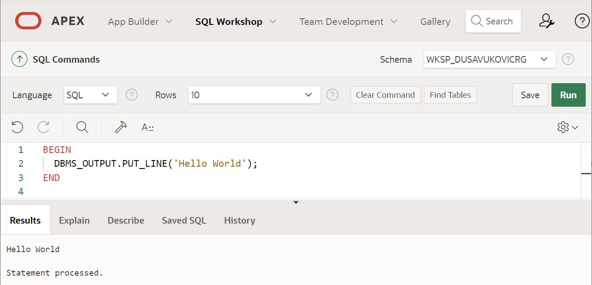
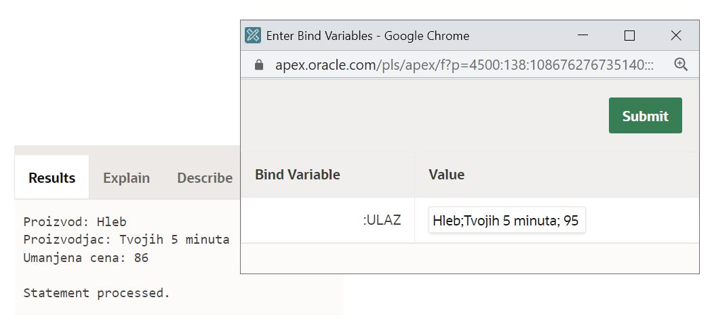
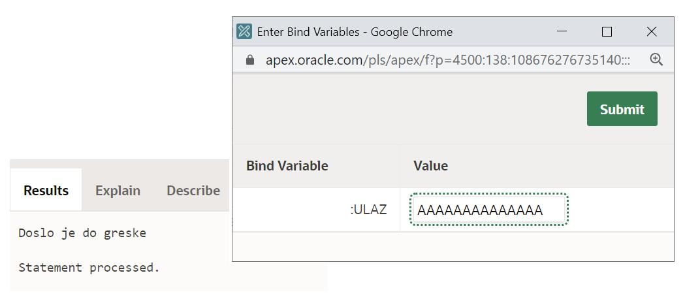
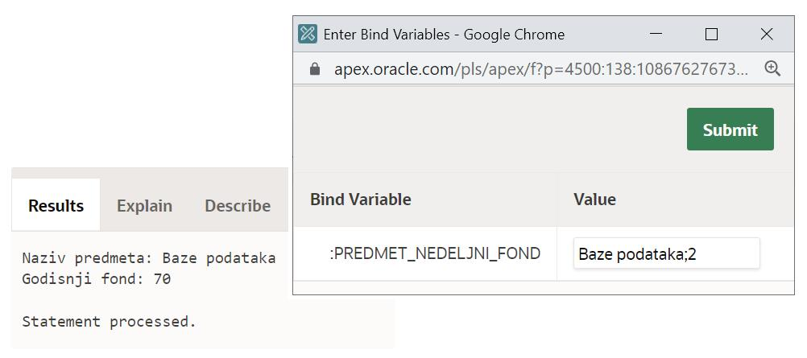

Језик PL / SQL - задаци
=======================

.. suggestionnote::

    Следе примери једноставних програма написаних у језику PL/SQL у онлајн окружењу *Oracle APEX.*

    Сваки програм узима неке податке који су или бројеви или текст, а резултат обраде приказује на екрану. Прва група задатака би могла да се посматра као део неке апликације која се користи у продавници, а друга група задатака се односи на школу.  

Програми се пишу у едитору у оквиру онлајн окружења *Oracle APEX*, а покрећу се кликом на дугме **Run**:

- https://apex.oracle.com/en/ (обавезно логовање на креирани налог)
- SQL Workshop
- SQL Commands

.. questionnote::

    1. Креирати PL/SQL програм у којем се уноси цена и број који представља за колико процената треба да се умањи цена, а приказује се нова цена. На пример, уколико се унесу два броја 1000 и 20, програм треба да испише 800. 

Програми писани у језику PL/SQL се везују за базе података и променљиве често одговарају неким подацима из базе. Уколико постоји у некој табели колона *cena*, а потребна је променљива у програму у коју ћемо сачувати ту цену из базе, онда је потребан и неки начин на који можемо да направимо разлику између назива колоне и назива променљиве, а да опет буде јасно да се обе ствари односе на исти податак. Начин на који то може да се реши је да се дода слово *v*, скраћено од енглеске речи за променљиву *variable*, и доња црта на почетку назива променљиве. Иако се примери који следе не повезују на базу података, добро је да већ сада, кроз понеки једноставан програм, вежбамо овај начин именовања променљивих.  

::

    DECLARE
        v_cena NUMBER(8, 2); --najveci broj 999,999.99
        v_procenat NUMBER(2); --dvocifren broj
    BEGIN
        v_cena := :cena;
        v_procenat := :procenat_smanjenja;
        v_cena := v_cena * (100 – v_procenat) / 100;
        DBMS_OUTPUT.PUT_LINE('Nova cena: '||v_cena);
    END

.. questionnote::

    2. Креирати PL/SQL програм који прерачунава унети износ новца у еврима у динаре.

Унутар програма који се пишу у језику PL/SQL могу да се користе функције које постоје у језику SQL. У овом примеру је употребљена функција за конверзију TO_CHAR, која служи да се број прикаже у датом формату.   

::

    
    DECLARE
        v_eur NUMBER;
    BEGIN
        v_eur := :EURO;
        DBMS_OUTPUT.PUT_LINE(TO_CHAR(v_eur*117.96,'999,999.99')||' RSD');
    END

.. questionnote::

    3. Креирати PL/SQL програм у којем се од два унета текстуална податка, на пример назива производа и назива произвођача, формира један њиховим надовезивањем и пребацивањем свих слова у велика. 

Оператор за конкатенацију се представља са две усправне црте || и њиме надовезујемо текстуалне податке у један.

::

     DECLARE
        v_prvi_tekst VARCHAR2(20);
        v_drugi_tekst VARCHAR2(20);
        v_rez VARCHAR2(40);
    BEGIN  
        v_prvi_tekst := :prvi_tekst;
        v_drugi_tekst := :drugi_tekst;
        v_rez := UPPER(v_prvi_tekst||v_drugi_tekst);
        DBMS_OUTPUT.PUT_LINE(v_rez);
    END

.. questionnote::

    4. Претпоставити да се име и презиме продавца уносе као један текстуални податак. Раздвојени су размаком. Креирати PL/SQL програм у којем се у одвојеним редовима приказују име и презиме, а затим у трећем реду и иницијали. 

Функција INSTR враћа прву позицију појављивања неког текста или знака, у овом случају размака, у датом текстуалном податку. Када се позове функција SUBSTR као друга два параметра се дају позиција од које узимамо знакове и колико нам знакова треба. Уколико се изостави број знакова, узеће се сви до краја текста. Име ћемо издвојити тако што ћемо позвати функцију SUBSTR и тражити да се издвоје знакови од прве позиције до размака, а презиме ћемо издвојити тако што ћемо узети све знакове после размака па до краја. Даље, за иницијале узимамо од прве позиције по један знак из имена и презимена. Да су нам била потребна прва два слова, онда бисмо написали SUBSTR(v_prezime,1,2).

::

    DECLARE
        v_tekst VARCHAR2(50);
        v_ime VARCHAR2(20);
        v_prezime VARCHAR2(30);
        v_poz NUMBER(2);
    BEGIN 
        v_tekst := :ime_i_prezime;
        v_poz := INSTR(v_tekst, ' ');
        v_ime := SUBSTR(v_tekst, 1, v_poz-1);
        v_prezime := SUBSTR(v_tekst, v_poz+1);
        DBMS_OUTPUT.PUT_LINE('Ime: '||v_ime);
        DBMS_OUTPUT.PUT_LINE('Prezime: '||v_prezime);
        DBMS_OUTPUT.PUT_LINE(UPPER(SUBSTR(v_ime,1,1)||SUBSTR(v_prezime,1,1)));
    END

.. questionnote::
    
    5. Креирати PL/SQL програм у који се уноси један текстуални податак који се састоји од две цене раздвојене тачка-зарезом (;), на пример: 9500;10000. Израчунати и исписати за колико је друга цена већа од прве. 

Функција INSTR враћа прву позицију појављивања неког текста или знака, у овом случају знака тачка-зарез, у датом текстуалном податку. Ову позицију можемо да употребимо у позиву функције SUBSTR тако да издвојимо део текста који претходи овој позицији, а у другом позиву исте функције да издвојимо део текста који следи након овог знака. Када у позиву функција SUBSTR имамо само два параметра, онда ће се издвојити део текста све до краја почетног текста.  

::

    DECLARE
        ulaz VARCHAR2(13);
        cena1 NUMBER(6); --najveca 999999
        cena2 NUMBER(6);
        poz NUMBER(1);
    BEGIN
        ulaz := :dve_cene;
        poz := INSTR(ulaz,';');
        cena1 := TO_NUMBER(SUBSTR(ulaz,1,poz-1));
        cena2 := TO_NUMBER(SUBSTR(ulaz,poz+1));
        DBMS_OUTPUT.PUT_LINE(cena2-cena1);
    END

.. questionnote::

    6. Креирати PL/SQL програм у који се уноси један текстуални податак који се састоји од три цене раздвојене тачка-зарезом (;), на пример: 9000;10000;11000. Израчунати и приказати просечну цену. 

Погледати коментаре у следећем програмском коду кроз које је илустровано како се издвајају појединачне цене из унетог текста. 

::

    DECLARE
        ulaz VARCHAR2(20);
        cena1 NUMBER(6); --najveca 999999
        cena2 NUMBER(6);
        cena3 NUMBER(6);
        poz NUMBER(1);
    BEGIN
        ulaz := :tri_cene; --npr. 9000;10000;11000 
        poz := INSTR(ulaz,';'); --poz je 5
        cena1 := TO_NUMBER(SUBSTR(ulaz,1,poz-1)); --cena1 je 9000
        ulaz := SUBSTR(ulaz,poz+1); --10000;11000
        poz := INSTR(ulaz,';'); --poz je 6
        cena2 := TO_NUMBER(SUBSTR(ulaz,1,poz-1)); --cena2 je 10000
        cena3 := TO_NUMBER(SUBSTR(ulaz,poz+1)); --cena3 je 11000
        DBMS_OUTPUT.PUT_LINE((cena1+cena2+cena3)/3);
    END

.. questionnote::

    7. Креирати PL/SQL програм у који се уноси један текстуални податак који се састоји од три податка раздвојена тачка-зарезом (;): назив производа, назив произвођача и цена. Приказати у засебним редовима назив производа, назив произвођача и цену умањену за 10%. 

Уколико унети текст није у очекиваном формату, може да дође до пуцања програма. Можемо да предвидимо и обрадимо одговарајућу грешку додавањем блока за обраду изузетака EXCEPTION. Овај блок креће након свих наредби одговарајућом резервисаном речју и завршава се када се цео програмски блок заврши. Блок за обраду изузетака може да има више грана. Реч OTHERS описује најопштију грешку, тј. тај део програмског кода хвата изузетак било ког типа. 

::

    DECLARE
        v_ulaz VARCHAR2(100);
        v_proizvod VARCHAR2(20);
        v_proizvodjac VARCHAR2(20);
        v_cena NUMBER(20);
        v_index NUMBER(20);

    BEGIN
        v_ulaz := :ULAZ;

        v_index := INSTR(v_ulaz,';');
        v_proizvod := SUBSTR(v_ulaz,1,v_index-1); 
        v_ulaz := SUBSTR(v_ulaz,v_index+1);

        v_index := INSTR(v_ulaz,';');
        v_proizvodjac := SUBSTR(v_ulaz,1,v_index-1);
        v_ulaz := SUBSTR(v_ulaz,v_index+1);

        v_cena := TO_NUMBER(v_ulaz);
        v_cena := 0.9*v_cena;

        DBMS_OUTPUT.PUT_LINE('Proizvod: '|| v_proizvod);
        DBMS_OUTPUT.PUT_LINE('Proizvodjac: '|| v_proizvodjac);
        DBMS_OUTPUT.PUT_LINE('Umanjena cena: '|| v_cena);

    EXCEPTION
        WHEN OTHERS THEN 
            DBMS_OUTPUT.PUT_LINE('Doslo je do greske');
    END

Уколико се исправно унесе текстуални податак, правилно ће се приказати резултат, што може да се види на следећој слици.

Уколико се, међутим, унесе неисправан податак, на пример текст који нема у себи сепаратор тачка-зарез на два места, долази до грешке. Како имамо блок за обраду изузетака, приказаће се одговарајућа порука. 

.. questionnote::

    8. Креирати PL/SQL програм у који се уносе укупан број ученика једног одељења и број одличних ученика. Приказати у процентима колико има одличних ученика у том одељењу.  

::

    DECLARE
        ukupan_broj NUMBER(2); 
        broj_odlicnih NUMBER(2);
        procenat NUMBER(5,2);
    BEGIN
        ukupan_broj := :broj_ucenika_u_odeljenju;
        broj_odlicnih := :broj_odlicnih;
        procenat := 100 * (broj_odlicnih/ukupan_broj);
        DBMS_OUTPUT.PUT_LINE(procenat);
    END

.. questionnote::

    9. Креирати PL/SQL програм у који се уносе назив предмета и недељни фонд часова као један текстуални податак. Назив предмета и фонд часова су раздвојени тачка-зарезом. Приказати у једном реду назив предмета, а у следећем годишњи фонд (школска година за матуранте има 35 наставних недеља). 

На пример, уколико је улаз

::

    DECLARE
        ulaz VARCHAR2(50);
        naziv VARCHAR2(45);
        nedeljni_fond NUMBER(1);
        godisnji_fond NUMBER(3);
        pozicija NUMBER(2);
    BEGIN
        ulaz := :predmet_nedeljni_fond;
        pozicija := INSTR(ulaz,';');
        naziv := SUBSTR(ulaz,1,pozicija-1);
        nedeljni_fond := TO_NUMBER(SUBSTR(ulaz,pozicija+1));
        godisnji_fond := 35 * nedeljni_fond;
        DBMS_OUTPUT.PUT_LINE('Naziv predmeta: '||naziv);
        DBMS_OUTPUT.PUT_LINE('Godisnji fond: '||godisnji_fond);
    END

.. questionnote::

    10. Креирати PL/SQL програм у који се уносе поштански број и назив града као један податак (раздвојени размаком). На пример: 11000 Beograd. Приказати у одвојеним редовима поштански број и назив места. 

::

    DECLARE
        unos VARCHAR(30);
    BEGIN
        unos := :postanski_broj_i_grad;
        DBMS_OUTPUT.PUT_LINE('Postanski broj: ' || SUBSTR(unos,1,5));
        DBMS_OUTPUT.PUT_LINE('Grad: ' || SUBSTR(unos,7));
    END

.. questionnote::

    11. Креирати PL/SQL програм у који се уносе три податка: име и презиме ученика и година уписа у школу (4 цифре). Формирати имејл адресу по систему који примењује Рачунарска гимназија у Београду. Имејл адреса се састоји од првог слова имена, целог презимена, последње две цифре године уписа и наставка @rg.edu.rs.

::

    DECLARE
        ime VARCHAR2(20);
        prezime VARCHAR2(20);
        godina NUMBER(4);
        mejl VARCHAR2(100);
    BEGIN
        ime := :ime_ucenika;
        prezime := :prezime_ucenika;
        godina := :godina_upisa;
        mejl := LOWER(SUBSTR(ime,1,1)||prezime||SUBSTR(TO_CHAR(godina),3,2))||'@rg.edu.rs';
        DBMS_OUTPUT.PUT_LINE(mejl);
    END

.. questionnote::

    12. Креирати PL/SQL програм у који се уноси један текстуални податак који се састоји од четири оцене раздвојене размаком ( ), на пример: 4 5 4 5. Израчунати и приказати просечну оцену. 
    
::
    
    DECLARE 
        ulaz VARCHAR2(7);
        ocena1 NUMBER(1);
        ocena2 NUMBER(1);
        ocena3 NUMBER(1);
        ocena4 NUMBER(1);
        prosek NUMBER(3,2);
    BEGIN
        ulaz := :cetiri_ocene;
        ocena1 := TO_NUMBER(SUBSTR(ulaz,1,1));
        ocena2 := TO_NUMBER(SUBSTR(ulaz,3,1));
        ocena3 := TO_NUMBER(SUBSTR(ulaz,5,1));
        ocena4 := TO_NUMBER(SUBSTR(ulaz,7,1));
        prosek := (ocena1+ocena2+ocena3+ocena4)/4.0;
        DBMS_OUTPUT.PUT_LINE('Prosecna ocena: '||prosek);
    END
