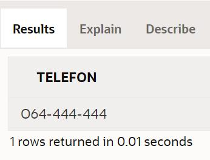

Процедуре и друге SQL команде
=============================

::
    
    До сада смо највише пажње посветили упиту SELECT од свих команди упитног језика SQL. Ово је потпуно оправдано јер управо помоћу ове команде ефикасно добијамо корисне информације из података које чувамо у бази. Складиштење великих количина података није било немогуће и пре појаве дигиталних технологија, али је значај релационих база података управо у брзини и прецизности којом можемо да обрађујемо податке које чувамо. 

    Наравно, у процедурама и функцијама можемо да користимо и друге команде упитног језика SQL. Као илустрација, следи неколико пробраних примера процедура у којима се користе команде INSERT и UPDATE. 

Програми се пишу у едитору у оквиру онлајн окружења *Oracle APEX*, а покрећу се кликом на дугме **Run**:

- https://apex.oracle.com/en/ (обавезно логовање на креирани налог)
- SQL Workshop
- SQL Commands

Сви примери PL/SQL програма који следе раде са подацима из базе података библиотеке, и то са три табеле. 

clanovi(**broj_clanske_karte**, ime, prezime, adresa, telefon, mejl_adresa)

zaposleni(**id**, ime, prezime, mejl, datum_zaposlenja, plata, *id_menadzera*)

izdavaci(**id**, naziv, adresa, veb_sajt

Написаћемо процедуру која служи да се измени број телефона члана у бази података када члан промени број телефона. Као улазне параметре процедура треба да има број чланске карте и нови телефон. Следи комплетан програмски код процедуре. 

::

    CREATE OR REPLACE PROCEDURE 
        izmena_tel_clana(p_broj_clanske_karte clanovi.broj_clanske_karte%TYPE, 
        p_novi_tel clanovi.telefon%TYPE)
        IS
    BEGIN
        UPDATE clanovi
        SET telefon = p_novi_tel
        WHERE broj_clanske_karte = p_broj_clanske_karte;
    END

Сетимо се како је изгледала команда којом смо у табелу clanovi унели податке о члану са бројем чланске карте 11. Можемо да видимо да је телефон био 061-111-111.

::

    INSERT INTO clanovi
    VALUES (11, 'Milica', 'Zoranovic', 'Dunavska 22, Beograd', '061-111-111', null);

Процедуру позивамо у PL/SQL програму. 

::

    BEGIN
        izmena_tel_clana(11, 'O14-444-444');
    END

Након што се овај програм изврши, можемо да покренемо следећи упит и видимо како је сада у бази података нови број телефона код члана са бројем чланске карте 11. 

::

    SELECT telefon FROM clanovi WHERE broj_clanske_karte = 11

У једној процедури можемо да имамо и више команди. Рецимо да треба да се уради корекција плата и да се у сваком тиму менаџеру смањи плата за одређени проценат, а свим запосленим у том тиму да се плата повећа за исти проценат. Процедура ће имати две команде UPDATE. 

::

    CREATE OR REPLACE PROCEDURE 
        promena_plata_tima(p_id_menadzera zaposleni.id%TYPE, p_procenat INT)
        IS
    BEGIN
        UPDATE zaposleni
        SET plata = plata * (100 - p_procenat)/100
        WHERE id = p_id_menadzera;
        UPDATE zaposleni
        SET plata = plata * (100 + p_procenat)/100
        WHERE id_menadzera = p_id_menadzera;
    END

Следи пример процедуре у којој имамо команду INSERT. Процедура омогућава да се унесе нови издавач са датим идентификационим бројем и називом. 

::

    CREATE OR REPLACE PROCEDURE 
    novi_izdavac(p_id izdavaci.id%TYPE, p_naziv izdavaci.naziv%TYPE)
    IS
    BEGIN
        INSERT INTO izdavaci
        VALUES (p_id, p_naziv, null, null);
    END

Процедуру позивамо у PL/SQL програму. 

::

    BEGIN 
        novi_izdavac(9, 'TASCHEN');
    END

Након што се овај програм изврши, можемо да покренемо следећи упит и видимо нови ред у табели. 

::

    SELECT * FROM izdavaci
