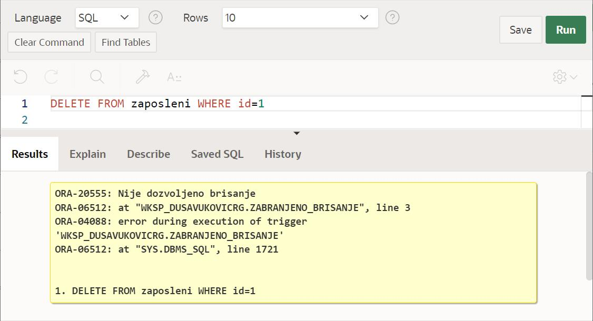

Тругери
=======

.. suggestionnote::

    До сада смо видели како се програмски језик PL/SQL користи за писање процедура и функција. Процедуре и функције су именовани подпрограми које можемо да позивамо у другим програмима. Понекад, међутим, имамо ситуације у којима је потребно да се нешто аутоматски изврши. На пример, да се спречи брисање података или да остане забележено које су измене учињене у табелама. За овакве ситуације је потребно креирати тригере. Они се везују за одређене команде и извршавају се аутоматски, без посебног позивања, када се изврше команде за које су везани. 
 
    Треба бити посебно обазрив у којим ситуацијама су тригери заиста неопходни. Следи неколико кратких илустративних примера да би се оквирно добила идеја шта су и чему служе.  

Програми се пишу у едитору у оквиру онлајн окружења *Oracle APEX*, а покрећу се кликом на дугме **Run**:

- https://apex.oracle.com/en/ (обавезно логовање на креирани налог)
- SQL Workshop
- SQL Commands

Прво ћемо креирати ту помоћну табелу тако да у њу можемо да забележимо идентификациони број запосленог коме је промењена плата, стари и нови износ плате, као и датум када је дошло до измене. 

::

    CREATE TABLE info_promena_plata(
    id NUMBER,
    stara_plata NUMBER,
    nova_plata NUMBER,
    datum_izmene DATE)

Креираћемо тригер који ће, када дође до промене плате, унети жељене податке у помоћну табелу. Користимо речи :OLD и :NEW да приступимо старој и новој вредности плате после извршења измене. 

::

    CREATE OR REPLACE TRIGGER promena_plate_triger
    AFTER UPDATE of plata on zaposleni
    FOR EACH ROW
    BEGIN
    INSERT INTO info_promena_plata(id, stara_plata, nova_plata, datum_izmene)
    VALUES (:OLD.id, :OLD.plata, :NEW.plata, SYSDATE);
    END;

Када извршимо следећи упит, видећемо да је 50.000 динара тренутна плата запосленог са идентификационим бројем 5 .

::

    SELECT plata FROM zaposleni WHERE id=5

Извршићемо следећу команду којом мењамо плату овом запосленом. 

::
    
    UPDATE zaposleni
    SET plata = 70000
    WHERE id=5

Када погледамо поново садржај табеле zaposleni, видећемо нови износ плате. 

Када се извршила команда UPDATE, аутоматски је извршен и тригер који смо креирали. Можемо да покренемо следећи упит и видимо да су информације о овој измени унете у помоћну табелу. 

::

    SELECT * FROM info_promena_plata

Упис информација о промени података у бази имао је смисла након што се измена догодила. Зато смо приликом креирања тригера навели AFTER UPDATE. 

Постоје ситуације у којима нам је важно да се тригер изврши пре неке команде. На пример, уколико желимо да спречимо брисање запосленог који има највишу позицију, потребно је да приликом креирања тригера наведемо BEFORE DELETE. Да би се спречило брисање, потребно је да зауставимо рад програма тако што ћемо да испалимо изузетак са одговарајућом поруком уколико је запослени којег покушавамо да обришемо онај који нема менаџера изнад себе. Брисање се неће извршити. 

::

    CREATE OR REPLACE TRIGGER zabranjeno_brisanje
    BEFORE DELETE ON zaposleni
    FOR EACH ROW
    BEGIN
    IF (:OLD.id_menadzera IS NULL)
    THEN RAISE_APPLICATION_ERROR(-20555, 'Nije dozvoljeno brisanje');
    END IF;
    END;

