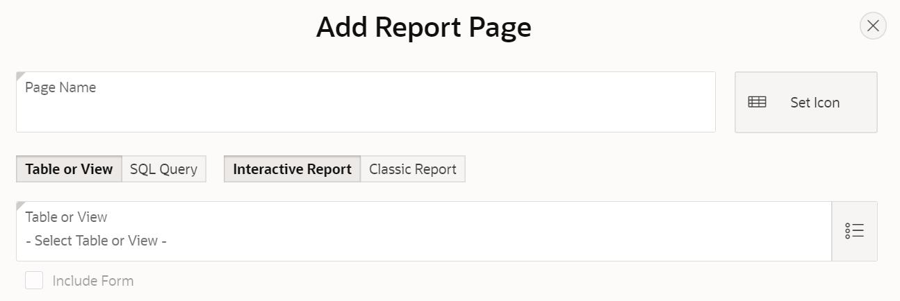
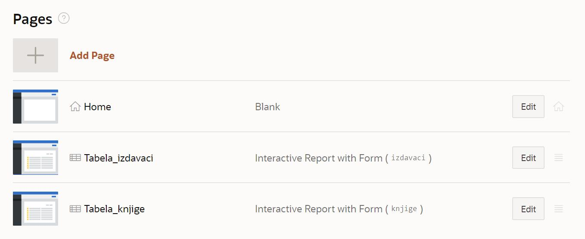

Креирање апликације помоћу алата *App Builder*
==============================================

.. suggestionnote::

    Део онлајн окружења *Oracle APEX* је и алат **App Builder**, који служи за креирање апликација које се повезују на базе података. Апликације које се креирају помоћу овог алата имају графички кориснички интерфејс и најчешће имају обрасце (*Form*) за унос података и извештаје (*Report*) за приказ података из табела из релационе базе података. 

    Са овим алатом ћемо се упознати тако што ћемо креирати апликацију која приступа делу базе података за библиотеку. Креираћемо обрасце и извештаје за табеле *knjige* и *izdavaci*. 

Алату App Builder се приступа у оквиру СУБП-a *Oracle APEX*:

- https://apex.oracle.com/en/ (обавезно логовање на креирани налог)
- App Builder 

.. image:: ../../_images/slika_10a.jpg
    :width: 600
    :align: center

.. infonote::

    НАПОМЕНА: Изглед сајта, поједини кораци и називи, као и код других ИКТ алата, могу да се временом промене, али су углавном најважније опције увек присутне и доступне.   

Након што се кликне дугме *Create*, потребно је изабрати опцију *New Application*. 

Први кораци у креирању апликације су унос назива и избор изгледа саме апликације. 

Изглед апликације подразумева дизајн, тј. тему, и организацију навигације кроз странице апликације. Увек постоји неки подразумевани избор, али он може да се промени. На претходној слици се види да је тема *Vita*, а организација навигације кроз апликацију је *Side Menu*. Ово може да се промени кликом на дугме које се налази са десне стране. Постоје неке предложене теме, а могуће је дефинисати и нову кликом на дугме *Use Custom Theme*. 

Назив апликације треба да се унесе у поље Name. Назив је произвољан, али треба да буде добро осмишљен да кратко описује чему апликација служи. У овом примеру ћемо апликацију да назовемо *Aplikacija_knjige*. 

Следећи корак је додавање страница апликацији. Поред почетне странице, додаћемо две странице које ће редом одговарати табелама *izdavaci* и *knjige*. За целу базу података за библиотеку би било потребно додати још страница апликацији. 

Уобичајeни називи за странице апликације које приступају табелама у релационој бази података и имају графички кориснички интерфејс су: 

- **образац** (*Form*) за унос података; 
- **извештај** (*Report*) за приказ података.

Након клика на дугме *Add Page*, изабрати *Interactive Report*

Појавиће се прозор који можете да видите на следећој слици. 

Пре него што се кликне на дугме *Add Page*, потребно је урадити следеће:

1. Унети *Tabela_izdavac*i као назив за извештај *Page Name*. 
2. Кликнути на дугме десно од поља за избор табеле *-Select Table or View-* и изабрати табелу *izdavaci*. 
3. Штриклирати опцију *Include Form*. 

Након што се креира ова страница апликације, поновити поступак за извештај који је у вези са табелом *knjige*:

1. Кликнути на дугме *Add Page* и изабрати *Interactive Report*. 
2. Унети *Tabela_knjige* као назив за извештај *Page Name*. 
3. Кликнути на дугме десно од поља за избор табеле *-Select Tab e or View-* и изабрати табелу knjige. 
4. Штриклирати опцију *Include Form*. 
5. Кликнути на дугме *Add Page*.

Странице су се појавиле на списку свих страница апликације. 

Да би се завршио процес креирања апликације, потребно је да се кликне дугме Create Application. 

