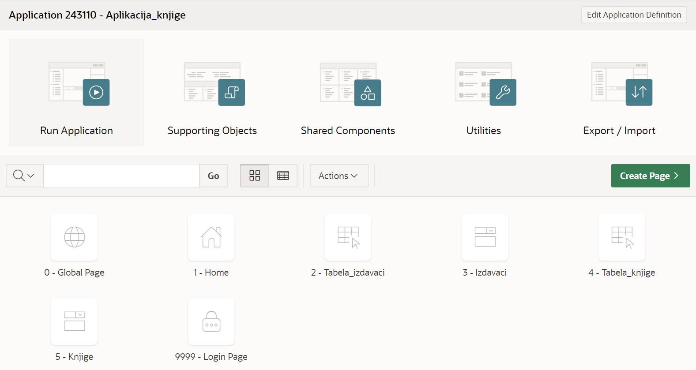
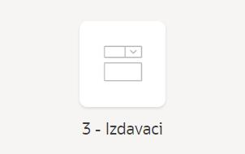
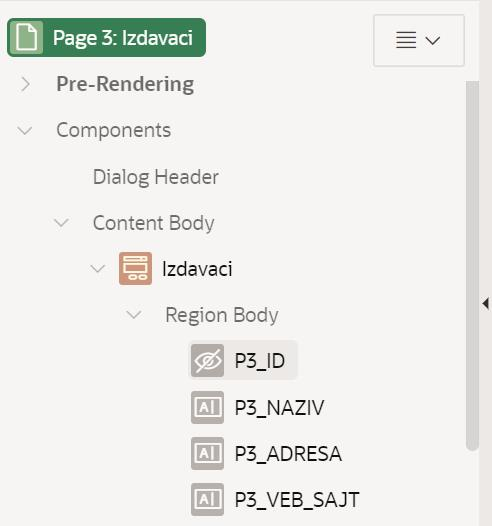
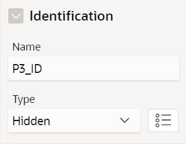
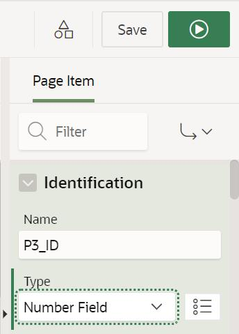
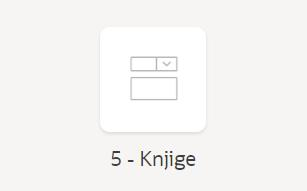
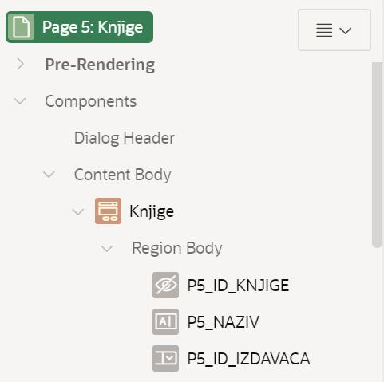

Додатне опције *App Builder* алата
==================================

.. suggestionnote::

    И након што је апликација креирана, она може да се мења и дорађује по потреби. Постоји веома много опција, овде ћемо приказати само неколико детаља који су важни за успешно покретање наше апликације.  

Алату App Builder се приступа у оквиру СУБП-а *Oracle APEX*:

- https://apex.oracle.com/en/ (обавезно логовање на креирани налог)
- App Builder 

.. infonote::

    Изглед сајта, поједини кораци и називи, као и код других ИКТ алата, могу да се временом промене, али су углавном најважније опције увек присутне и доступне.   

Након што се креира апликација, добијамо њен комплетан преглед са списком свих страница које су у нашем случају обрасци и извештаји у вези са две табеле. Као што може да се види на следећој слици, могуће је радити измене на апликацији кликом на дугме *Edit Application Definition*, а могуће је и додавати нове странице кликом на дугме *Create Page*. 

Пре него што се покрене апликација, потребно је извршити још неке промене. 

Подразумева се да су поља за унос вредности примарног кључа скривена. Постоји механизам да се ове вредности саме попуњавају користећи објекте који се називају секвенце. То је посебно значајно за табеле са великим бројем редова. Секвенце нисмо користили за наш пример базе података за библиотеку, па је потребно да и у апликацији омогућимо да постоје поља за унос идентификационих бројева. 

Кликнути на образац за табелу *izdavaci*

На списку на левој страни пронаћи и кликнути на скривено поље за унос идентификационог броја *P3_ID*. 

У десном делу екрана се појављују опције у вези са овим пољем.

Променити тип поља тако да не буде скривено, већ да буде поље за унос броја *Number Field*, а затим кликнути на дугме *Save*. 

Потребно је ове кораке урадити и за други образац. Кликнути на образац за табелу *knjige*. 

На списку на левој страни пронаћи и кликнути на скривено поље за унос идентификационог броја *P5_ID_KNJIGE*. 

У десном делу екрана се појављују опције у вези са овим пољем. Променити тип поља тако да не буде скривено већ да буде поље за унос броја *Number Field*, а затим кликнути на дугме *Save*. 