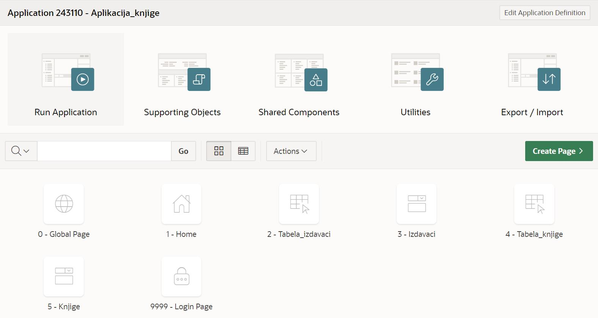

Покретање апликације
=====================

.. suggestionnote::

    Након што се заврше сви кораци за креирање апликације која приступа делу базе података за библиотеку и има обрасце и извештаје за табеле *knjige* и *izdavaci*, апликација може да се покрене. 

Алату App Builder се приступа у оквиру СУБП-а *Oracle APEX*:

- https://apex.oracle.com/en/ (обавезно логовање на креирани налог)
- App Builder 

.. infonote::

    Изглед сајта, поједини кораци и називи, као и код других ИКТ алата, могу да се временом промене, али су углавном најважније опције увек присутне и доступне.   

Након што се креира апликација, добијамо њен комплетан преглед са списком свих страница које су у нашем случају обрасци и извештаји у вези са две табеле. Као што може да се види на следећој слици, могуће је радити измене на апликацији кликом на дугме *Edit Application Definition*, а могуће је и додавати нове странице кликом на дугме *Create Page*. 

Апликација се покреће кликом на дугме *Run Application*. 

.. image:: ../../_images/slika_10_3b.jpg
    :width: 200
    :align: center

Апликација тражи логовање и за приступ се користе исто корисничко име, тј. имејл адреса, и лозинка као за логовање на онлајн систем *Oracle APEX*. 

Када се кликне на страницу *Tabela_izdavaci*, појављује се извештај са приказом садржаја табеле *izdavaci*. Унос података је могућ када се кликне на дугме *Create* које отвара образац.

Можемо да унесемо податке о још једном издавачу. 

Након уноса података (обавезни су идентификациони број и назив) потребно је да се кликне дугме *Create*, након чега је нови ред додат у базу. 

Помоћу навигације кроз апликацију можемо да пређемо на страницу у вези са табелом *knjige.*

Додаћемо још једну књигу у табелу. Нова књига коју додајемо је у издању издавача којег смо управо унели у базу. Како је ова књига збирка прича великог броја аутора, за сада у базу података не морамо да додајемо њене ауторе и да их повезујемо са овом књигом. 

.. image:: ../../_images/slika_10_3h.jpg
    :width: 350
    :align: center

Нову књигу додајемо након што се отвори образац за унос података кликом на дугме *Create*.

