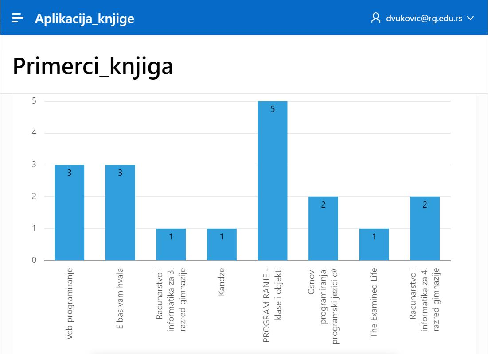

Креирање нових страница у апликацији
=====================================

.. suggestionnote::

    Страница апликације не мора да приказује садржај целе табеле већ може да буде у вези са упитом SELECT. Постоји и више опција за графички приказ информација које добијемо из базе као резултат извршења упита. Графички приказ помаже да се лакше разумеју подаци. Погледајмо, на пример, упит којим се за сваку књигу пребројавају њене позајмице. Уместо да само посматрамо бројеве, када имамо графички приказ резултата упита, можемо визуелно јасно да видимо колико је нека књига више или мање позајмљивана у односу на неку другу. 

Алату App Builder се приступа у оквиру СУБП-а *Oracle APEX*:

- https://apex.oracle.com/en/ (обавезно логовање на креирани налог)
- App Builder 

.. infonote::

    НАПОМЕНА: Изглед сајта, поједини кораци и називи, као и код других ИКТ алата, могу да се временом промене, али су углавном најважније опције увек присутне и доступне.   

Увек можемо поново да приступимо свакој креираној апликацији чим приступимо алату *App Builder*. Испод списка основних опција се налази списак свих креираних апликацијa. 

.. image:: ../../_images/slika_10_4a.jpg
    :width: 600
    :align: center

Након што се кликне на апликацију, добијамо њен комплетан преглед са списком свих страница које су у нашем случају обрасци и извештаји у вези са две табеле. 

Додаћемо нову страницу на којој ће бити графички приказано колико је било позајмица сваке књиге. На овој страници треба да се прикаже резултат упита којим се за сваку књигу пребројавају њене позајмице. 

::

    SELECT naziv, COUNT(*) FROM knjige JOIN primerci USING (id_knjige)
    JOIN pozajmice USING (inventarski_broj) GROUP BY naziv

Нову страницу додајемо кликом на дугме *Create Page*. У првом кораку ћемо изабрати *Chart*, а у наредном, након што кликнемо на дугме *Next*, изабраћемо *Pie*. 

Назив странице треба да се унесе у поље *Name*. У овом примеру ћемо страницу да назовемо *Pozajmice_knjiga*. Да би могао да се унесе упит, потребно је за *Source Type* изабрати опцију *SQL* Query*. Упит се уписује у поље *Enter a SQL SELECT statement*.

У следећем кораку, након што се кликне дугме *Next*, потребно је изабрати назив као *Label Column*, а број позајмица као *Value Column*. 

Након што се кликне дугме *Create Page*, могуће је покренути управо креирану страницу кликом. 

На следећој слици се види новододата страница наше апликације.

Страница се аутоматски појавила и у оквиру навигације

Можемо апликацији да додамо још једну страницу која ће за сваку књигу приказивати број њених примерака који имамо у библиотеци. 

Следи упит који треба да буде садржан на овој страници апликације. 

::

    SELECT naziv, COUNT(inventarski_broj)
    FROM primerci JOIN knjige USING (id_knjige) GROUP BY naziv

Страницу додајемо кликом на дугме *Create Page*. У првом кораку ћемо изабрати *Chart*, а у наредном, пошто кликнемо на дугме *Next*, изабраћемо *Bar*. 

Након што се унесу назив странице и упит, потребно је изабрати назив као *Label Column*, а број примерака као *Value Column*. Страница затим може да се креира и покрене. 

Уколико желимо да обришемо неку од страница апликације, имамо опцију *Delete Page*. 

