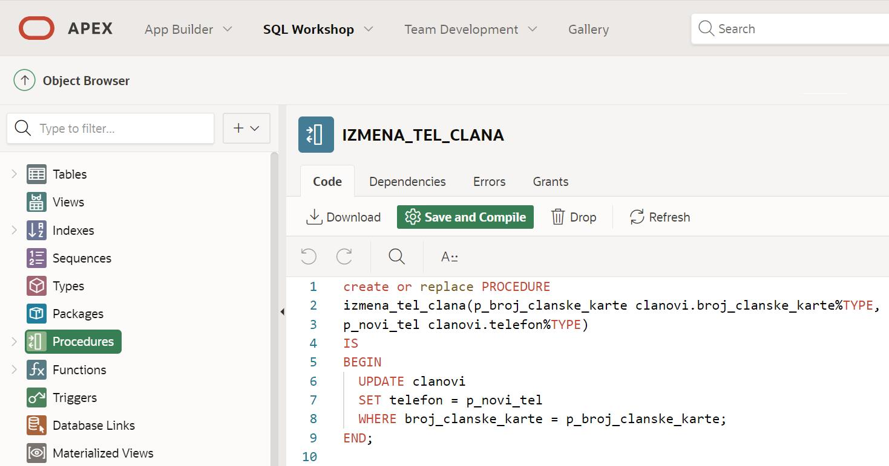
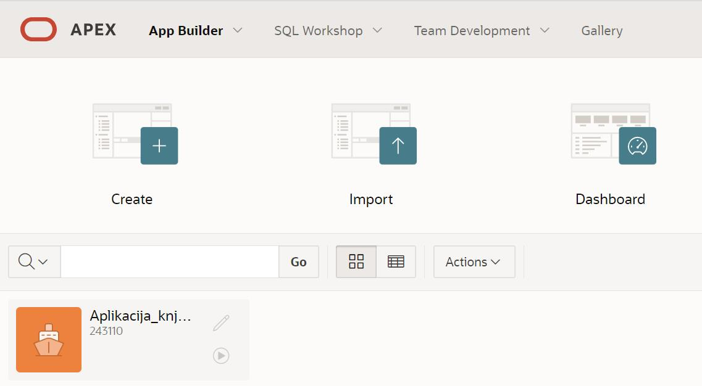
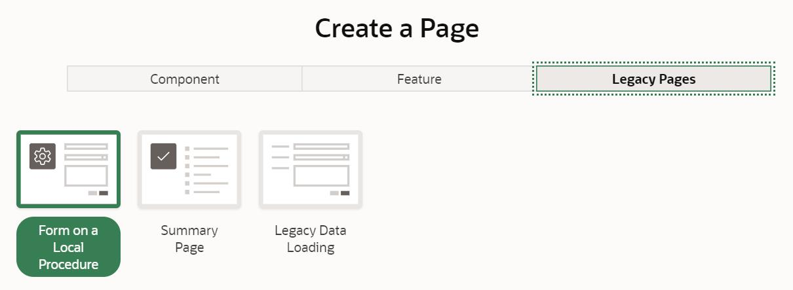
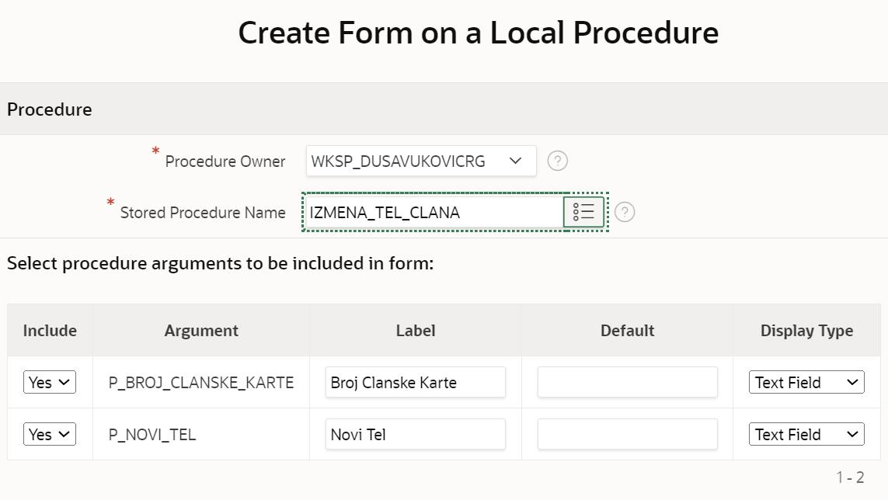
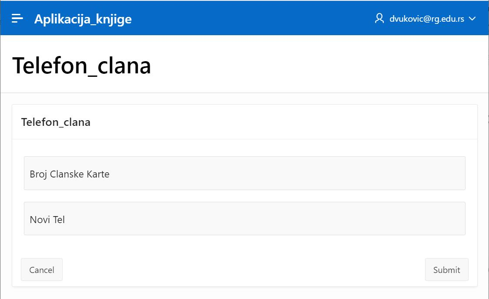

Покретање раније креиране процедуре
====================================

.. suggestionnote::

    Страница апликације може да користи написани PL/SQL програмски код, на пример креирану и сачувану процедуру. Могућности алата *App Builder* су веома велике. Илустрације ради, овде ћемо креирати једну једноставну страницу која користи већ креирану процедуру која омогућава да се измени број телефона члана чији број чланске карте унесемо. 

Алату App Builder се приступа у оквиру СУБП-а *Oracle APEX*:

- https://apex.oracle.com/en/ (обавезно логовање на креирани налог)
- App Builder 

.. infonote::

    Изглед сајта, поједини кораци и називи, као и код других ИКТ алата, могу да се временом промене, али су углавном најважније опције увек присутне и доступне.   

Погледајмо прво раније креирану и сачувану процедуру *izmena_tel_clana*, коју ћемо употребити у апликацији. Процедура узима као улазне параметре број чланске карте и нови телефон, и извршава команду UPDATE, која уписује нови број телефона у базу података. 

До програмског кода процедура можемо да дођемо на следећи начин у оквиру СУБП-а *Oracle APEX*:

- https://apex.oracle.com/en/ (обавезно логовање на креирани налог)
- SQL Workshop
- Object Browser

Потребно је да у креираној апликацији додамо нову страницу. Увек можемо поново да приступимо свакој креираној апликацији чим приступимо алату *App Builder*. Испод списка основних опција се налази списак свих креираних апликацијa.

Након што се кликне на апликацију, добијамо њен комплетан преглед са списком свих страница. Додаћемо нову страницу која ће да омогући измену телефона члана библиотеке. Опција за додавање странице која нам је потребна може да се нађе у групи *Legacy Pages*. 

Након што унесемо назив за нову страницу, потребно је да изаберемо процедуру у пољу *Stored Procedure Name*. Када изаберемо процедуру, појавиће се предлог за поља за унос параметара према дефиницији саме процедуре. Ова процедура узима два параметра, број чланске карте и нови број телефона, па ће се појавити предлог за два поља за унос вредности. 

Када сачувамо и покренемо ову страницу, добићемо могућност уноса новог телефона за члана чији број чланске карте унесемо. 

