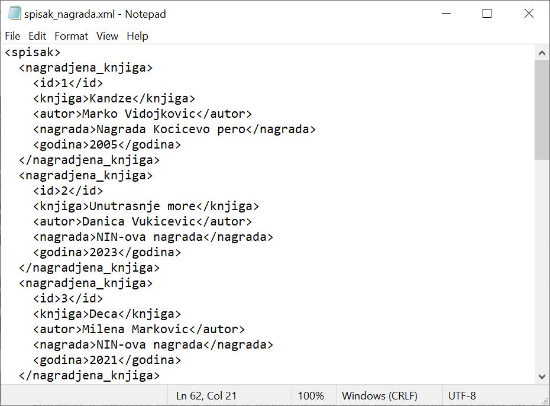
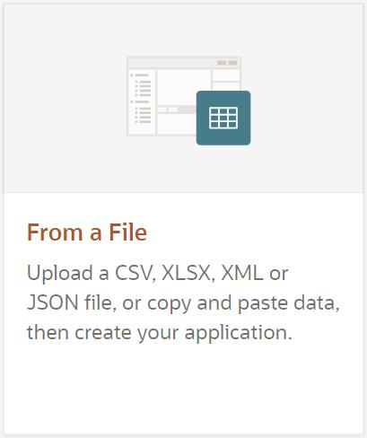
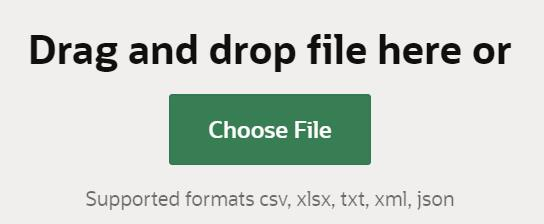
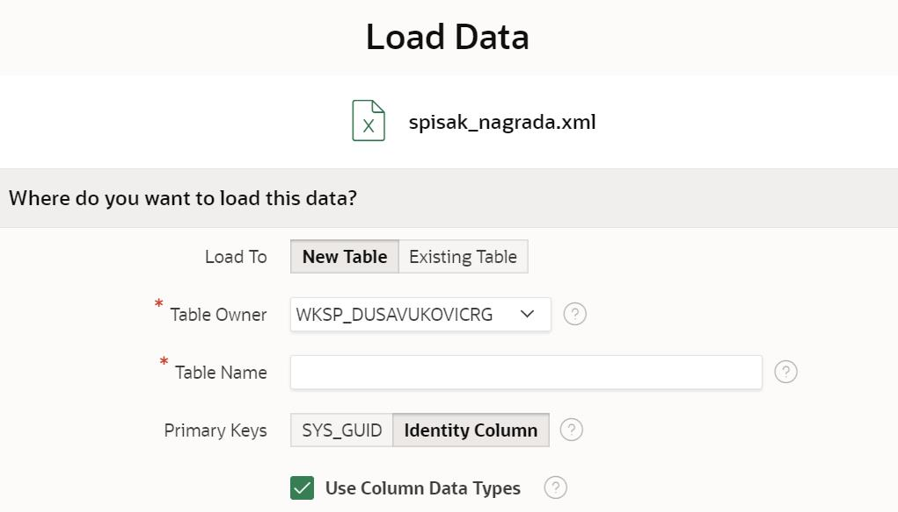
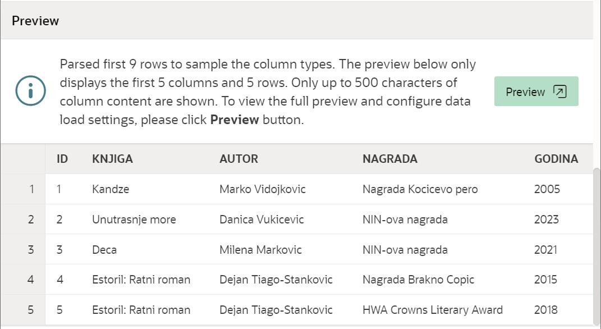
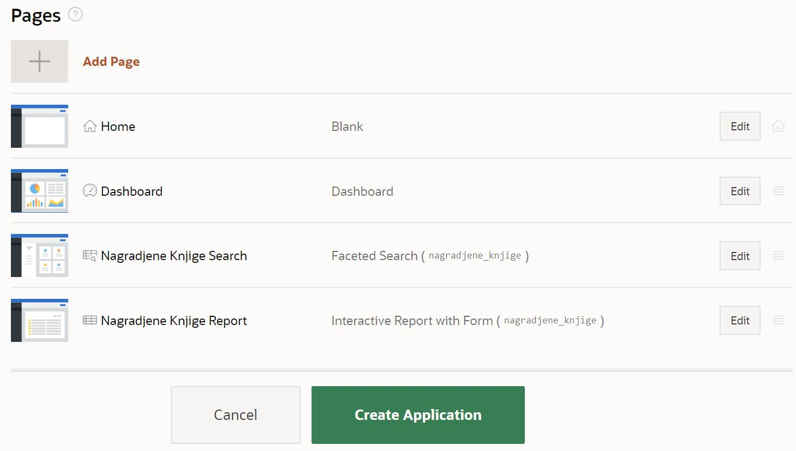
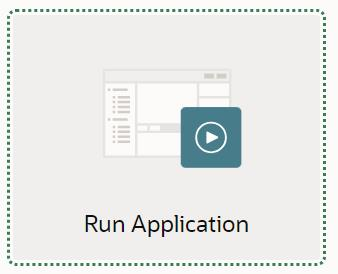
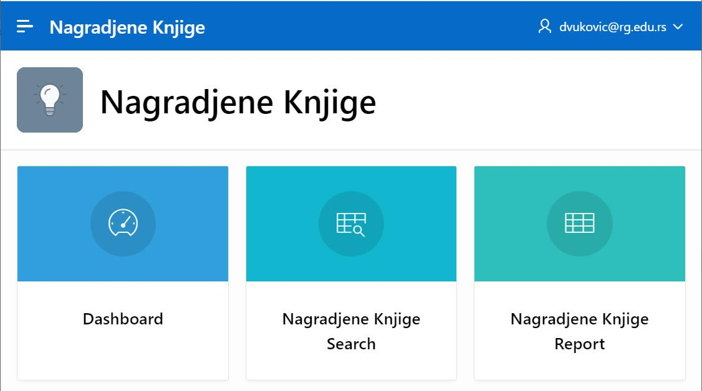
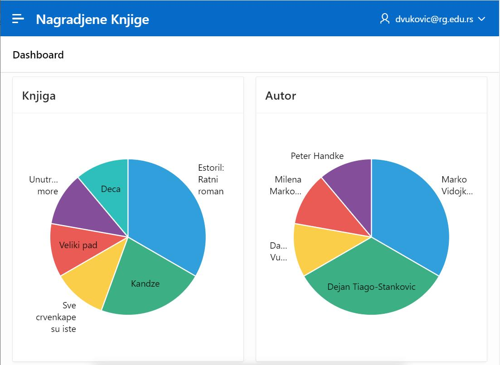

Алат App Builder и XML
========================

.. suggestionnote::

    Један од начина организовања података је у формату XML, који омогућава да се подаци дефинишу и складиште тако да се могу лако делити. Формат XML подржава размену информација између рачунарских система као што су веб-локације, базе података и апликације трећих страна.

    Уколико имамо XML фајл са подацима, могуће је на основу њега креирати апликацију у онлајн окружењу *Oracle APEX* помоћу алата *App Builder*.

Формат XML користи тагове којима описујемо податке које чувамо. Фајлови у овом формату могу да се креирају у обичном едитору, као што је, на пример, програм *Notepad*. На следећој слици може да се види део XML фајла у којем се налазе подаци о награђеним књигама. 

Сами подаци се уписују између отвореног и затвореног тага. Тако је, на пример, назив књиге „Деца“ наведен између отвореног тага *<knjiga>* и затвореног тага *</knjiga>*.

::

    <knjiga>Deca</knjiga>

За сваку награђену књигу чувамо идентификациони број, назив књиге, име аутора, назив награде и годину када је додељена. Следи део XML фајла који се односи на једну награђену књигу. 

::

    <nagradjena_knjiga>
        <id>3</id>
        <knjiga>Deca</knjiga>
        <autor>Milena Markovic</autor>
        <nagrada>NIN-ova nagrada</nagrada>
        <godina>2021</godina>
    </nagradjena_knjiga>

На почетку фајла мора да се налази један отворен таг који се односи на почетак целог документа и који има одговарајући затворен таг на самом крају. 

Комплетан XML фајл који ћемо користити са списком награђених књига треба да се преузме и сачува негде на рачунару да би се после искористио за креирање базе. 

spisak_nagrada.xml (ОБЕЗБЕДИТИ ПРЕУЗИМАЊЕ ФАЈЛА)

Алату *App Builder* се приступа у оквиру СУБП-а *Oracle APEX*:

- https://apex.oracle.com/en/ (обавезно логовање на креирани налог)
- App Builder 

.. image:: ../../_images/slika_10_6b.jpg
    :width: 600
    :align: center

.. infonote::

    Изглед сајта, поједини кораци и називи, као и код других ИКТ алата, могу да се временом промене, али су углавном најважније опције увек присутне и доступне.   

Након што се кликне дугме *Create*, потребно је изабрати опцију *From a File*. 

Појављује се могућност да учитамо фајл. 

Изабрати преузети XML фајл *spisak_nagrada.xml*.

Потребно је да се унесе назив табеле која ће се креирати у бази података и у коју ће се уписати подаци из XML фајла. Нова табела може да се зове *nagradjene_knjige*.

У доњем делу прозора који се појавио можемо да видимо како ће да изгледа део табеле. На основу тагова је систем препознао које колоне табела треба да има. 

Табела ће се креирати након што кликнемо на дугме *Load Data*, и већ у следећем кораку је могуће креирање апликације кликом на дугме *Create Application*. 

Апликација се покреће кликом на дугме *Run Application*. 

Апликација тражи логовање и за приступ се користе исто корисничко име, тј. имејл адреса, и лозинка као за логовање на онлајн систем *Oracle APEX*. 

