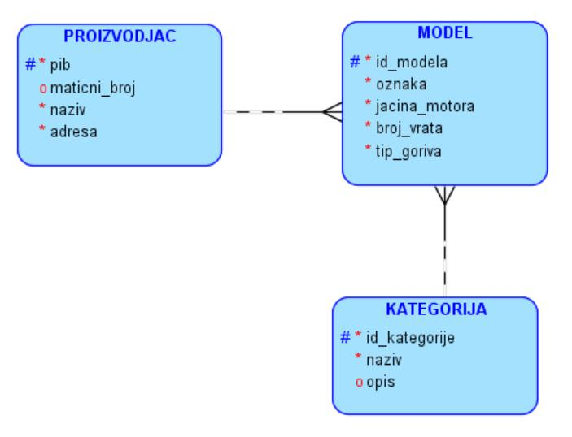
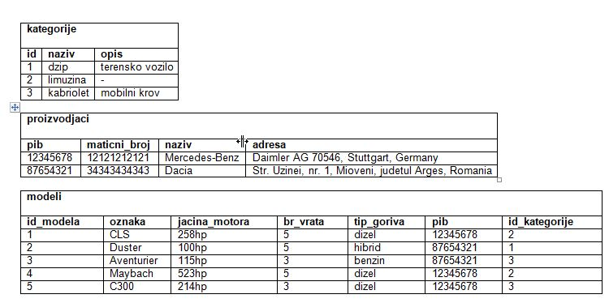

База података за салон аутомобила у СУБП-у *Oracle Apex* - пројектни рад - 1. део
=======================================================================================

.. suggestionnote::

    Пројектни задатак се састоји од три веће целине:

    1.	Креирати базу података за салон аутомобила на основу датог модела и података. 
    2.	Написати PL/SQL програме који су решења датих задатака. 
    3.	Креирати апликацију помоћу алата App Builder. 

    Први део пројекта подразумева да се креира база податка тако што се направе табеле и унесу подаци. 

Приликом рада на било ком делу пројекта, погледајте претходно решене примере и лекције. Након што решите неки задатак па желите да проверите да ли је решење добро или видите да не можете да га решите, можете да погледате решење које ће се приказати након што кликнете на дугме. 

Команде за креирање базе података и програми пишу се у едитору у оквиру онлајн окружења *Oracle APEX*, а покрећу се кликом на дугме **Run**:

- https://apex.oracle.com/en/ (обавезно логовање на креирани налог)
- SQL Workshop
- SQL Commands

**САЛОН АУТОМОБИЛА:** Сваки произвођач аутомобила има назив и адресу седишта. Произвођачи аутомобила су правна лица којима су додељени ПИБ и матични број. Произвођач аутомобила производи више различитих модела. Сваки модел има своју ознаку, јачину мотора, број врата и тип горива. Аутомобили су подељени у категорије: лимузина, караван, кабриолет... 

.. infonote::

    Препоручљиво је да се у сваки назив табеле на почетак дода *sa_* (скраћеница за салон аутомобила)  да би ове табеле биле груписане на списку свих табела које имамо на онлајн налогу *Oracle APEX*. Тако су предложени називи табела базе података за салон аутомобила *sa_proizvodjaci, sa_kategorije и sa_modeli*.

Следе подаци које треба унети у базу командама INSERT INTO.

.. reveal:: pitanje_11_1a
    :showtitle: Прикажи одговор
    :hidetitle: Сакриј одговор

    Следе команде за креирање базе података. 

    ::

        CREATE TABLE sa_kategorije
        (
            id_kategorije NUMBER(2) PRIMARY KEY,
            naziv VARCHAR2(30) NOT NULL UNIQUE,
            opis VARCHAR2(150)
        )

    ::

        CREATE TABLE sa_proizvodjaci
        (
            pib NUMBER(8) PRIMARY KEY,
            maticni_broj NUMBER(11) UNIQUE,
            naziv VARCHAR2(100) NOT NULL UNIQUE,
            adresa VARCHAR2(150) NOT NULL
        )

    ::

        CREATE TABLE sa_modeli
        (
            id_modela NUMBER(4) PRIMARY KEY,
            oznaka VARCHAR2(20) NOT NULL UNIQUE,
            jacina_motora VARCHAR2(6) NOT NULL,
            broj_vrata NUMBER(1) NOT NULL,
            tip_goriva VARCHAR2(10) NOT NULL,
            pib NUMBER(8) NOT NULL REFERENCES sa_proizvodjaci(pib),
            id_kategorije NUMBER(2) NOT NULL REFERENCES sa_kategorije(id_kategorije)
        )

    ::

        INSERT INTO sa_kategorije VALUES(1, 'dzip', 'terensko vozilo')
        INSERT INTO sa_kategorije VALUES(2, 'limuzina', null)
        INSERT INTO sa_kategorije VALUES(3, 'kabriolet', 'mobilni krov')
        INSERT INTO sa_proizvodjaci 
        VALUES(12345678, 12121212121, 'Mercedes-Benz', 'Daimler AG 70546, Stuttgart, Germany')
        INSERT INTO sa_proizvodjaci 
        VALUES(87654321, 34343434343, 'Dacia', 
        'Str. Uzinei, nr. 1, Mioveni, judetul Arges, Romania')
        INSERT INTO sa_modeli VALUES(1, 'CLS', '258hp', 5, 'dizel', 12345678, 2)
        INSERT INTO sa_modeli VALUES(2, 'Duster', '100hp', 5, 'hibrid', 87654321, 1)
        INSERT INTO sa_modeli VALUES(3, 'Aventurier', '115hp', 3, 'benzin', 87654321, 3)
        INSERT INTO sa_modeli VALUES(4, 'Maybach', '523hp', 5, 'dizel', 12345678, 2)
        INSERT INTO sa_modeli VALUES(5, 'C300', '214hp', 3, 'dizel', 12345678, 3)

