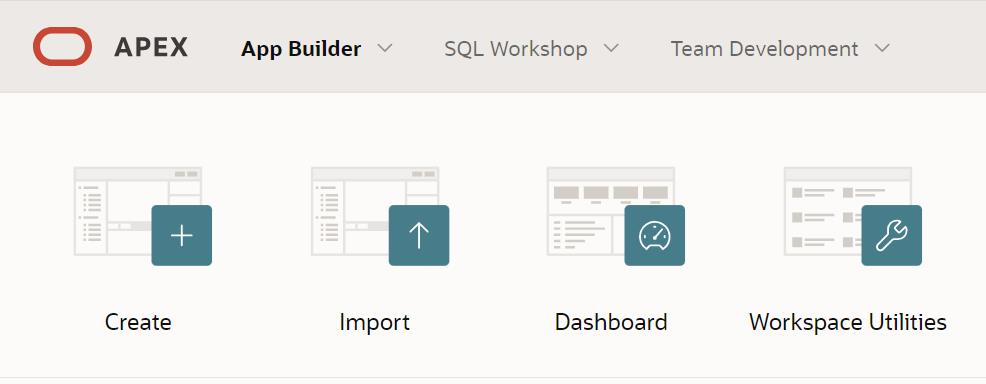

База података за салон аутомобила у СУБП-у *Oracle Apex* - пројектни рад - 3. део
=================================================================================

.. suggestionnote::

    Пројектни задатак се састоји од три веће целине:

    1.	Креирати базу података за **салон аутомобила** на основу датог модела и података. 
    2.	Написати PL/SQL програме који су решења датих задатака. 
    3.	Креирати апликацију помоћу алата *App Builder*. 

    Базе података користимо готово увек путем апликација које имају графички кориснички интерфејс и које приступају самој бази. 

    Трећи део пројекта подразумева да се креира програм употребом алата *App Builder*. 

Приликом рада на било ком делу пројекта, погледајте претходно решене примере и лекције. Након што решите неки задатак па желите да проверите да ли је решење добро или видите да не можете да га решите, можете да погледате решење које ће се приказати након што кликнете на дугме. 

Алату *App Builder* се приступа у оквиру СУБП-а *Oracle APEX*:

- https://apex.oracle.com/en/ (обавезно логовање на креирани налог)
- *App Builder*

Креирати апликацију са обрасцима и извештајима за базу података за салон аутомобила помоћу алата *App Builder*.

.. reveal:: pitanje_11_3a
    :showtitle: Прикажи одговор
    :hidetitle: Сакриј одговор

    Након што се кликне дугме Create, потребно је изабрати опцију New Application. 

    .. image:: ../../_images/slika_11_3b.jpg
        :width: 250
        :align: center

    Први кораци у креирању апликације су унос назива и избор изгледа саме апликације. 

    .. image:: ../../_images/slika_11_3c.jpg
        :width: 600
        :align: center

    Изглед апликације подразумева дизајн, тј. тему, и организацију навигације кроз странице апликације. Увек постоји неки подразумевани избор, али он може да се промени. На претходној слици се види да је тема *Vita*, а организација навигације кроз апликацију је *Side Menu*. Ово може да се промени кликом на дугме које се налази са десне стране. Постоје неке предложене теме, а могуће је дефинисати и нову кликом на дугме *Use Custom Theme*. 

    Назив апликације треба да се унесе у поље *Name*. Назив је произвољан, али треба да буде добро осмишљен да кратко описује чему апликација служи. У овом примеру ћемо апликацију да назовемо *Aplikacija_salon_automobila*. 

    Следећи корак је додавање страница апликацији. Поред почетне странице, додаћемо три странице које ће редом одговарати табелама *sa_proizvodjaci*, *sa_kategorije* и *sa_modeli*. 

    .. image:: ../../_images/slika_11_3d.jpg
        :width: 600
        :align: center

    Уобичајени називи за странице апликације које приступају табелама у релационој бази података и имају графички кориснички интерфејс су: 

    - **образац** (Form) за унос података; 
    - **извештај** (Report) за приказ података.

    Након клика на дугме *Add Page*, изабрати *Interactive Report*. 

    .. image:: ../../_images/slika_11_3e.jpg
        :width: 300
        :align: center

    Појавиће се прозор који можете да видите на следећој слици.

    .. image:: ../../_images/slika_11_3f.jpg
        :width: 600
        :align: center

    Пре него што се кликне на дугме *Add Page*, потребно је урадити следеће:

    1.	Унети *Tabela_sa_proizvodjaci* као назив за извештај Page Name. 
    2.	Кликнути на дугме десно од поља за избор табеле *-Select Table or View-* и изабрати табелу *sa_proizvodjaci*. 
    3.	Штриклирати опцију *Include Form*. 

    .. image:: ../../_images/slika_11_3g.jpg
        :width: 600
        :align: center

    Након што се креира ова страница апликације, поновити поступак за извештај који је у вези са табелом *sa_kategorije*:

    1.	Кликнути на дугме *Add Page* и изабрати *Interactive Report*. 
    2.	Унети *Tabela_sa_kategorije* као назив за извештај *Page Name*. 
    3.	Кликнути на дугме десно од поља за избор табеле *-Select Table or View-* и изабрати табелу *sa_kategorije*. 
    4.	Штриклирати опцију *Include Form*. 
    5.	Кликнути на дугме *Add Page*.

    Потребно  је креирати још једну страницу која је у вези са табелом *sa_modeli*:

    1.	Кликнути на дугме *Add Page* и изабрати *Interactive Report*. 
    2.	Унети *Tabela_sa_modeli* као назив за извештај *Page Name*. 
    3.	Кликнути на дугме десно од поља за избор табеле *-Select Table or View-* и изабрати табелу *sa_modeli*. 
    4.	Штриклирати опцију *Include Form*. 
    5.	Кликнути на дугме *Add Page*.

    Странице ће се појавити на списку свих страница апликације

    .. image:: ../../_images/slika_11_3h.jpg
        :width: 600
        :align: center

    Да би се завршио процес креирања апликације, потребно је да се кликне дугме *Create Application*. 

    .. image:: ../../_images/slika_11_3i.jpg
        :width: 250
        :align: center

    Након што се креира апликација, добијамо њен комплетан преглед са списком свих страница које су у нашем случају обрасци и извештаји у вези са три табеле.

    .. image:: ../../_images/slika_11_3j.jpg
        :width: 600
        :align: center

    Пре него што се покрене апликација, потребно је извршити још неке промене. 

    Подразумева се да су поља за унос вредности примарног кључа скривена. Постоји механизам да се ове вредности саме попуњавају користећи објекте који се називају секвенце. То је посебно значајно за табеле са великим бројем редова. Секвенце нисмо користили за наш пример базе података за библиотеку, па је потребно да и у апликацији омогућимо да постоје поља за унос идентификационих бројева. 

    Кликнути на образац за табелу *sa_proizvodjaci*. 

    .. image:: ../../_images/slika_11_3k.jpg
        :width: 250
        :align: center

    На списку на левој страни пронаћи и кликнути на скривено поље за унос идентификационог броја *P3_PIB*. 

    .. image:: ../../_images/slika_11_3l.jpg
        :width: 300
        :align: center

    У десном делу екрана се појављују опције у вези са овим пољем. 

    .. image:: ../../_images/slika_11_3m.jpg
        :width: 300
        :align: center

    Променити тип поља тако да не буде скривено већ да буде поље за унос броја *Number Field*, а затим кликнути на дугме *Save*. 

    .. image:: ../../_images/slika_11_3n.jpg
        :width: 300
        :align: center

    Вратити се на комплетан преглед апликације и изменити одговарајућа поља за *id_kategorije* и *id_modela* на обрасцима за табеле *sa_kategorije* и *sa_modeli*. 

    Апликација се покреће кликом на дугме *Run Application*. 
    
    .. image:: ../../_images/slika_11_3o.jpg
        :width: 300
        :align: center

    Апликација тражи логовање и за приступ се користе исто корисничко име, тј. имејл адреса, и лозинка као за логовање на онлајн систем *Oracle APEX*.

    .. image:: ../../_images/slika_11_3p.jpg
        :width: 600
        :align: center

    Апликацији можемо да додамо још неке странице. На пример, можемо да додамо страницу са графичким приказом броја модела које имамо у свакој категорији. На овој страници треба да се прикаже резултат следећег упита. 

    ::

        SELECT naziv, COUNT(id_modela) 
        FROM sa_modeli JOIN sa_kategorije USING (id_kategorije) GROUP BY naziv

    Нову страницу додајемо кликом на дугме *Create Page*. У првом кораку ћемо изабрати *Chart*, а у наредном, након што кликнемо на дугме *Next*, изабраћемо *Pie*. 

    .. image:: ../../_images/slika_11_3q.jpg
        :width: 600
        :align: center

    Назив странице треба да се унесе у поље *Name*. У овом примеру ћемо страницу да назовемо *Broj_modela_po_kategoriji*. Да би могао да се унесе упит, потребно је за *Source Type* изабрати опцију *SQL Query*. Упит се уписује у поље *Enter a SQL SELECT statement*. 

    .. image:: ../../_images/slika_11_3r.jpg
        :width: 600
        :align: center

    У следећем кораку, пошто се кликне дугме *Next*, потребно је изабрати назив категорије као *Label Column*, а број модела као *Value Column*. 

    Након што се кликне дугме Create Page, могуће је покренути управо креирану страницу кликом.

    .. image:: ../../_images/slika_11_3s.jpg
        :width: 600
        :align: center

    На следећој слици се види новододата страница наше апликације. Страница се аутоматски појавила и у оквиру навигације. 

    .. image:: ../../_images/slika_11_3t.jpg
        :width: 600
        :align: center

