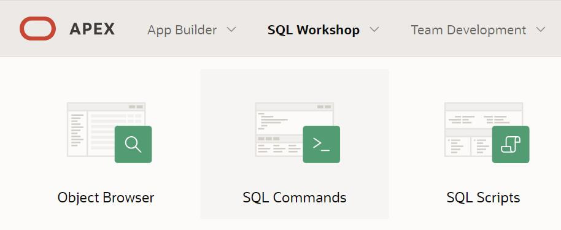

Наредбе циклуса
===============

.. suggestionnote::

    У програмима можемо да користимо наредбе циклуса:

    - LOOP са EXIT WHEN 
    - WHILE
    - FOR

    Све наредбе ће бити објашњене кроз конкретне задатке. 

Програми се пишу у едитору у оквиру онлајн окружења *Oracle APEX*, а покрећу се кликом на дугме **Run**:

- https://apex.oracle.com/en/ (обавезно логовање на креирани налог)
- SQL Workshop
- SQL Commands

.. questionnote::

    1. Креирати PL/SQL програм у којем се приказују сви бројеви од 1 до 100. Задатак решити на два начина: тако да се бројеви прикажу од мањег ка већем, и од већег ка мањем. Обе варијанте задатка решити на три начина: употребом циклуса FOR, WHILE и LOOP са EXIT WHEN. 

Следи решење задатка употребом циклуса WHILE. Бројеви се приказују у растућем поретку.

::

    DECLARE
        i NUMBER(3);
    BEGIN
        i := 1;
        WHILE i <= 100 LOOP
            DBMS_OUTPUT.PUT_LINE(i);
            i := i + 1;
        END LOOP;
    END

У следећем програму је употребљен исти циклус, али се бројеви приказују у опадајућем поретку.

:: 

    DECLARE
        i NUMBER(3);
    BEGIN
        i := 100;
        WHILE i >= 0 LOOP
            DBMS_OUTPUT.PUT_LINE(i);
            i := i - 1;
        END LOOP;
    END

Када користимо циклус FOR, бројачка променљива која се користи у циклусу је имплицитно декларисана и није потребно да је декларишемо у одељку DECLARE. 

::

    BEGIN
        FOR i IN 1..100 LOOP
            DBMS_OUTPUT.PUT_LINE(i);
        END LOOP;
    END

У следећем програму је употребљен исти циклус, али се бројеви приказују у опадајућем поретку. Границе интервала се наводе у истом редоследу, али је неопходно додати реч REVERSE. 

::

    BEGIN
        FOR i IN REVERSE 1..100 LOOP
            DBMS_OUTPUT.PUT_LINE(i);
        END LOOP;
    END

Следи решење задатка употребом циклуса LOOP са EXIT WHEN. Бројеви се приказују у растућем поретку. Уколико би се изоставила наредба EXIT WHEN, која садржи услов изласка из циклуса, имали бисмо бесконачан циклус. 

::

    DECLARE
        i NUMBER(3);
    BEGIN
        i := 1;
        LOOP
            DBMS_OUTPUT.PUT_LINE(i);
            i := i + 1;
            EXIT WHEN i > 100;
        END LOOP;
    END

У следећем програму је употребљен исти циклус, али се бројеви приказују у опадајућем поретку.

::

    DECLARE
        i NUMBER(3);
    BEGIN
        i := 100;
        LOOP
            EXIT WHEN i = 0;
            DBMS_OUTPUT.PUT_LINE(i);
            i := i - 1;
        END LOOP;
    END

.. questionnote::

    2. Креирати PL/SQL програм у који се уносе два броја, а приказују се сви бројеви из датог интервала. 

::

    DECLARE
        a NUMBER(3);
        b NUMBER(3);
    BEGIN
        a := :pocetak_intervala;
        b := :kraj_intervala;
        FOR i IN a..b LOOP
            DBMS_OUTPUT.PUT_LINE(i);
        END LOOP;
    END

