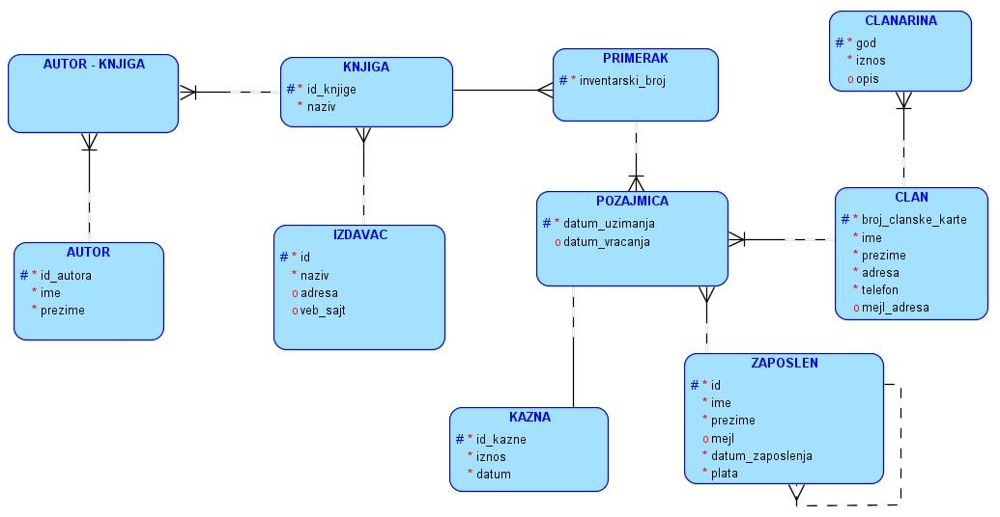
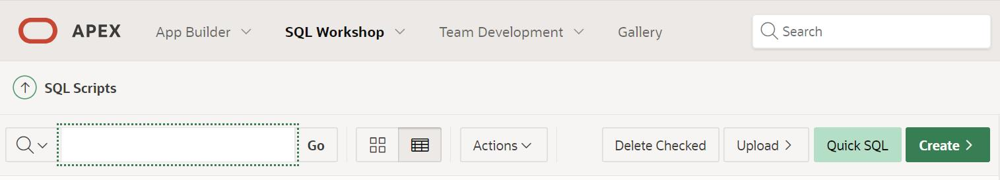
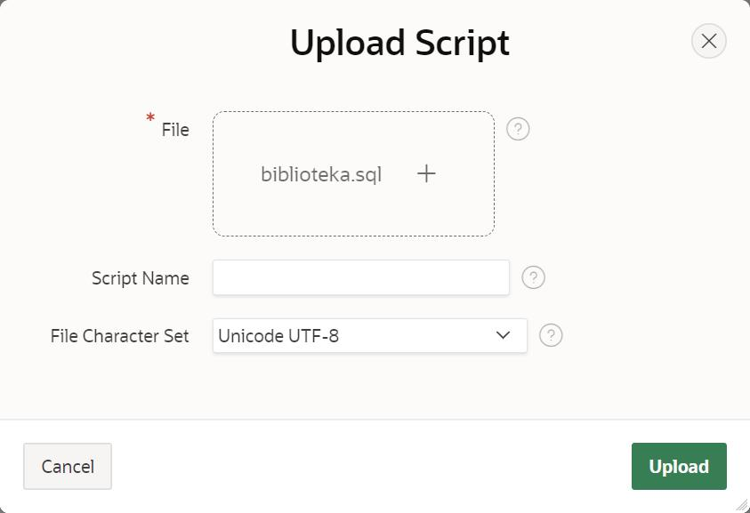
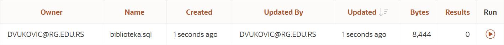
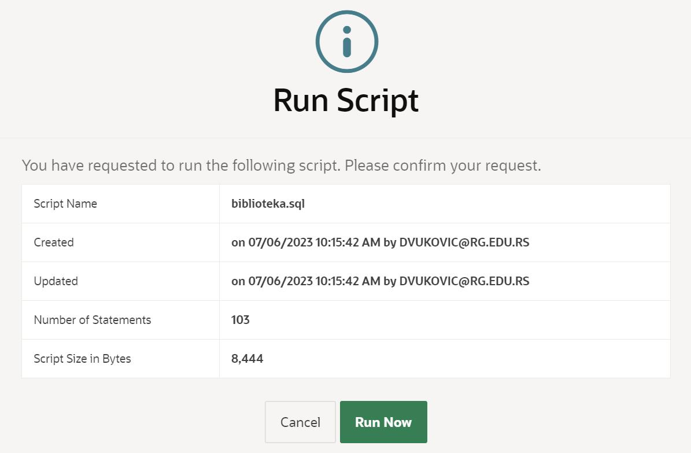
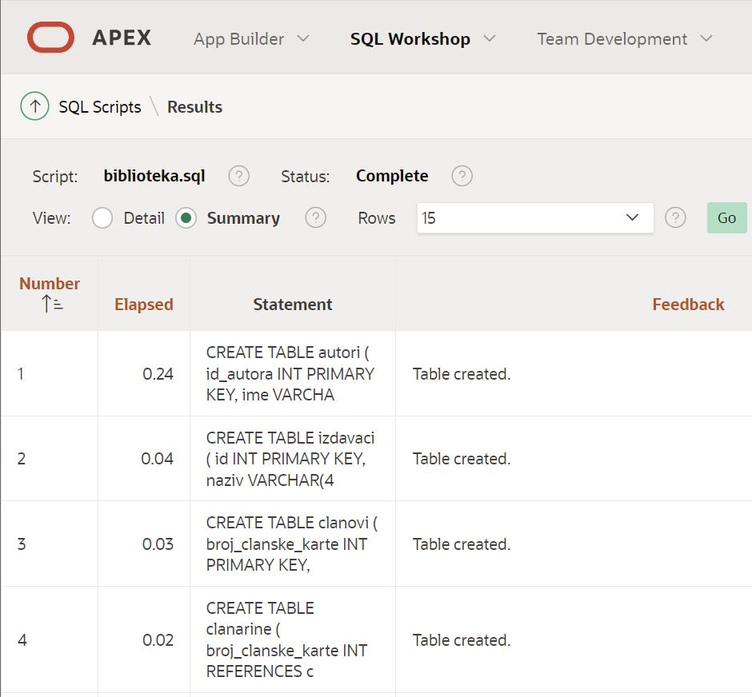
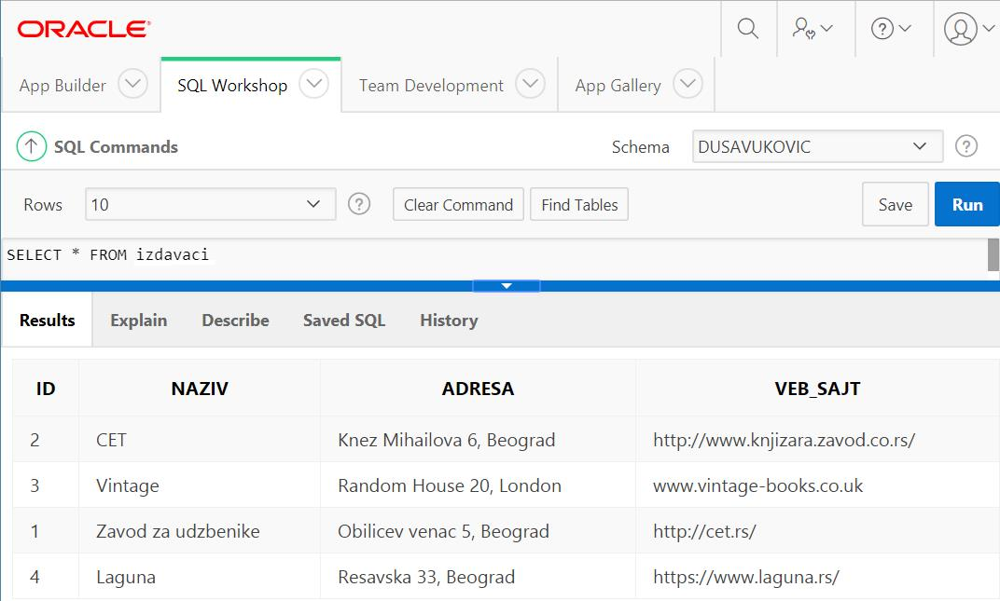
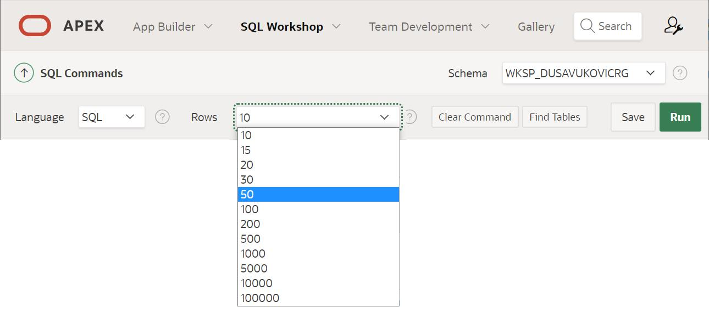
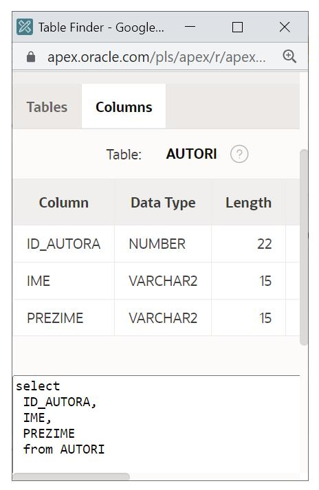

База података за библиотеку у СУБП-ѕ *Oracle Apex* - практичан рад
====================================================================

.. suggestionnote::

    Са базом података за библиотеку смо се већ детаљно упознали. Креирали смо је извршавајући команду по команду. Команде смо извршавали једну по једну да би их што боље запамтили кроз практичан рад. Постоји могућност да се направи скрипт фајл којим се креирање базе података далеко поједностављује. 

    Следи детаљно упутство како да се креира комплетна база података за библиотеку у систему за управљање базама података *Oracle APEX*. Искористићемо нови алат да прикажемо како се ради са скрипт фајлом. 

    Приказани пример базе података за библиотеку ћемо убрзо употребити тако што ћемо креирати PL/SQL програме у којима ћемо јој приступати. 

На следећој слици је приказан већ познати модел на основу којег ћемо креирати релациону базу података библиотеке. 

Креирати базу података за библиотеку употребом алата Oracle APEX. 

Све команде потребне да се креира база се налазе у скрипт фајлу. Фајл треба да се преузме и сачува негде на рачунару да би се после искористио за креирање базе. 

`biblioteka.sql <_sources\biblioteka.sql>`_ (ОБЕЗБЕДИТИ ПРЕУЗИМАЊЕ ФАЈЛА)

.. infonote::

    ВАЖНО: Када се у скрипт фајлу налази више команди, као што је то овде случај, на крају сваке мора да стоји тачка-зарез (;).

Скрипт фајл је неопходно поставити у оквиру онлајн окружења *Oracle APEX*:

- https://apex.oracle.com/en/ (обавезно логовање на креирани налог)
- SQL Workshop
- SQL Scripts

Кликнути прво на дугме *Upload*, а затим кликнути на дугме *Choose File*, које се појави, пронаћи скрипт фајл сачуван на рачунару. Када се појави назив фајла, кликнути на зелено дугме *Upload*, које се налази доле десно.

Скрипт фајл ће се појавити, као и могућност да се покрене, дугме *Run* (испуњен троуглић у кругу) које се налази скроз десно поред назива додатог скрипт фајла. 

У следећем кораку је неопходно потврдити да желимо да се покрене скрип фајл кликом на дугме *Run Now*. 

Појавиће се извештај о извршеним командама. 

Након што је креирана база података за библиотеку, могуће је проверити садржај сваке табеле тако што се напише и изврши одговарајући SELECT упит.

::

    SELECT * FROM naziv_tabele

Упити се пишу у едитору у оквиру онлајн окружења *Oracle APEX*, а покрећу се кликом на дугме **Run**:

- SQL Workshop
- SQL Commands

Подразумевано ће се приказати првих 10 редова, чак и уколико табела има више редова. Ово може да се измени тако што се изабере неки други понуђени број поред опције *Rows* изнад самог поља за унос програмског кода. 

Поред тога постоји и дугме *Find Tables*,* којим се отвара помоћни прозор у којем можемо да видимо списак свих табела које имамо у бази, као и упит SELECT за сваку табелу, који можемо да копирамо и употребимо.

