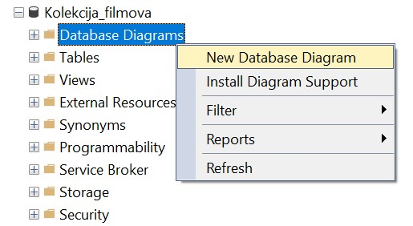
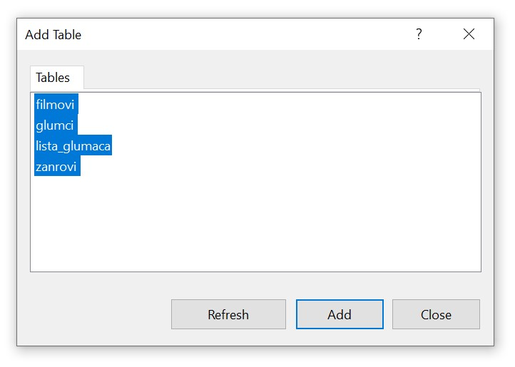
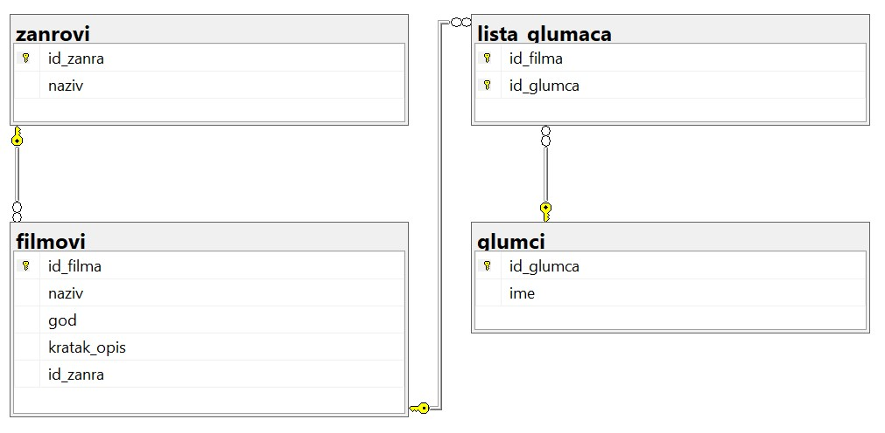
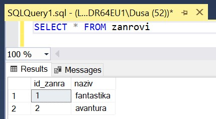
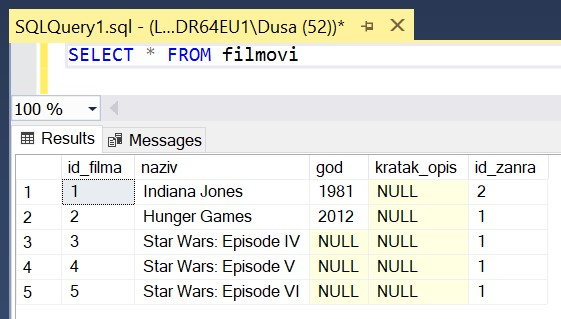
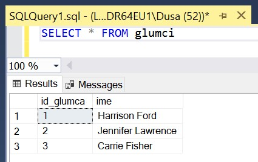
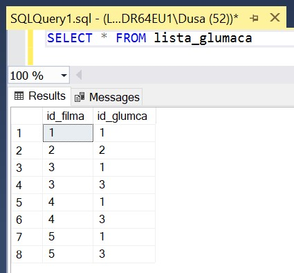

Дијаграм и унети подаци
=======================

.. suggestionnote::

    Пре него што кренемо да решавамо задатке и извлачимо податке из базе, важно је да се упознамо детаљно са самом базом. Направићемо дијаграм и погледаћемо све унете податке по табелама. 

Након што је креирана комплетна база података, можемо да креирамо њен дијаграм. Кликнути десни тастер миша над *Database Diagrams* под базом података за колекцију филмова, и изабрати *New Database Diagram*. 

У наредном кораку додати све табеле.

Према потреби зумирати или одаљити слику и испремештати табеле. Добијени дијаграм је приказан на следећој слици. 

Покретањем једноставних упита можемо да видимо како изгледају попуњене табеле. 

