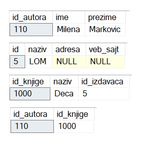

Процедуре и команда INSERT
==========================

.. suggestionnote::

    Често имамо потребу да исти програмски код позивамо више пута. На пример, сваки пут када библиотека набави нову књигу, потребно је да у базу података унесемо све податке о њој тако што се изврши одређена команда или скуп команди. 

    Најбоље решење за овакве ситуације је да имамо спреман програмски код који је сачуван у бази података и који се, по потреби, позива за различите улазне параметре. У системима за управљање базама података можемо да напишемо **процедуре**, именоване блокове програмског кода који најчешће узимају неке параметре. Како процедуре остају сачуване у систему, називају се још и снимљене процедуре или ускладиштене процедуре (енг. *Stored Procedure*). 

    Упознаћемо се са начином писања процедура кроз примере. 

Сви приказани примери су у вези са табелом *autori* која је део базе података за библиотеку. Програмски код, као и команде језика *SQL*, пише се и покреће када се кликне *New Query* након што се покрене систем *SQL Server* и кликне на креирану базу *Biblioteka_knjige* у прозору *Object Explorer*. Фајл са упитима *SQLQuery1.sql* може, а и не мора да се сачува.

Након што се унесе програмски код, кликне се на дугме **Execute**. Уколико се у простору за писање команди налази више блокова кода, потребно је обележити онај који желимо да покренемо. Ако имате више база података, обавезно проверите да ли је поред овог дугмета назив базе у којој желите да покрећете програме. 

.. image:: ../../_images/slika_510a.jpg
    :width: 600
    :align: center

Узмимо пример уноса података у базу. Желимо да напишемо програмски код који можемо лако да позивамо сваки пут када нам треба да унесемо новог аутора у базу података. 

Сетимо се програмског кода за креирање табеле *autori*. 

Како је потребно да унесемо податке у ову табелу, вредности које уносимо треба да буду одговарајућег типа. 

Можемо да проверимо који су типови колона и у прозору *Object Explorer* као што је приказано на следећој слици. 

Можемо да напишемо процедуру. Након што наведемо назив процедуре, у овом случају *unos_autora*, наводимо списак параметара. Процедура коју креирамо има три параметра *@id_autora*, *@ime_autora* и *@prezime_autora*, чији су типови података исти као типови података одговарајућих колона у табели autori. 

::

    CREATE PROCEDURE unos_autora 
    @id_autora int, @ime_autora varchar(15), @prezime_autora varchar(15)
    AS
    INSERT INTO autori
    VALUES (@id_autora, @ime_autora, @prezime_autora)

Након што кликнемо на дугме *Execute*, добијамо поруку да је команда успешно извршена. Можемо да видимо у прозору *Object Explorer* да се процедура појавила на списку. 

Процедура се позива командом EXEC тако што се дају конкретне вредности за параметре. 

::

    EXEC unos_autora @id_autora=10, @ime_autora='Miodrag', @prezime_autora='Majic'

Након што се позове процедура, може да се види у табели *autori* да је додат нови ред са новим аутором. 

Није уобичајено да ручно уносимо вредност примарног кључа. Можемо да уклонимо креирану процедуру и да креирамо нову у којој ћемо вредност идентификационог броја узети као број који је за један већи од највећег идентификационог броја који имамо у табели. 

Процедура се уклања из базе командом DROP. 

::

    DROP PROCEDURE unos_autora

Следи програмски код нове процедуре са само два параметра који служе да унесемо име и презиме аутора, док се идентификациони број сам попуњава. Да бисмо формирали нови идентификациони број, потребно је да се декларише променљива у самој процедури. Упитом SELECT у ту променљиву упишемо највећи идентификациони број који већ постоји у табели, а у нови ред унесемо број за један већи. 

::

    CREATE PROCEDURE unos_autora @ime_autora varchar(15), @prezime_autora varchar(15)
    AS
    DECLARE @id_autora int;
    SELECT @id_autora = MAX(id_autora) FROM autori;
    INSERT INTO autori
    VALUES (@id_autora+1, @ime_autora, @prezime_autora)

Пре него што креирамо процедуру, има смисла да је мало дорадимо и да додамо проверу да се нови аутор додаје само уколико није већ у бази. Пре него што кренемо у процес формирања новог идентификационог броја, исту променљиву *@id_autora* можемо прво да употребимо да проверимо да ли аутор већ постоји тако што ћемо у упиту SELECT у њу да прочитамо идентификациони број аутора датог имена и презимена. Уколико аутора нема у табели, вредност променљиве ће бити null и у том случају има смисла додавање реда. Уколико смо нашли идентификациони број аутора којег покушавамо да упишемо у базу, нема потребе да га поново додајемо. 

::

    CREATE PROCEDURE unos_autora @ime_autora varchar(15), @prezime_autora varchar(15)
    AS
    DECLARE @id_autora int;
    SELECT @id_autora = id_autora FROM autori 
    WHERE ime=@ime_autora AND prezime=@prezime_autora;
    IF @id_autora IS NULL 
    BEGIN
        SELECT @id_autora = MAX(id_autora) FROM autori;
        INSERT INTO autori
        VALUES (@id_autora+1, @ime_autora, @prezime_autora);
    END

Када извршимо код и креирамо процедуру, можемо да је покренемо. За унос новог аутора је довољно да наведемо име и презиме. Ако покушамо да унесемо неког аутора који већ постоји, ништа се неће променити у табели. 

::

    EXEC unos_autora @ime_autora='Danica', @prezime_autora='Vukicevic'

За попуњавање вредности у колони која је примарни кључ можемо да користимо и секвенцу. Секвенца је објекат у бази који служи да формира различите бројеве. Команда која следи креира секвенцу која почиње формирање бројева од 110 и сваки следећи је за један већи. Ову почетну вредност смо изабрали тако да је већа од бројева које у почетку имамо у колони *id_autora* у табели *autori*. Иначе је уобичајено да за секвенцу бројање почиње од јединице. 

::

    CREATE SEQUENCE novi_identifikacioni_broj 
        START WITH 110
        INCREMENT BY 1;  

Не морамо да бришемо и поново креирамо процедуру. Програмски код процедуре може да се измени када изаберемо ставку *Modify* са менија који се појави када кликнемо десни тастер миша над процедуром у прозору *Object Explorer*.

Програмски код треба да изменимо тако што ћемо, уколико уносимо нови ред у табелу, вредност идентификационог броја формирати као следећу вредност коју нам даје креирана секвенца.

::

    SELECT @id_autora = NEXT VALUE FOR novi_identifikacioni_broj;  

На следећој слици се види комплетан измењен код процедуре. Потребно је обавезно да се кликне на дугме *Execute* да би измене остале трајне. 

Први нови аутор којег додамо на овај начин ће имати идентификациони број 110 од којег креирана секвенца почиње бројање.

::

    EXEC unos_autora @ime_autora = 'Milena', @prezime_autora = 'Markovic' 

.. infonote::

    ВАЖНО: У пракси се користи аутоматско попуњавање вредности у колонама које су примарни кључеви, помоћу секвенци или неких других сличних механизама. У свим базама података које су дате у овом курсу, вредности примарних кључева смо ми прецизирали. Да смо користили свуда секвенце или неке друге сличне механизме, илустрације у оквиру курса би се вероватно много разликовале од ситуација на конкретним рачунарима где би се исте базе креирале.

Погледајмо још један пример. Када додајемо нови роман, књигу која има једног аутора, има смисла да напишемо име и презиме аутора, назив књиге и назив издавача, а да се ти подаци правилно повезани унесу у четири различите табеле. Креираћемо процедуру *unos_romana*. 

Следи списак табела у које треба да унесемо податке о новој књизи. Примарни кључеви су истакнути болд, а страни италик. 

Потребно је пронаћи идентификационе бројеве издавача и аутора ако они већ постоје у бази. Уколико не постоје, наћи ћемо највеће идентификационе бројеве у одговарајућим табелама и унећемо као нове за по један веће. Књигу сигурно додајемо. Иако су мале шансе, није немогуће да две књиге различитих аутора имају исти назив. Веома је важно да не заборавимо на крају да унесемо у табелу autori_knjige одговарајући пар идентификационих бројева *id_autora* и *id_knjige*.

Следи комплетан програмски код са коментарима. Коментари не утичу на извршавање програма, почињу са две цртице и завршавају се крајем реда. 

::

    CREATE PROCEDURE unos_romana @naziv varchar(50), 
    @ime_autora varchar(15), @prezime_autora varchar(15), 
    @izdavac varchar(40)
    AS

    DECLARE @id_autora int;
    --proveravamo da li autor vec postoji
    SELECT @id_autora = id_autora FROM autori 
    WHERE ime=@ime_autora AND prezime=@prezime_autora;
    --dodajemo autora ako nije u bazi
    IF @id_autora IS NULL 
    BEGIN
        SELECT @id_autora = (MAX(id_autora)+1) FROM autori;
        INSERT INTO autori
        VALUES (@id_autora, @ime_autora, @prezime_autora);
    END

    DECLARE @id_izdavaca int;
    --proveravamo da li izdavac vec postoji
    SELECT @id_izdavaca = id FROM izdavaci 
    WHERE naziv=@izdavac; 
    --dodajemo izdavaca ako nije u bazi
    IF @id_izdavaca IS NULL 
    BEGIN
        SELECT @id_izdavaca = (MAX(id)+1) FROM izdavaci;
        INSERT INTO izdavaci
        VALUES (@id_izdavaca, @izdavac, null, null);
    END

    DECLARE @id_knjige int;
    --dodajemo knjigu i odgovarajuci id izdavaca
    SELECT @id_knjige = (MAX(id_knjige)+1) FROM knjige;
    INSERT INTO knjige
    VALUES (@id_knjige, @naziv, @id_izdavaca);
    --povezujemo knjigu i autora
    INSERT INTO autori_knjige
    VALUES (@id_autora, @id_knjige);

Након што је процедура креирана, можемо да је позовемо и унесемо у базу податке о новој књизи.

::

    EXEC unos_romana @naziv = 'Deca', 
    @ime_autora = 'Milena', @prezime_autora = 'Markovic', @izdavac = 'LOM' 

Како смо аутора Милену Марковић већ додали у базу, овај позив процедуре ће додати три реда у преостале три табеле. На следећој слици се види садржај свих редова који се односе на новододату књигу у табелама, редом, *autori, izdavaci, knjige и autori_knjige*. 

На овај начин смо написали програмски код који се прилагођава различитим потребама и не морамо сваки пут, за унос сваке нове књиге, да пишемо све команде којима се уносе подаци у четири табеле, већ само позивамо процедуру са подацима о новој књизи. 

::

    EXEC unos_romana @naziv = 'Unutrasnje more', 
    @ime_autora = 'Danica', @prezime_autora = 'Vukicevic', @izdavac = 'Futura publikacije' 

Поред тога што не морамо сваки пут да пишемо четири команде INSERT INTO, писање процедуре нам је омогућило и да имамо додатне провере да ли аутор и издавач већ постоје, па неће доћи до непотребног уноса у базу података који се у њој већ налазе. Када се покрене следећи позив процедуре, неће се поново унети подаци о аутору и издавачу, зато што их већ имамо у бази. Унеће се подаци о књизи и повезаће се са постојећим аутором и издавачем. 

::

    EXEC unos_romana @naziv = 'Drame 2', 
    @ime_autora = 'Milena', @prezime_autora = 'Markovic', @izdavac = 'LOM' 
