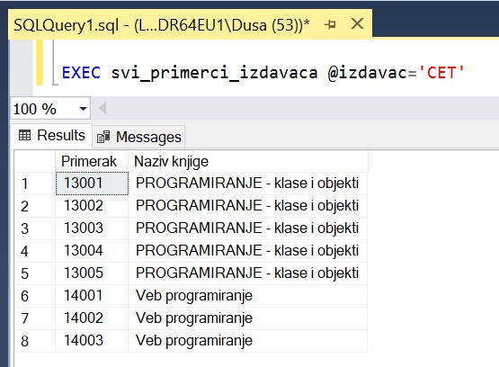
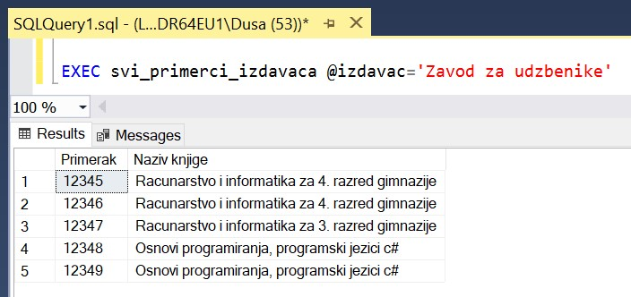

Процедуре и упит SELECT
=======================

.. suggestionnote::

    Као што смо већ више пута нагласили, упит SELECT је управо команда језика SQL којом ефикасно из великих количина сачуваних података добијамо информације. Из тог разлога, у великом броју процедура је потребно да имамо угњеждену управо ову команду. 

    Ако, на пример, библиотека жели да провери колико има примерака књига чији је издавач СЕТ како би размотрили да ли да набављају још књига овог издавача. За сваки примерак је пожељно да се види и која је књига у питању да би се размотрило могуће додатно набављање и појединих наслова овог издавача који се већ налазе у библиотеци.  

    Детаљно објашњење формирања упита SELECT који пишемо као део процедуре је дато раније у материјалима и по потреби је могуће вратити се на тај део да би се додатно разумело како смо дошли до комплетног решења. 

Сви приказани примери су у вези са табелама које чине део базе података за библиотеку. Следи списак свих табела са колонама. Примарни кључеви су истакнути болд, а страни италик. 

.. image:: ../../_images/slika_512a.jpg
    :width: 600
    :align: center

Програмски код, као и команде језика *SQL*, пише се и покреће када се кликне *New Query* након што се покрене систем *SQL Server* и кликне на креирану базу *Biblioteka_knjige* у прозору *Object Explorer*. Фајл са упитима *SQLQuery1.sql* може, а и не мора да се сачува.

Након што се унесе програмски код, кликне се на дугме **Execute**. Уколико се у простору за писање команди налази више блокова кода, потребно је обележити онај који желимо да покренемо. Ако имате више база података, обавезно проверите да ли је поред овог дугмета назив базе у којој желите да покрећете програме. 

.. image:: ../../_images/slika_510a.jpg
    :width: 600
    :align: center

Вратимо се на пример да библиотека жели да провери колико има примерака књига чији је издавач СЕТ како би размотрили да ли да набављају још књига овог издавача. За сваки примерак је пожељно да се види и која је књига у питању да би се размотрило могуће додатно набављање и појединих наслова овог издавача који се већ налазе у библиотеци. Потребно је написати програм којим ћемо добити овај извештај. 

Централни део програма је упит којим се приказују инвентарски бројеви и назив књига издавача чији је назив CET. Заглавља колона у приказу резултата могу да буду измењена тако да буду редом „Primerak“ и „Naziv knjige“. 

Овај упит у себи има: 

- пројекцију – избор само неких података за приказ, тј. података из само одређених колона,
- селекцију – избор само неких редова из табеле по одређеном услову претраге, 
- спајање табела – тражени подаци се налазе у различитим табелама и треба да их повежемо.

::

    SELECT inventarski_broj "Primerak", knjige.naziv "Naziv knjige"
    FROM primerci JOIN knjige ON (primerci.id_knjige=knjige.id_knjige)
    JOIN izdavaci ON (knjige.id_izdavaca=izdavaci.id)
    WHERE izdavaci.naziv = 'CET'

Следећа модификација упита враћа исти списак, али је тај списак уређен по називу књиге, а ако имамо више примерака исте књиге, ти примерци ће бити уређени по инвентарском броју. 

::

    SELECT inventarski_broj "Primerak", knjige.naziv "Naziv knjige"
    FROM primerci JOIN knjige ON (primerci.id_knjige=knjige.id_knjige)
    JOIN izdavaci ON (knjige.id_izdavaca=izdavaci.id)
    WHERE izdavaci.naziv = 'CET'
    ORDER BY knjige.naziv, inventarski_broj

База података за библиотеку коју користимо нема превелики број података. Најчешће у базама имамо табеле са веома великим бројем редова и није могуће да све податке из табеле повучемо у програм. Из тог разлога можемо да ограничимо број редова из којих узимамо податке користећи у упиту TOP уз навођење броја редова који нам је потребан. 

.. infonote::

    ВАЖНО: Како је пример базе података за библиотеку мали, ово нећемо употребљавати у програмима који следе, али би требало да увек имате у виду да се TOP, или нека друга опција за ограничавање броја редова који се узимају, обавезно користи у већим базама података. 

Следећи упит узима само податке о првих пет примерака. 

::

    SELECT TOP 5 inventarski_broj "Primerak", knjige.naziv "Naziv knjige"
    FROM primerci JOIN knjige ON (primerci.id_knjige=knjige.id_knjige)
    JOIN izdavaci ON (knjige.id_izdavaca=izdavaci.id)
    WHERE izdavaci.naziv = 'CET'
    ORDER BY knjige.naziv, inventarski_broj

Наредни корак подразумева да ово решење, тј. написани упит, укључимо у програм, на пример у процедуру.

::

    CREATE PROCEDURE svi_primerci_CET
    AS
        SELECT inventarski_broj "Primerak", knjige.naziv "Naziv knjige"
        FROM primerci JOIN knjige ON (primerci.id_knjige=knjige.id_knjige)
        JOIN izdavaci ON (knjige.id_izdavaca=izdavaci.id)
        WHERE izdavaci.naziv = 'CET';

Након што се покрене овај програмски код кликом на дугме **Execute**, процедура остаје сачувана у систему и можемо да је позовемо командом EXEC. 

::
        
    EXEC svi_primerci_CET;

Ова процедура има веома ограничену примену зато што се односи на једног издавача. За библиотеку би било добро да има процедуру која ће на основу назива издавача приказати све примерке свих књига тог издавача. 

::

    CREATE PROCEDURE svi_primerci_izdavaca @izdavac VARCHAR(40)
    AS
        SELECT inventarski_broj "Primerak", knjige.naziv "Naziv knjige"
        FROM primerci JOIN knjige ON (primerci.id_knjige=knjige.id_knjige)
        JOIN izdavaci ON (knjige.id_izdavaca=izdavaci.id)
        WHERE izdavaci.naziv = @izdavac;

Креирана процедура може да се позове за различите издаваче. 

::

    EXEC svi_primerci_izdavaca @izdavac='CET'

Резултат овог позива процедуре можемо да видимо на следећој слици. 

Исту процедуру можемо да позовемо и за другог издавача. 

::

    EXEC svi_primerci_izdavaca @izdavac='Zavod za udzbenike' 

