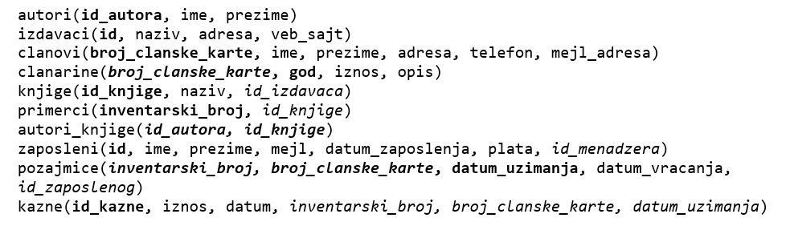

Процедуре и функције са упитом SELECT из једне табеле - вежбање
===============================================================

Решити следеће задатке писањем процедуре или функције и програмског кода у којем се креирана процедура или функција позива. 

Приликом решавања задатака, погледајте претходно решене примере. Након што решите неки задатак па желите да проверите да ли је решење добро или видите да не можете да га решите, можете да погледате решење које ће се приказати након што кликнете на дугме. 

Детаљно објашњење формирања упита SELECT који треба да буде део процедуре или функције је дато раније у материјалима и по потреби је могуће вратити се на тај део као помоћ у писању комплетног решења. 

Програмски код, као и команде језика SQL, пише се и покреће када се кликне *New Quer*y након што се покрене систем *SQL Server* и кликне на креирану базу *Biblioteka* у прозору *Object Explorer*. Фајл са упитима *SQLQuery1.sql* може, а и не мора да се сачува.

Након што се унесе програмски код, кликне се на дугме *Execute*. Уколико се у простору за писање команди налази више блокова кода, потребно је обележити онај који желимо да покренемо. Ако имате више база података, обавезно проверите да ли је поред овог дугмета назив базе у којој желите да покрећете програме.  

.. image:: ../../_images/slika_521a.jpg
    :width: 600
    :align: center

Сви приказани задаци су у вези са табелама које чине базу података за библиотеку. Следи списак свих табела са колонама. Примарни кључеви су истакнути болд, а страни италик. 

.. questionnote::

    1. Библиотека планира да умањи износ за плаћање казне за оне који плате казну у најкраћем року. Пре него што обавести чланове библиотеке о новом правилу, потребно је да се анализирају досадашње плаћене казне да би се што боље проценило како ће се у будућности одразити умењење износа казне на појединачне случајеве. 

**Задатак**: Приказати број чланске карте члана коме је издата казна, датум плаћања казне, износ казне и како би изгледао износ казне умањен за 15%. 

.. reveal:: pitanje_523a
    :showtitle: Прикажи решење
    :hidetitle: Сакриј решење

    ::

        CREATE PROCEDURE umanjene_kazne @procenat INT
        AS
        SELECT broj_clanske_karte, datum, iznos, 
        iznos*(100-@procenat)/100 AS umanjen_iznos
        FROM kazne

        Позив процедуре.

        EXEC umanjene_kazne @procenat=15

.. questionnote::
    
    2. Поштени проналазач је изгубљену чланску карту са бројем 11 донео у библиотеку. Да би могли да је врате члану, потребне су његове контакт информације. 

**Задатак**: Приказати све податке о члану са датим бројем чланске карте.

.. reveal:: pitanje_523b
    :showtitle: Прикажи решење
    :hidetitle: Сакриј решење

    ::

        CREATE FUNCTION podaci_o_clanu (@broj_clanske_karte INT)
        RETURNS TABLE
        AS
        RETURN SELECT * FROM clanovi
        WHERE broj_clanske_karte=@broj_clanske_karte

        Позив функције.

        SELECT * FROM podaci_o_clanu(11)

.. questionnote::

    3. Члан Оливера Стошић је дошла у библиотеку након што је изгубила чланску карту. Библиотека треба да јој изда дупликат па је потребно да се провери који је био број њене чланске карте. 

**Задатак**: Приказати број чланске карте члана датог имена и презимена.

.. reveal:: pitanje_523c
    :showtitle: Прикажи решење
    :hidetitle: Сакриј решење

    ::

        CREATE FUNCTION broj_clanske_karte_clana (@ime VARCHAR(15), @prezime VARCHAR(15))
        RETURNS INT
        AS
        BEGIN
            DECLARE @broj INT;
            SELECT @broj = broj_clanske_karte FROM clanovi
            WHERE ime=@ime AND prezime=@prezime;
            RETURN @broj;
        END

    Позив функције.

    ::

        PRINT dbo.broj_clanske_karte_clana('Olivera', 'Stosic')

.. questionnote::

    4. Ради лакше комуникације, библиотека је одлучила да креира посебне имејл адресе за све чланове. 

**Задатак**: Приказати новоформиране имејл адресе свих чланова. Имејл адреса се формира од прва два слова имена, прва три слова презимена и наставка *@biblioteka23.rs* за све чланове. Цела имејл адреса се састоји од малих слова. 

.. reveal:: pitanje_523d
    :showtitle: Прикажи решење
    :hidetitle: Сакриј решење

    ::

        CREATE PROCEDURE nove_mejl_adrese
        AS
        SELECT LOWER(SUBSTRING(ime, 1, 2)+SUBSTRING(prezime, 1, 3))+'@biblioteka23.rs' 
        AS nova_mejl_adresa
        FROM clanovi

    Позив процедуре.

    ::
        
        EXEC nove_mejl_adrese

.. questionnote::

    5. Још нису креиране нове имејл адресе за све чланове библиотеке, а у плану је да се имејлом пошаље неко важно обавештење. Потребно је прво проверити да ли имамо имејл адресе свих чланова. 

**Задатак**: Приказати податке о члановима: број чланске карте, презиме и имејл адресу. Уколико члан нема унету имејл адресу, приказати „Nema mejl adresu“.  

.. reveal:: pitanje_523e
    :showtitle: Прикажи решење
    :hidetitle: Сакриј решење

    ::

        CREATE PROCEDURE podaci_o_clanovima
        AS
            DECLARE kursor_clanovi CURSOR FOR
            SELECT broj_clanske_karte, prezime, mejl_adresa
            FROM clanovi;
            DECLARE @broj_clanske_karte INT;
            DECLARE @prezime VARCHAR(15);
            DECLARE @mejl_adresa VARCHAR(50);

            OPEN kursor_clanovi;
            FETCH NEXT FROM kursor_clanovi 
            INTO @broj_clanske_karte, @prezime, @mejl_adresa;

            WHILE @@FETCH_STATUS=0
            BEGIN
                PRINT 'Clanska karta: '+CAST(@broj_clanske_karte AS VARCHAR);
                PRINT 'Prezime: '+@prezime;
                IF @mejl_adresa IS NOT NULL
                PRINT 'Mejl adresa: '+@mejl_adresa;
                ELSE
                PRINT 'Nema mejl adresu';
                FETCH NEXT FROM kursor_clanovi 
                INTO @broj_clanske_karte, @prezime, @mejl_adresa;
            END;
            CLOSE kursor_clanovi;
            DEALLOCATE kursor_clanovi;

    Позив процедуре.

    ::

        EXEC podaci_o_clanovima

.. questionnote::

    6. Библиотеци је потребан извештај о свим примерцима књига који су тренутно издати. На почетку извештаја је важно да се прикажу књиге које су дуже време код чланова библиотеке.  

**Задатак**: Приказати инвентарске бројеве примерака књига који су тренутно издати и датуме узимања из библиотеке. Списак уредити по датуму узимања.  

.. reveal:: pitanje_523f
    :showtitle: Прикажи решење
    :hidetitle: Сакриј решење

    ::

        CREATE PROCEDURE izdate_knjige
        AS
        SELECT inventarski_broj, datum_uzimanja FROM pozajmice
        WHERE datum_vracanja IS NULL
        ORDER BY datum_uzimanja

    Позив процедуре.

    ::

        EXEC izdate_knjige

.. questionnote::

    7. Члан библиотеке са својом чланском картом чији је број 33 је дошао да позајми неке књиге. Пре него што му библиотека изда нове књиге, потребно је да се провери да ли члан тренутно држи неке књиге код себе. 

**Задатак**: Приказати датуме узимања и инвентарске бројеви књига које се тренутно налазе код члана са датим бројем чланске карте. 

.. reveal:: pitanje_523g
    :showtitle: Прикажи решење
    :hidetitle: Сакриј решење

    ::

        CREATE FUNCTION zaduzene_knjige_clana (@broj_clanske_karte INT)
        RETURNS TABLE
        AS
        RETURN SELECT datum_uzimanja, inventarski_broj
        FROM pozajmice
        WHERE broj_clanske_karte=@broj_clanske_karte 
        AND datum_vracanja IS NULL

    Позив функције.

    ::

        SELECT * FROM zaduzene_knjige_clana(33)

.. questionnote::

    8. Библиотека жели да понуди посебне погодности код плаћања чланарине и резервације књига за чланове који често позајмљују књиге и који књиге враћају у року. У библиотеку је дошао члан са бројем чланске карте 11 и библиотекар жели да провери да ли овај члан испуњава услов да добије погодности. Приликом одлучивања посматрају се на првом месту скорије активности члана, тј. скорије позајмице.  

**Задатак**: Приказати све позајмице члана са датим бројем чланске карте. Приказати инвентарски број, датум узимања и датум враћања сортиран према датуму узимања тако да прво буду приказане скорије позајмице. Уколико члан има више позајмица истог дана, сортирати по датуму враћања. Уколико су књиге позајмљене истог дана и враћене истог дана, сортирати по инвентарском броју.  

.. reveal:: pitanje_523h
    :showtitle: Прикажи решење
    :hidetitle: Сакриј решење

    ::

        CREATE PROCEDURE sve_pozajmice_clana @broj_clanske_karte INT
        AS
        SELECT inventarski_broj, datum_uzimanja, datum_vracanja
        FROM pozajmice
        WHERE broj_clanske_karte=@broj_clanske_karte
        ORDER BY datum_uzimanja DESC, datum_vracanja DESC, inventarski_broj

    Позив процедуре.

    ::

        EXEC sve_pozajmice_clana @broj_clanske_karte=11

.. questionnote::

    9. Приликом подношења извештаја о свим својим активностима, библиотеци је потребно и да анализира из којих све разлога су чланови библиотеке имали неке попусте или друге специфичне ситуације приликом плаћања чланарина. Део извештаја се посебно концентрише на 2017. и 2018. годину зато што су тих година донете неке веће измене у пословању библиотеке. 

**Задатак**: Приказати годину, износ и опис за све чланарине које имају унет опис за све чланарине плаћене 2017. и 2018. године. 

.. reveal:: pitanje_523i
    :showtitle: Прикажи решење
    :hidetitle: Сакриј решење

    ::

        CREATE FUNCTION clanarine_sa_popustom()
        RETURNS TABLE 
        AS
        RETURN SELECT god, iznos, opis
        FROM clanarine
        WHERE opis IS NOT NULL;

    Позив функције.

    ::
        
        SELECT * FROM clanarine_sa_popustom()
        WHERE god IN (2017,2018)

.. questionnote::

    10. Библиотека је набавила нове књиге аутора који је написао књигу која има само један примерак у библиотеци са инвентарским бројем 15001 и планира да обавести све чланове који су ову књигу читали о томе да сада имају прилику да прочитају још дела истог аутора. 

**Задатак**: Приказати бројеве чланских карата свих чланова који су позајмљивали примерак књиге са датим инвентарским бројем. Како је неки члан могао да више пута у различитим тренуцима позајми ову исту књигу, обезбедити да се елиминише дуплирање података приликом приказа.

.. reveal:: pitanje_523j
    :showtitle: Прикажи решење
    :hidetitle: Сакриј решење

    ::

        CREATE FUNCTION clanovi_koji_su_pozajmljivali (@inventarski_broj INT)
        RETURNS TABLE 
        AS
        RETURN SELECT DISTINCT broj_clanske_karte 
        FROM pozajmice 
        WHERE inventarski_broj=@inventarski_broj;

    Позив функције.

    ::

        SELECT * FROM clanovi_koji_su_pozajmljivali(15001)

.. questionnote::

    11. За могуће повећање плате се разматрају запослени који раде у тиму чији менаџер има идентификациони број 3. Плата би била увећана само онима који имају нижу плату и то плату у опсегу од 45.000 до 50.000 динара.

**Задатак**: Приказати имена и презимена запослених који зарађују износе између два дата, укључујући и те износе, а њихов менаџер има дати идентификациони број. 

.. reveal:: pitanje_523k
    :showtitle: Прикажи решење
    :hidetitle: Сакриј решење

    :: 

        CREATE PROCEDURE spisak_zaposlenih 
        @id_menadzera INT, @donja_granica INT, @gornja_granica INT
        AS
        SELECT ime, prezime FROM zaposleni
        WHERE id_menadzera = @id_menadzera 
        AND plata>=@donja_granica AND plata<=@gornja_granica

    Позив процедуре.

    ::

        EXEC spisak_zaposlenih 
        @id_menadzera=3, @donja_granica=45000, @gornja_granica=50000

.. questionnote::

    12. Библиотека прати и анализира понашање чланова и као један од извештаја проучава све позајмице по месецима. За то ће бити потребни извештаји за сваки месец, на пример, извештај о свим позајмицама током априла 2019. године. 

**Задатак**: Приказати инвентарске бројеве примерака књига, датум узимања и датум враћања за све позајмице између два датума. 

.. reveal:: pitanje_523l
    :showtitle: Прикажи решење
    :hidetitle: Сакриј решење

    ::

        CREATE PROCEDURE pozajmice_izmedju_dana @dan1 DATE, @dan2 DATE
        AS
        SELECT inventarski_broj, datum_uzimanja, datum_vracanja
        FROM pozajmice
        WHERE datum_uzimanja>=@dan1 AND datum_uzimanja<=@dan2

    Позив процедуре.

    ::

        EXEC pozajmice_izmedju_dana @dan1='2019-04-01', @dan2='2019-04-30'
