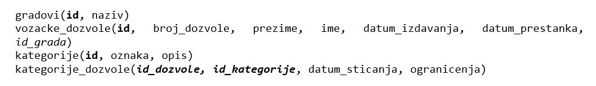

Процедуре и функције - нерешени задаци
======================================

Решити следеће задатке писањем процедуре или функције, као и програмског кода у којем се позива написана процедура или функција. Приликом решавања нерешених задатака, погледајте претходно решене примере који узимају податке из исте базе. 

Тамо где има смисла, задатке решити на више начина и упоредити решења.

риликом решавања задатака, погледајте претходно решене примере. Након што решите неки задатак па желите да проверите да ли је решење добро или видите да не можете да га решите, можете да погледате решење које ће се приказати након што кликнете на дугме. 

Детаљно објашњење формирања упита SELECT који треба да буде део процедуре или функције је дато раније у материјалима и по потреби је могуће вратити се на тај део као помоћ у писању комплетног решења. 

Програмски код, као и команде језика *SQL*, пише се и покреће када се кликне *New Query* након што се покрене систем *SQL Serve*r и кликне на креирану базу *Izdate_dozvole* у прозору *Object Explorer*. Фајл са упитима *SQLQuery1.sql* може, а и не мора да се сачува.

Након што се унесе програмски код, кликне се на дугме *Execute*. Уколико се у простору за писање команди налази више блокова кода, потребно је обележити онај који желимо да покренемо. Ако имате више база података, обавезно проверите да ли је поред овог дугмета назив базе у којој желите да покрећете програме.  

.. image:: ../../_images/slika_531a.jpg
    :width: 600
    :align: center

Сви приказани задаци су у вези са табелама које чине базу података за евиденцију издатих возачких дозвола. Следи списак свих табела са колонама. Примарни кључеви су истакнути болд, а страни италик. 

.. questionnote::

    1. Приказати датум до када важи и број возачке дозволе особе датог имена и презимена. Приликом позива процедуре или функције нека особа буде Јанко Мировић.

.. questionnote::

    2. Приказати податке о свим категоријама на дозволи са датим бројем. Приликом позива процедуре или функције нека број буде 001560375.   

.. questionnote::

    3. Приказати све дозволе које ће важити и после одређеног датума. Приликом позива процедуре или функције нека датум буде 1. јун 2024. године. 

.. questionnote::

    4. Омогућити додавање података о новој возачкој дозволи.  

.. questionnote::

    5. Приказати списак различитих градова у којима имамо издате возачке дозволе одређене категорије. Приликом позива процедуре или функције нека категорија буде AM. 

.. questionnote::

    6. Приказати број различитих градова у којима имамо издате возачке дозволе одређене категорије. Приликом позива процедуре или функције нека категорија буде AM. 

.. questionnote::

    7. За сваку категорију приказати све градове у којима имамо дозволе те категорије. 

.. questionnote::

    8. Приказати за сваку категорију број издатих дозвола. 

.. questionnote::

    9. За сваку категорију приказати све дозволе које је садрже. 

.. questionnote::

    10. Приказати податке о особи или особама којима дозвола важи дуже од тренутно издате дозволе особи датог имена и презимена. Приликом позива процедуре или функције нека дата особа буде Бранислав Зорановић.

.. questionnote::

    11. Приказати све категорије за које није унет опис. 

.. questionnote::

    12. Омогућити измену податка о опису категорије. 
