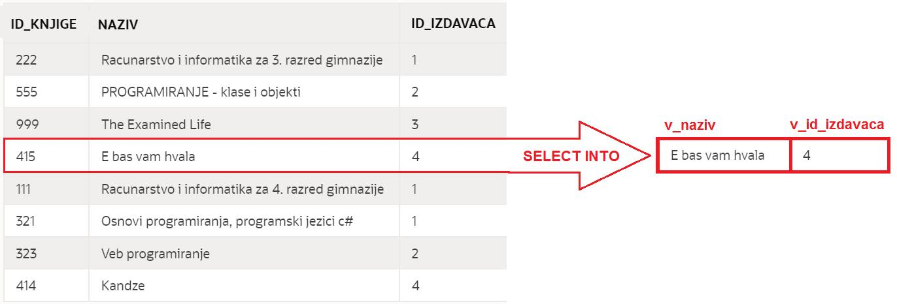
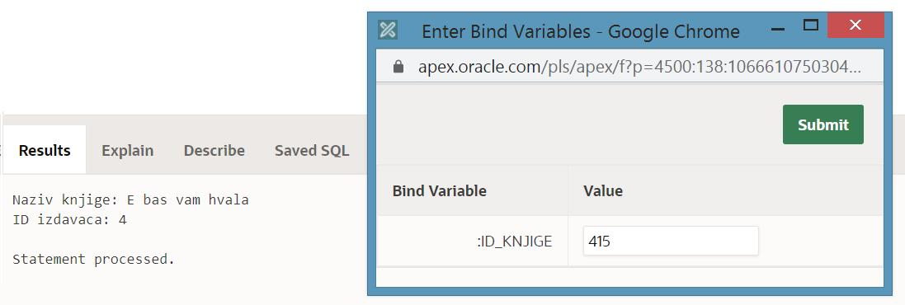
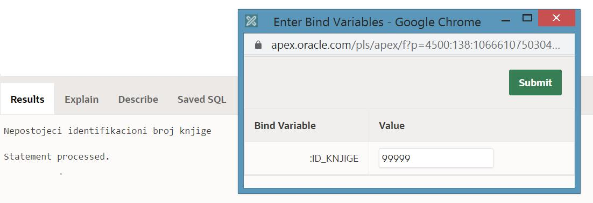

Језик PL/SQL и наредба SELECT INTO
==================================

.. suggestionnote::

    Основна сврха програмског језика PL/SQL, који је направљен као проширење упитног језика SQL, јесте писање програма који се повезују на базе података.

    У PL/SQL програму може да буде угњеждена једна или више SQL наредби. Најједноставнија угњеждена наредба је **SELECT INTO**, упит којим се узима један ред из базе. 

Програми се пишу у едитору у оквиру онлајн окружења *Oracle APEX*, а покрећу се кликом на дугме **Run**:

- https://apex.oracle.com/en/ (обавезно логовање на креирани налог)
- SQL Workshop
- SQL Commands

Потребно је декларисати онолико променљивих колико података читамо из базе. Уколико променљиве одговарају називима колона, онда је правило да се променљива назове исто као колона са префиксом v_ (v од енглеске речи *variable*, која означава променљиву), на пример, *v_id_knjige*, *v_naziv*... За тип података тих променљивих је најбоље употребити исти тип одговарајуће колоне употребом %TYPE. 

На пример, следи декларација променљиве *v_naziv*, која је истог типа као колона naziv у табели *knjige*.

::
    

  v_naziv knjige.naziv%TYPE;

Када је део PL/SQL програма, упит мора да има део INTO тако да се јасно наведе у које променљиве се учитавају вредности које су прочитане из базе програма. У примеру који следи, из табеле *knjige* из реда који одговара књизи са идентификационим бројем 415, вредности *naziv* и *id_izdavaca* уписују се у променљиве *v_naziv* и *v_id_izdavaca*.  

::

  SELECT naziv, id_izdavaca INTO v_naziv, v_id_izdavaca
  FROM knjige WHERE id_knjige=415;

Следи комплетан PL/SQL програм у којем се узимају и приказују подаци о књизи са идентификационим бројем 415.

::

    DECLARE
        v_naziv knjige.naziv%TYPE;
        v_id_izdavaca knjige.id_izdavaca%TYPE;
    BEGIN
        SELECT naziv, id_izdavaca INTO v_naziv, v_id_izdavaca
        FROM knjige WHERE id_knjige=415;
        DBMS_OUTPUT.PUT_LINE('Naziv knjige: '||v_naziv);
        DBMS_OUTPUT.PUT_LINE('ID izdavaca: '|| v_id_izdavaca);
    END

У овом примеру смо били сигурни да постоји књига са идентификационим бројем 415. Уколико постоји могућност да тражимо књигу чији идентификациони број можда не постоји, онда треба да предвидимо изузетак NO_DATA_FOUND. Уз било који специфичан изузетак је добро предвидети и блок који ће ухватити било који тип изузетка, најопштији случај. Реч OTHERS не означава назив посебног изузетка већ служи да се ухвати грешка било ког типа. 

Следи пример исправљеног кода у којем се идентификациони број књиге учитава са тастатуре. 

::

    DECLARE
        v_id_knjige knjige.id_knjige%TYPE;
        v_naziv knjige.naziv%TYPE;
        v_id_izdavaca knjige.id_izdavaca%TYPE;
    BEGIN
        v_id_knjige := :id_knjige;
        SELECT naziv, id_izdavaca INTO v_naziv, v_id_izdavaca
        FROM knjige WHERE id_knjige=v_id_knjige;
        DBMS_OUTPUT.PUT_LINE('Naziv knjige: '||v_naziv);
        DBMS_OUTPUT.PUT_LINE('ID izdavaca: '|| v_id_izdavaca);
        EXCEPTION
        WHEN NO_DATA_FOUND THEN
            DBMS_OUTPUT.PUT_LINE('Nepostojeci identifikacioni broj knjige');
        WHEN OTHERS THEN
            DBMS_OUTPUT.PUT_LINE('Greska');
    END

Уколико се унесе непостојећи идентификациони број. 

Уместо декларације више променљивих, може да се употреби једна сложена променљива употребом %ROWTYPE. 

Следи исти пример са називом и идентификационим бројем издавача књиге са идентификационим бројем 415, али у којем се користи сложена променљива. 

::

    DECLARE
        v_knjiga knjige%ROWTYPE;
    BEGIN
        SELECT * INTO v_knjiga
        FROM knjige WHERE id_knjige=415;
        DBMS_OUTPUT.PUT_LINE('Naziv knjige: '||v_knjiga.naziv);
        DBMS_OUTPUT.PUT_LINE('ID izdavaca: '|| v_knjiga.id_izdavaca);
    END

У PL/SQL програму може да буде угњеждено и више упита. Следећи програм проверава која од две књиге аутора Марка Видојковића има више примерака у библиотеци. Ове књиге имају идентификационе бројеве 414 и 415. 

::

    DECLARE
        v_broj_primeraka_1 INT;
        v_broj_primeraka_2 INT;
    BEGIN
        SELECT COUNT(*) INTO v_broj_primeraka_1 
        FROM primerci WHERE id_knjige=414;
        SELECT COUNT(*) INTO v_broj_primeraka_2 
        FROM primerci WHERE id_knjige=415;
        IF v_broj_primeraka_1=v_broj_primeraka_2 THEN
            DBMS_OUTPUT.PUT_LINE('Obe knjige imaju isti broj primeraka.');
        ELSIF v_broj_primeraka_1>v_broj_primeraka_2 THEN
            DBMS_OUTPUT.PUT_LINE('Knjiga 414 ima vise primeraka.');
        ELSE
            DBMS_OUTPUT.PUT_LINE('Knjiga 415 ima vise primeraka.');
        END IF;
    END
