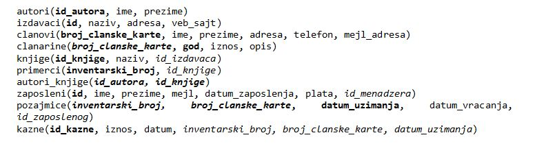
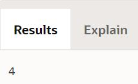
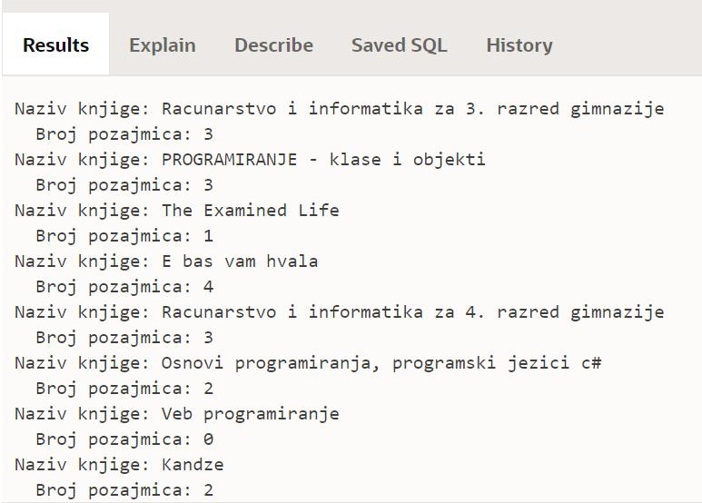
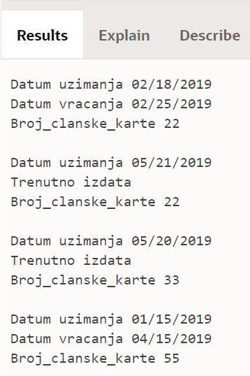

Позајмице једне књиге - пример
==============================

.. suggestionnote::

    
    База података за библиотеку може да послужи и да се једноставно и брзо дође до информација у вези са позајмицом књига. Када знамо да ли се нека књига позајмљује ређе или чешће, библиотека може да донесе одлуку да ли да наручује још примерака књиге или да раздужи постојеће. 

    Овој теми ћемо приступити кроз неколико различитих програмских решења која сада укључују и писање процедура и функција. 

Програми се пишу у едитору у оквиру онлајн окружења *Oracle APEX*, а покрећу се кликом на дугме **Run**:

- https://apex.oracle.com/en/ (обавезно логовање на креирани налог)
- SQL Workshop
- SQL Commands

Сви примери PL/SQL програма узимају податке из базе података библиотеке. Следи списак свих табела са колонама. Примарни кључеви су истакнути болд, а страни италик. 

.. questionnote::

    1. Написати PL/SQL функцију која за дати назив књиге рачуна и враћа укупан број позајмица те књиге. Написати PL/SQL програм у којем се позива функција. 

::

    CREATE OR REPLACE FUNCTION broj_pozajmica(p_naziv knjige.naziv%TYPE) RETURN NUMBER AS
            broj NUMBER;
    BEGIN
        SELECT COUNT(*) INTO broj FROM pozajmice JOIN primerci USING(inventarski_broj) JOIN knjige USING(id_knjige)
        WHERE naziv = p_naziv;
        RETURN broj;
    END

Следећи програм позива креирану и сачувану функцију за једну књигу. 

::

    BEGIN
        DBMS_OUTPUT.PUT_LINE(broj_pozajmica('E bas vam hvala'));
    END

Исту функцију можемо да позовемо и у другом програму тако што ћемо за сваку књигу приказати укупан број позајмица. 

::

    DECLARE
        CURSOR kursor_knjige IS SELECT naziv FROM knjige;
    BEGIN
        FOR v_knjiga IN kursor_knjige LOOP
            DBMS_OUTPUT.PUT_LINE('Naziv knjige: '||v_knjiga.naziv);
            DBMS_OUTPUT.PUT_LINE('  Broj pozajmica: '||broj_pozajmica(v_knjiga.naziv));
        END LOOP;  
    END

.. questionnote::

    2. Написати PL/SQL процедуру са једним параметром (назив књиге) која користи курсор и којом се приказују све позајмице те књиге. За сваку позајмицу приказати: датум узимања, датум враћања или поруку „Тренутно издата“ и број чланске карте члана. Написати PL/SQL програм у којем се покреће процедура за књигу са називом „Е, баш вам хвала“.

::

    
        CREATE OR REPLACE PROCEDURE spisak_pozajmica(p_naziv knjige.naziv%TYPE) AS
        CURSOR kursor_pozajmice IS 
        SELECT * FROM pozajmice JOIN primerci USING (inventarski_broj) 
        JOIN knjige USING(id_knjige) WHERE naziv = p_naziv;
    BEGIN
            FOR v_pozajmica IN kursor_pozajmice LOOP
                DBMS_OUTPUT.PUT_LINE('Datum uzimanja ' || v_pozajmica.datum_uzimanja);
                IF v_pozajmica.datum_vracanja IS NULL THEN
                    DBMS_OUTPUT.PUT_LINE('Trenutno izdata');
                ELSE
                    DBMS_OUTPUT.PUT_LINE('Datum vracanja ' || v_pozajmica.datum_vracanja);
                END IF;
                DBMS_OUTPUT.PUT_LINE('Broj_clanske_karte ' || v_pozajmica.broj_clanske_karte);
                DBMS_OUTPUT.PUT_LINE(' ');
            END LOOP;
    END

Следећи PL/SQL програм позива процедуру за књигу са називом „Е, баш вам хвала“. 

::

    BEGIN
        spisak_pozajmica('E bas vam hvala');
    END

