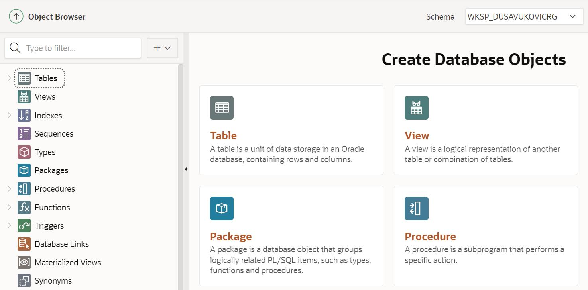
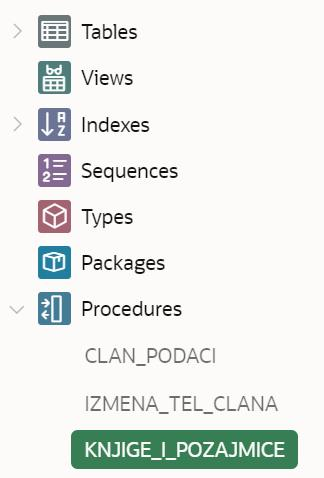
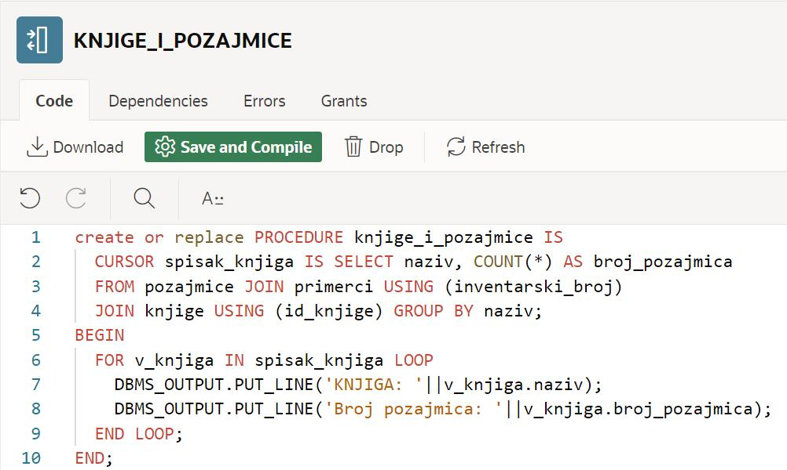
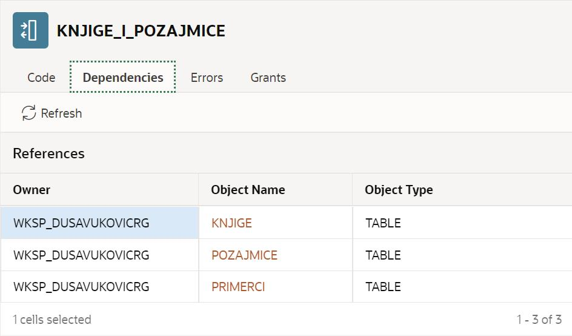

Списак свих објеката у бази података
=====================================

.. suggestionnote::

    Док радимо у едитору у онлајн окружењу Oracle APEX, програмски код пишемо и бришемо, али не морамо да га чувамо. Свака процедура и функција која се креира остаје запамћена у систему, па тако остаје запамћен и њен програмски код. Погледаћемо како приступамо запамћеним подпрограмима. 

Списак свих објеката креираних у окрвиру СУБП-а *Oracle APEX*:

- https://apex.oracle.com/en/ (обавезно логовање на креирани налог)
- SQL Workshop
- Object Browser

Као што можемо да видимо, најважнији објекти који се појављују на списку су табеле. Погледаћемо списак процедура које смо креирали. 

 

Када кликнемо на неку од процедура, приказује се њен комплетан програмски код. 

Поред програмског кода, важно нам је и да знамо од којих других објеката процедура зависи. Када изаберемо картицу Dependencies, можемо да видимо да ова процедура користи три табеле. Уколико дође до измена структура ових табела, на пример, додају се или обришу неке колоне, то може да утиче на ову процедуру.  

